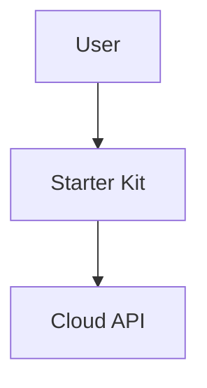

# Project Overview

This repository contains the documentation for Dev Kit for AI, built using Mintlify. The documentation provides guides, API references, and AI tool integration instructions for users of the Dev Kit platform.

## Documentation Focus

The documentation focuses on three core components of the Dev Kit platform (ordered by importance from the user's perspective):

1. **Starter Kit** - A Next.js-based web application template that developers clone and customize to build AI-powered SaaS applications
2. **Cloud Admin** - A web console where developers manage their projects, API keys, and view analytics
3. **Cloud API** - Backend API services that power AI generation and project management features

When documenting or updating content, prioritize these components and their user-facing features.

The Starter Kit is open-source and available on GitHub at [GitHub Repository](https://github.com/your-repo/starter-kit).

For Cloud Admin and Cloud API, there are two usage patterns:

- **SaaS Platform** - Developers use the hosted Cloud Admin and Cloud API services provided at [devkit4ai.com](https://devkit4ai.com) or [vibecoding.ad](https://vibecoding.ad) to manage their projects and power their applications. It has a free tier and paid plans for advanced features.
- **Self-Hosted** - Advanced users can deploy their own instances of Cloud Admin and Cloud API for full control. This is not the primary use case and is a paid feature for Enterprise and Team plans. Documentation for self-hosting is not the main focus at this time.

Always check the relevant project in the workspace when documenting features to ensure accuracy.

## Technology Stack

- **Framework**: Mintlify documentation platform
- **Markup Language**: MDX (Markdown with JSX components)
- **CLI Tool**: `mint` (for local development and deployment)
- **Node.js**: Version 19 or higher required

## Folder Structure

- `/` - Root contains main documentation pages (index.mdx, quickstart.mdx, development.mdx)
- `/starter-kit` - Complete guides for setting up and customizing the Starter Kit application
  - `/auth` - Authentication and user management documentation
  - `/features` - Core features and capabilities
  - `/customization` - Branding, styling, and customization guides
  - `/deployment` - Production deployment and hosting guides
  - `/advanced` - Advanced topics like state management and API integration
- `/cloud-admin` - Documentation for the Cloud Admin console
  - `/projects` - Project creation and management
  - `/api-keys` - API key management and security
  - `/users` - User analytics and management
  - `/console` - Console features and quick actions
- `/cloud-api` - API reference documentation
  - `/health` - Health check endpoints
  - `/auth` - Authentication endpoints
  - `/projects` - Project management endpoints
  - `/generation` - AI generation endpoints
- `/getting-started` - Platform overview and core concepts
- `/tutorials` - Step-by-step tutorials and use cases
  - `/first-app` - First app tutorials
  - `/use-cases` - AI use case examples
  - `/integrations` - Integration guides
- `/development-tools` - AI assistant integration guides and local development
  - `/ai-assistants` - Cursor, Claude Code, Windsurf guides
  - `/local-dev` - Frontend, backend, testing, multi-mode setup
  - `/vscode` - VS Code workspace configuration
- `/reference` - Architecture, configuration, and best practices
  - `/architecture` - Event sourcing, CQRS, multi-mode design, database schema
  - `/config` - Environment variables, deployment modes, security settings
  - `/best-practices` - Security, performance, code organization, testing
- `/logo` - Logo assets (devkit-light.png, devkit-dark.png)
- `docs.json` - Mintlify configuration file

## Content Guidelines

### Component Focus

When creating or updating documentation:

- **Starter Kit documentation** should focus on:
  - Installation and setup procedures
  - Feature implementation and customization
  - Deployment to various hosting platforms
  - Integration with Cloud API
  - Best practices for building SaaS applications

- **Cloud Admin documentation** should focus on:
  - Console navigation and features
  - Project and API key management workflows
  - User analytics and monitoring
  - Security best practices

- **Cloud API documentation** should focus on:
  - Endpoint functionality and parameters
  - Authentication and authorization
  - Request/response examples
  - Integration patterns with Starter Kit

Always prefer `devkit4ai.com` URLs but also always mention alternative `vibecoding.ad`.

### What to Avoid

- Do not include internal implementation details or architecture
- Do not document backend infrastructure or deployment processes
- Do not reference internal codebases or private repositories
- Keep focus on user-facing features and public APIs
- Avoid technical details that are not relevant to end users building applications with the platform

## File Naming Conventions

- Use lowercase with hyphens for file names (e.g., `my-page.mdx`, `api-endpoint.mdx`)
- MDX files use `.mdx` extension
- Follow existing naming patterns in each directory

## Documentation Standards

### Frontmatter

Every MDX page must begin with YAML frontmatter:

```yaml
---
title: "Clear, specific, keyword-rich title"
description: "Concise description explaining page purpose and value"
icon: "icon-name"
---
```

### Writing Style

- Use clear, direct language appropriate for technical audiences
- Write in second person ("you") for instructions and procedures
- Use active voice over passive voice
- Employ present tense for current states
- Keep sentences concise while providing necessary context
- Use descriptive, keyword-rich headings for navigation

### Content Organization

- Lead with the most important information
- Break complex procedures into numbered steps using `<Steps>` component
- Include prerequisites and context before instructions
- Use progressive disclosure: basic concepts before advanced ones
- Group related information logically with clear section breaks

### SEO

Optimize documentation for search engines and discoverability:

- **Title Tags**: Use clear, keyword-rich titles in frontmatter (50-60 characters optimal)
- **Descriptions**: Write compelling meta descriptions (150-160 characters) that summarize page value
- **Headings**: Structure content with H2-H6 headings containing relevant keywords
- **Keywords**: Include primary and secondary keywords naturally throughout content
- **Internal Linking**: Link to related documentation pages using descriptive anchor text
- **URL Structure**: Use clean, descriptive URLs that match page titles (handled by file naming)
- **Alt Text**: Provide descriptive alt text for all images for accessibility and SEO
- **Content Length**: Aim for comprehensive coverage (300+ words) for main pages
- **Code Examples**: Include working code examples as they improve engagement metrics
- **Update Frequency**: Keep documentation current to maintain search rankings

## Mintlify Components

### Callout Components

Use these components to highlight different types of information:

- `<Note>` - Additional helpful information
- `<Tip>` - Best practices and pro tips
- `<Warning>` - Important cautions or breaking changes
- `<Info>` - Neutral contextual information
- `<Check>` - Success confirmations

### Code Components

- Single code blocks: Use triple backticks with language and optional filename
- `<CodeGroup>` - Show the same concept in multiple programming languages
- `<RequestExample>` and `<ResponseExample>` - For API endpoint documentation

### Structural Components

- `<Steps>` and `<Step>` - For step-by-step procedures
- `<Tabs>` and `<Tab>` - For platform-specific content or alternatives
- `<AccordionGroup>` and `<Accordion>` - For collapsible content
- `<Card>` and `<CardGroup>` - For emphasizing important links or concepts
- `<Columns>` - For multi-column layouts

### API Documentation Components

- `<ParamField>` - Document API parameters (path, body, query, header)
- `<ResponseField>` - Document response fields
- `<Expandable>` - For nested object properties

### Media Components

- `<Frame>` - Wrap all images in frames for consistent styling
- Add descriptive `alt` text to all images
- Use `caption` attribute for image captions

### Mermaid Diagrams

Use Mermaid diagrams wherever suitable to visualize:

- **Workflows and processes** - User journeys, authentication flows, deployment pipelines
- **Architecture** - Component relationships, system interactions, data flows
- **Sequences** - API request/response flows, multi-step operations
- **Relationships** - User types, role hierarchies, project structures

Mermaid diagrams are preferred over static images when possible because they:
- Are version-controlled as code
- Render consistently across themes
- Are easier to update and maintain
- Don't require external image assets

Example usage:



### Placeholder Images

For screenshots and advanced diagrams that Mermaid cannot handle, use placeholder syntax:

```
(((REPLACE_THIS_WITH_IMAGE: FILE_NAME.png: IMAGE_DESCRIPTION)))
```

- **FILE_NAME**: SEO-friendly filename (e.g., `console-dashboard-stats-overview.png`)
- **IMAGE_DESCRIPTION**: Brief description of what the image should show

Use placeholder images for:
- UI screenshots showing specific features
- Complex diagrams requiring custom styling
- Product screenshots for marketing pages
- Annotated interface walkthroughs

## Code Quality Standards

### MDX Code Examples

- Include complete, runnable examples
- Use realistic data instead of placeholder values
- Test all code examples before publishing
- Specify language for syntax highlighting
- Never include real API keys or secrets

### Accessibility

- Include descriptive alt text for all images
- Use specific, actionable link text
- Ensure proper heading hierarchy (start with H2, frontmatter title is H1)
- Structure content for easy scanning with headers and lists

## Configuration Files

### docs.json

This is the main Mintlify configuration file. When editing:

- Maintain proper JSON structure
- Update navigation structure when adding/removing pages
- Follow existing patterns for navigation tabs and groups
- Test changes locally with `mint dev` before committing

## Development Workflow

1. Install Mintlify CLI: `npm i -g mint`
2. Run local preview: `mint dev` (uses port 4001 by default)
3. Validate links: `mint broken-links`
4. Update CLI when needed: `mint update`

## Best Practices

- Preview changes locally before committing
- Maintain consistency with existing documentation style
- Keep navigation structure logical and user-friendly
- Use appropriate Mintlify components for each content type
- Follow the existing patterns in similar pages
- Test all code examples and links
- Ensure all images have descriptive alt text
- Keep documentation up-to-date with product changes

## Common Tasks

### Adding a new documentation page

1. Create new `.mdx` file in appropriate directory
2. Add frontmatter with title and description
3. Write content using Mintlify components
4. Add page to navigation in `docs.json`
5. Test locally with `mint dev`
6. Verify links work correctly

### Updating API documentation

1. Update OpenAPI specification if needed (`cloud-api/openapi.json`)
2. Update or create MDX files in `/cloud-api` directory
3. Use `<ParamField>` and `<ResponseField>` components
4. Include `<RequestExample>` and `<ResponseExample>`
5. Update navigation in `docs.json` if adding new endpoints

### Adding images

1. Place images in root directory or appropriate subdirectory
2. Use descriptive filenames
3. Wrap in `<Frame>` component
4. Include descriptive alt text
5. Optimize images for web (reasonable file size)

## Additional Information

The documentation repository does not include `/essentials`, `/snippets`, or `/images` folders. Images are typically placed in the root directory or in the `/logo` folder for brand assets.

The starter-kit is exported from the user-app in the private devkit4ai project. Developers clone the starter-kit repository to create their own projects. Direct changes are made to user-app in devkit4ai, then exported to starter-kit with only end-user relevant features.

## Ignore Patterns

The following should generally not be modified by automated tools:

- `.git/` - Git directory
- `node_modules/` - Dependencies (if present locally)
- `/logo` - Brand assets
- `favicon.ico` - Site icon
- `LICENSE` - License file
