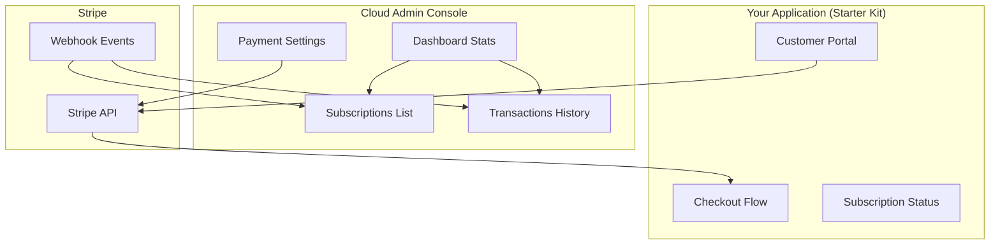
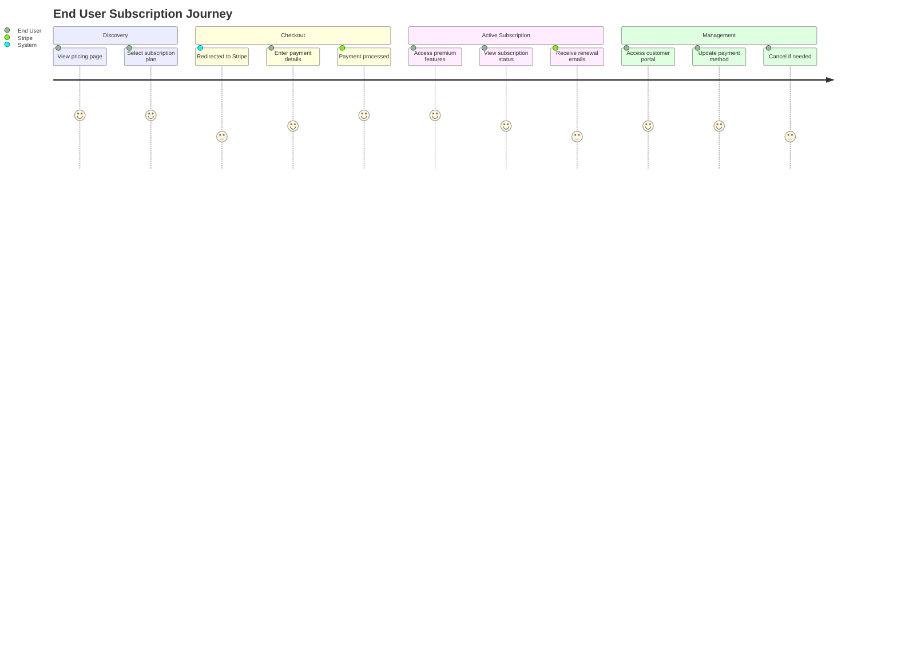

The Payment Management module in Cloud Admin provides a centralized dashboard for developers to configure, monitor, and manage billing for their AI-powered applications. Each project can have independent payment settings with separate test and live Stripe credentials.

## What is Payment Management?

Payment Management enables you to:

- **Configure Stripe Integration**: Set up API keys and webhooks per project
- **Monitor Subscriptions**: Track active, trialing, and cancelled subscriptions
- **View Transactions**: Audit payment history and identify failed charges
- **Test Before Launch**: Use Stripe test mode to validate your billing flow
- **Enable End-User Billing**: Allow your users to subscribe and manage their plans

## Enabling Payments for Your Project

<Steps>
  <Step title="Access Payment Settings">
    Navigate to **Console > Payments > Settings** or use the "Configure Payments" quick action from your dashboard.
  </Step>
  
  <Step title="Enter Stripe Credentials">
    Add your Stripe API keys for test mode first. You'll need:
    - Publishable Key (starts with `pk_test_`)
    - Secret Key (starts with `sk_test_`)
    
    <Tip>Start with test mode to validate your integration before going live.</Tip>
  </Step>
  
  <Step title="Configure Webhooks">
    Copy the webhook URL from Cloud Admin and add it to your Stripe Dashboard under **Developers > Webhooks**.
    
    Your webhook URLs follow this pattern:
    - Test: `https://api.devkit4ai.com/api/v1/payments/stripe/webhooks/{project_id}/test`
    - Live: `https://api.devkit4ai.com/api/v1/payments/stripe/webhooks/{project_id}/live`
  </Step>
  
  <Step title="Test the Integration">
    Create test subscriptions using Stripe test cards to verify your setup works correctly.
  </Step>
  
  <Step title="Go Live">
    Once testing is complete, add your live Stripe credentials and switch your application to production mode.
  </Step>
</Steps>

## Dashboard Payment Statistics

The Cloud Admin dashboard displays real-time payment metrics:

<CardGroup cols={2}>
  <Card title="Subscriptions Count" icon="users">
    Total active subscriptions across all projects or filtered by project. Includes breakdown by status (active, trialing, past_due).
  </Card>
  
  <Card title="Transactions Count" icon="receipt">
    Total payment transactions with success/failure breakdown. Helps identify payment issues quickly.
  </Card>
</CardGroup>

(((REPLACE_THIS_WITH_IMAGE: cloud-admin-payment-dashboard-stats.png: Dashboard showing subscription and transaction counts in the statistics panel)))

## Sidebar Navigation

Access payment features through the console sidebar:

- **Payments** (parent menu)
  - **Settings**: Configure Stripe credentials and webhooks
  - **Subscriptions**: View and filter subscription list
  - **Transactions**: Browse payment transaction history

(((REPLACE_THIS_WITH_IMAGE: cloud-admin-payment-sidebar.png: Sidebar navigation showing the Payments menu expanded with Settings, Subscriptions, and Transactions submenu items)))

## How End Users Use Billing

Your end users interact with payments through the Starter Kit application:

| Feature | Description | Where |
|---------|-------------|-------|
| **Subscription Checkout** | Users select a plan and complete payment | Pricing page → Stripe Checkout |
| **Subscription Status** | View current plan and billing period | User dashboard |
| **Change Plan** | Upgrade or downgrade subscription | Customer portal |
| **Update Payment Method** | Change credit card or billing info | Customer portal |
| **Cancel Subscription** | Self-service cancellation with optional feedback | Customer portal |
| **View Invoices** | Download past invoices and receipts | Customer portal |

## Billing Capabilities

The payment module supports comprehensive billing scenarios:

### Subscription Features

- **Multiple Pricing Plans**: Support tiered pricing (Free, Pro, Enterprise)
- **Trial Periods**: Offer free trials before charging
- **Proration**: Automatic credit/charge when changing plans mid-cycle
- **Cancellation Handling**: Grace period with access until period end
- **Renewal Management**: Automatic renewals with failure handling

### Payment Features

- **Secure Processing**: PCI-compliant via Stripe
- **Multiple Payment Methods**: Credit cards, bank transfers (via Stripe)
- **Invoice Generation**: Automatic invoices for each payment
- **Refund Support**: Process refunds through Stripe Dashboard
- **Tax Handling**: Stripe Tax integration ready

### Developer Features

- **Per-Project Isolation**: Each project has independent credentials
- **Test/Live Separation**: Separate keys prevent accidental production charges
- **Webhook Reliability**: Automatic retry with event deduplication
- **Audit Trail**: Complete transaction history for compliance

## Quick Actions

From the console dashboard, use these quick actions for common payment tasks:

<CardGroup cols={3}>
  <Card title="Configure Payments" icon="gear" href="/cloud-admin/payments/stripe-configuration">
    Set up or update Stripe credentials for your project
  </Card>
  
  <Card title="View Subscriptions" icon="users" href="/cloud-admin/payments/subscriptions">
    Monitor active subscriptions and their status
  </Card>
  
  <Card title="Transaction History" icon="clock-rotate-left" href="/cloud-admin/payments/transactions">
    Review payment history and identify issues
  </Card>
</CardGroup>

## Next Steps

<CardGroup cols={2}>
  <Card title="Configure Stripe" icon="stripe-s" href="/cloud-admin/payments/stripe-configuration">
    Set up API keys and webhooks for your project
  </Card>
  
  <Card title="Test Payments" icon="flask" href="/cloud-admin/payments/testing-payments">
    Learn how to test your integration before going live
  </Card>
  
  <Card title="Payment Setup Guide" icon="book" href="/getting-started/features/payment-setup">
    Complete Stripe configuration walkthrough
  </Card>
  
  <Card title="Implement Billing UI" icon="window" href="/starter-kit/features/payments">
    Add checkout and billing to your application
  </Card>
</CardGroup>
