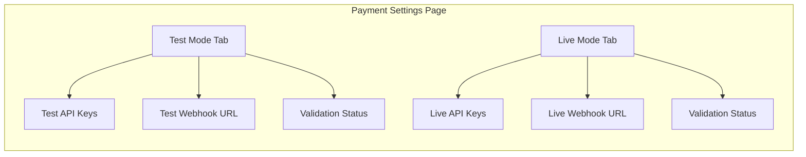
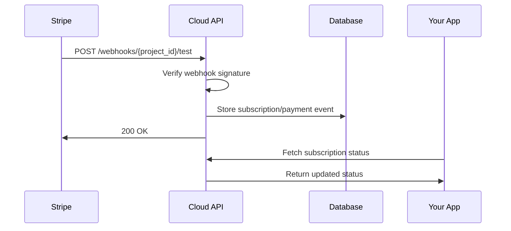

The Payment Settings page in Cloud Admin allows you to configure Stripe integration for each project. Your credentials are encrypted and stored securely, with separate configurations for test and live modes.

## Accessing Payment Settings

Navigate to **Console > Payments > Settings** or:

1. Open the Console sidebar
2. Click **Payments**
3. Select **Settings**

(((REPLACE_THIS_WITH_IMAGE: cloud-admin-payment-settings-page.png: Payment Settings page showing the configuration form with Test Mode and Live Mode sections)))

## Configuration Interface

The settings page provides a tabbed interface for managing test and live credentials:

### Test Mode Configuration

<Steps>
  <Step title="Open Test Mode Tab">
    The Test Mode tab is selected by default. Use this for development and testing.
  </Step>
  
  <Step title="Enter Publishable Key">
    Paste your Stripe test publishable key (starts with `pk_test_`).
    
    Find this in Stripe Dashboard: **Developers > API keys**
  </Step>
  
  <Step title="Enter Secret Key">
    Paste your Stripe test secret key (starts with `sk_test_`).
    
    <Warning>Keep your secret key confidential. It's encrypted before storage.</Warning>
  </Step>
  
  <Step title="Validate Credentials">
    Click **Validate** to verify your keys are correct. The system will:
    - Test API connectivity
    - Verify key permissions
    - Display validation status
  </Step>
  
  <Step title="Save Configuration">
    Click **Save** to store your encrypted credentials.
  </Step>
</Steps>

### Live Mode Configuration

Follow the same steps with your live Stripe keys:

- Publishable Key: `pk_live_...`
- Secret Key: `sk_live_...`

<Warning>
Only configure live mode after thoroughly testing with test mode. Live credentials process real payments.
</Warning>

## Webhook Configuration

Each project has unique webhook URLs that you must register in Stripe:

### Get Your Webhook URLs

The settings page displays your webhook URLs:

| Mode | URL Pattern |
|------|-------------|
| Test | `https://api.devkit4ai.com/api/v1/payments/stripe/webhooks/{project_id}/test` |
| Live | `https://api.devkit4ai.com/api/v1/payments/stripe/webhooks/{project_id}/live` |

<Tip>
Click the copy button next to each URL to copy it to your clipboard.
</Tip>

### Register Webhooks in Stripe

<Steps>
  <Step title="Open Stripe Dashboard">
    Go to [Stripe Dashboard](https://dashboard.stripe.com) and select **Developers > Webhooks**.
  </Step>
  
  <Step title="Add Endpoint">
    Click **Add endpoint** and paste your test webhook URL.
  </Step>
  
  <Step title="Select Events">
    Choose the events to listen for:
    
    **Required Events:**
    - `checkout.session.completed`
    - `customer.subscription.created`
    - `customer.subscription.updated`
    - `customer.subscription.deleted`
    - `invoice.payment_succeeded`
    - `invoice.payment_failed`
    
    <Tip>Select "All events" during development to see the full event flow.</Tip>
  </Step>
  
  <Step title="Copy Webhook Secret">
    After creating the endpoint, reveal and copy the **Signing secret** (starts with `whsec_`).
  </Step>
  
  <Step title="Update Cloud Admin">
    Return to Cloud Admin and enter the webhook signing secret in the settings form.
  </Step>
</Steps>

## Validation Status

The settings page shows the current validation status for each mode:

| Status | Meaning | Action |
|--------|---------|--------|
| ✅ **Valid** | Credentials verified successfully | Ready to use |
| ⚠️ **Not Configured** | No credentials entered | Add API keys |
| ❌ **Invalid** | Credentials failed validation | Check and re-enter keys |

(((REPLACE_THIS_WITH_IMAGE: cloud-admin-stripe-validation-status.png: Validation status indicators showing valid, not configured, and invalid states)))

## Security Considerations

<AccordionGroup>
  <Accordion title="Encrypted Storage">
    All Stripe credentials are encrypted using AES-256 before storage. Secret keys are never exposed in API responses or logs.
  </Accordion>
  
  <Accordion title="Per-Project Isolation">
    Each project has independent credentials. Compromising one project's keys doesn't affect others.
  </Accordion>
  
  <Accordion title="Test/Live Separation">
    Test and live credentials are stored separately with mode-specific webhook URLs, preventing accidental production charges during development.
  </Accordion>
  
  <Accordion title="Webhook Signature Verification">
    All incoming webhooks are verified using the signing secret to prevent unauthorized event injection.
  </Accordion>
</AccordionGroup>

## API Reference

The settings page uses these server actions:

| Action | Purpose |
|--------|---------|
| `getPaymentConfigAction` | Fetch current configuration (keys masked) |
| `updatePaymentConfigAction` | Save new credentials |
| `validateStripeCredentialsAction` | Test credential validity |
| `getStripeWebhookUrlsAction` | Get webhook URL for current project |

For API integration, see [Cloud API Payments documentation](/cloud-api/payments/stripe/get-config).

## Troubleshooting

<AccordionGroup>
  <Accordion title="Validation fails with 'Invalid API key'">
    - Verify you're using the correct key type (test vs live)
    - Check for extra whitespace when copying keys
    - Ensure the key hasn't been rolled in Stripe Dashboard
  </Accordion>
  
  <Accordion title="Webhooks not received">
    - Confirm the webhook URL is correctly registered in Stripe
    - Check Stripe Dashboard for webhook delivery attempts
    - Verify the signing secret matches the endpoint
    - Test with Stripe CLI: `stripe listen --forward-to <url>`
  </Accordion>
  
  <Accordion title="'Configuration not found' error">
    - Ensure you've saved the configuration after entering keys
    - Check that you're viewing the correct project
    - Verify the project is active
  </Accordion>
</AccordionGroup>

## Next Steps

<CardGroup cols={2}>
  <Card title="Test Your Integration" icon="flask" href="/cloud-admin/payments/testing-payments">
    Use test cards and Stripe CLI to validate your setup
  </Card>
  
  <Card title="View Subscriptions" icon="users" href="/cloud-admin/payments/subscriptions">
    Monitor subscriptions created through your integration
  </Card>
</CardGroup>
