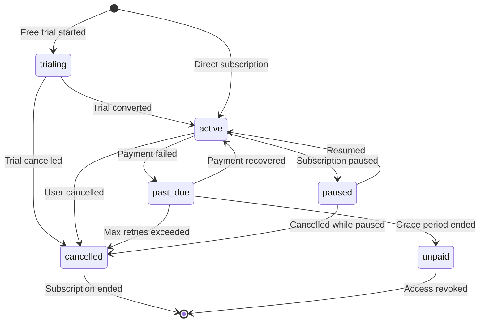
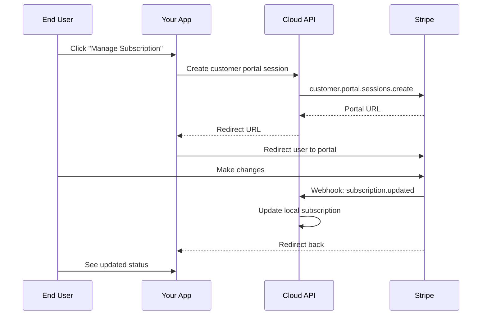

The Subscriptions page in Cloud Admin provides a comprehensive view of all end-user subscriptions across your projects. Monitor subscription health, identify issues, and understand your recurring revenue.

## Accessing Subscriptions

Navigate to **Console > Payments > Subscriptions** to view the subscriptions list.

(((REPLACE_THIS_WITH_IMAGE: cloud-admin-subscriptions-list.png: Subscriptions list page showing table with user email, plan, status, and dates)))

## Subscriptions List

The subscriptions table displays:

| Column | Description |
|--------|-------------|
| **User** | End user's email address |
| **Plan** | Subscription plan name from Stripe |
| **Status** | Current subscription status |
| **Amount** | Recurring charge amount and currency |
| **Current Period** | Billing cycle start and end dates |
| **Created** | When the subscription was created |

## Subscription Statuses



### Status Definitions

| Status | Meaning | User Access | Developer Action |
|--------|---------|-------------|------------------|
| **active** | Subscription is current and paid | ✅ Full access | None required |
| **trialing** | User is in free trial period | ✅ Full access | Monitor conversion |
| **past_due** | Payment failed, retrying | ✅ Grace period | Contact user if persistent |
| **cancelled** | User cancelled, access until period end | ⚠️ Until period end | Retention opportunity |
| **paused** | Temporarily paused | ❌ No access | Resume when ready |
| **unpaid** | Grace period ended, no payment | ❌ No access | Requires user action |
| **incomplete** | Initial payment pending | ❌ No access | Payment required |

## Filtering Subscriptions

Use the filter controls to find specific subscriptions:

### By Status

Filter to show only subscriptions with a specific status:

- All Statuses
- Active
- Trialing
- Past Due
- Cancelled
- Paused
- Unpaid

### By Project

When managing multiple projects, filter subscriptions by project:

1. Select the project from the dropdown
2. View only that project's subscriptions
3. Or select "All Projects" for a global view

### By Date Range

Filter by subscription creation date:

- Last 7 days
- Last 30 days
- Last 90 days
- Custom range

(((REPLACE_THIS_WITH_IMAGE: cloud-admin-subscription-filters.png: Filter controls showing status dropdown, project selector, and date range picker)))

## Subscription Details

Click on a subscription row to view detailed information:

<AccordionGroup>
  <Accordion title="Customer Information">
    - User ID and email
    - Stripe Customer ID
    - Customer creation date
  </Accordion>
  
  <Accordion title="Subscription Details">
    - Stripe Subscription ID
    - Plan name and price
    - Billing interval (monthly/yearly)
    - Trial dates (if applicable)
  </Accordion>
  
  <Accordion title="Billing History">
    - List of payments for this subscription
    - Payment dates and amounts
    - Success/failure status
  </Accordion>
  
  <Accordion title="Status Timeline">
    - Status changes over time
    - Cancellation reasons (if captured)
    - Pause/resume history
  </Accordion>
</AccordionGroup>

## Monitoring Subscription Health

Use the subscriptions view to monitor key metrics:

### Active Rate

```
Active Rate = (active + trialing) / total_subscriptions × 100
```

A healthy application typically maintains 85%+ active rate.

### Churn Indicators

Watch for warning signs:

| Signal | Indicates | Action |
|--------|-----------|--------|
| Rising `past_due` count | Payment collection issues | Review payment failure emails |
| Spike in `cancelled` | User dissatisfaction | Review cancellation feedback |
| Many `incomplete` | Checkout friction | Check checkout flow |
| Low trial conversion | Value proposition unclear | Improve onboarding |

### Best Practices

<CardGroup cols={2}>
  <Card title="Weekly Review" icon="calendar-week">
    Review subscription health weekly. Address past_due subscriptions promptly.
  </Card>
  
  <Card title="Retention Campaigns" icon="envelope">
    Contact users who cancelled with win-back offers before their access ends.
  </Card>
</CardGroup>

## How End Users Manage Subscriptions

End users manage their subscriptions through the Customer Portal in your application:

| Action | How End User Does It | What Happens |
|--------|---------------------|--------------|
| **View Status** | Dashboard subscription widget | Fetches status from Cloud API |
| **Change Plan** | Customer Portal → Change plan | Stripe handles proration |
| **Update Payment** | Customer Portal → Update payment | Stripe updates default method |
| **Cancel** | Customer Portal → Cancel | Access continues until period end |
| **View Invoices** | Customer Portal → Invoices | Downloads from Stripe |



## Exporting Data

Export subscription data for analysis or reporting:

1. Apply desired filters
2. Click **Export** button
3. Choose format (CSV or JSON)
4. Download the file

Exported data includes:
- All visible columns
- Applied filter criteria
- Export timestamp

## Related Views

<CardGroup cols={2}>
  <Card title="Transactions" icon="receipt" href="/cloud-admin/payments/transactions">
    View individual payment transactions for subscriptions
  </Card>
  
  <Card title="Statistics" icon="chart-bar" href="/cloud-admin/console/statistics">
    See aggregated subscription metrics on your dashboard
  </Card>
</CardGroup>

## Troubleshooting

<AccordionGroup>
  <Accordion title="Subscription not appearing">
    - Verify webhook is correctly configured for `customer.subscription.created`
    - Check Stripe Dashboard for webhook delivery status
    - Ensure the subscription was created for the correct project
  </Accordion>
  
  <Accordion title="Status out of sync">
    - Webhook may have failed delivery; check Stripe Dashboard
    - Manually trigger a resend from Stripe's webhook logs
    - Subscription status updates on next webhook event
  </Accordion>
  
  <Accordion title="Missing user email">
    - User may have been created without email in Stripe
    - Check the Stripe Customer record
    - Customer email is pulled from Stripe metadata
  </Accordion>
</AccordionGroup>

## Next Steps

<CardGroup cols={2}>
  <Card title="View Transactions" icon="receipt" href="/cloud-admin/payments/transactions">
    Audit payment history for your subscriptions
  </Card>
  
  <Card title="Configure Stripe" icon="gear" href="/cloud-admin/payments/stripe-configuration">
    Update payment settings if needed
  </Card>
</CardGroup>
