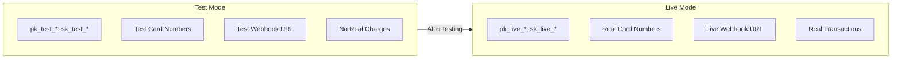
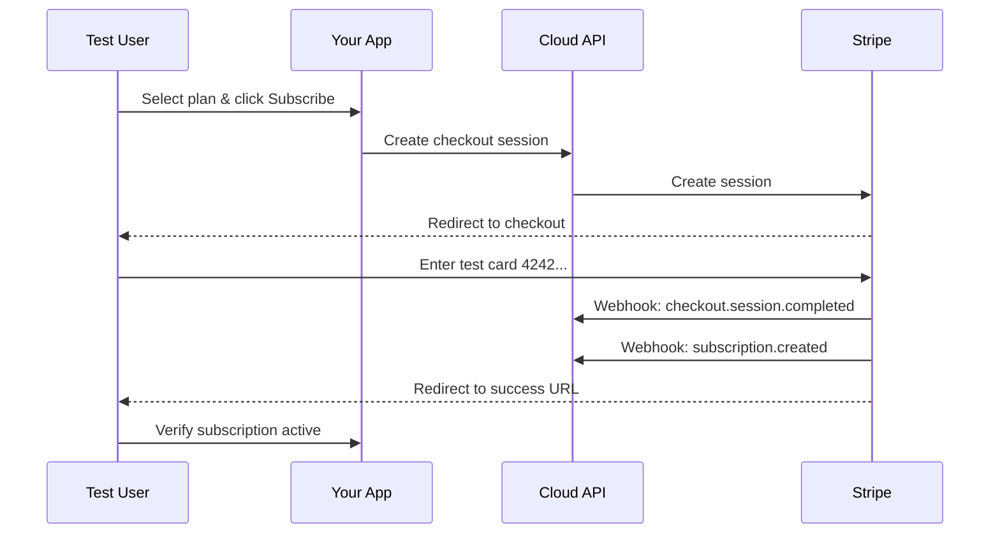

Before processing real payments, thoroughly test your integration using Stripe's test mode. This guide covers the complete testing workflow from local development to production readiness.

## Test Mode vs Live Mode



| Aspect | Test Mode | Live Mode |
|--------|-----------|-----------|
| **API Keys** | `pk_test_*`, `sk_test_*` | `pk_live_*`, `sk_live_*` |
| **Card Numbers** | Stripe test cards | Real credit cards |
| **Charges** | No real money | Real transactions |
| **Webhook URL** | `.../webhooks/{id}/test` | `.../webhooks/{id}/live` |

## Development Testing Workflow

### Step 1: Configure Test Mode

In Cloud Admin, navigate to **Payments > Settings** and enter your test credentials:

<Steps>
  <Step title="Get Test Keys from Stripe">
    Go to [Stripe Dashboard](https://dashboard.stripe.com) > **Developers** > **API keys**
    
    Copy:
    - Publishable key: `pk_test_...`
    - Secret key: `sk_test_...`
  </Step>
  
  <Step title="Enter Keys in Cloud Admin">
    Paste both keys in the Test Mode section and click **Validate**.
  </Step>
  
  <Step title="Copy Webhook URL">
    Copy the test webhook URL displayed on the settings page.
  </Step>
</Steps>

### Step 2: Set Up Local Webhook Testing

Use Stripe CLI to forward webhooks to your local development environment:

```bash
# Install Stripe CLI
brew install stripe/stripe-cli/stripe

# Login to Stripe
stripe login

# Forward webhooks to Cloud API
stripe listen --forward-to https://api.devkit4ai.com/api/v1/payments/stripe/webhooks/{your-project-id}/test
```

<Note>
Replace `{your-project-id}` with your actual project UUID from Cloud Admin.
</Note>

The CLI will display a webhook signing secret:

```
Ready! Your webhook signing secret is whsec_...
```

Add this secret to your Cloud Admin webhook configuration.

### Step 3: Trigger Test Events

Use Stripe CLI to simulate events:

```bash
# Trigger a checkout completion
stripe trigger checkout.session.completed

# Trigger subscription lifecycle events
stripe trigger customer.subscription.created
stripe trigger customer.subscription.updated
stripe trigger invoice.payment_succeeded

# Trigger payment failure
stripe trigger invoice.payment_failed
```

## Test Card Numbers

Use these Stripe test cards to simulate various scenarios:

### Successful Payments

| Card Number | Description |
|-------------|-------------|
| `4242 4242 4242 4242` | Standard successful payment |
| `4000 0025 0000 3155` | Requires 3D Secure authentication |
| `5555 5555 5555 4444` | Mastercard (successful) |
| `3782 822463 10005` | American Express (successful) |

### Failed Payments

| Card Number | Failure Type |
|-------------|--------------|
| `4000 0000 0000 0002` | Card declined |
| `4000 0000 0000 9995` | Insufficient funds |
| `4000 0000 0000 9987` | Lost card |
| `4000 0000 0000 9979` | Stolen card |
| `4000 0000 0000 0069` | Expired card |
| `4000 0000 0000 0127` | Incorrect CVC |

### Special Scenarios

| Card Number | Scenario |
|-------------|----------|
| `4000 0027 6000 3184` | Requires authentication (fails if not completed) |
| `4000 0000 0000 3220` | 3D Secure 2 required |
| `4000 0000 0000 0341` | Attach payment method fails |

<Tip>
For all test cards, use any future expiry date and any 3-digit CVC.
</Tip>

## Testing Subscription Scenarios

### New Subscription Flow



<Steps>
  <Step title="Start Subscription">
    In your app, navigate to the pricing page and select a plan.
  </Step>
  
  <Step title="Complete Checkout">
    Use test card `4242 4242 4242 4242` with any future date and CVC.
  </Step>
  
  <Step title="Verify in Cloud Admin">
    Check **Payments > Subscriptions** - new subscription should appear.
  </Step>
  
  <Step title="Verify in Stripe">
    Check Stripe Dashboard > Customers > Your test customer.
  </Step>
</Steps>

### Test Plan Changes

```bash
# Simulate upgrade (proration charge)
stripe trigger customer.subscription.updated

# Check Cloud Admin for updated subscription
```

### Test Payment Failure

<Steps>
  <Step title="Create Subscription">
    Complete checkout with `4242 4242 4242 4242`.
  </Step>
  
  <Step title="Update to Failing Card">
    In Stripe Dashboard, update the customer's payment method to `4000 0000 0000 0341`.
  </Step>
  
  <Step title="Trigger Invoice">
    ```bash
    stripe trigger invoice.payment_failed
    ```
  </Step>
  
  <Step title="Verify Status">
    Check **Payments > Subscriptions** - status should change to `past_due`.
  </Step>
</Steps>

### Test Cancellation

<Steps>
  <Step title="Cancel via Customer Portal">
    In your app, open the Customer Portal and cancel the subscription.
  </Step>
  
  <Step title="Verify Webhook">
    Check Stripe CLI output for `customer.subscription.updated` with cancel_at_period_end.
  </Step>
  
  <Step title="Check Cloud Admin">
    Subscription should show as `cancelled` with access until period end.
  </Step>
</Steps>

## Monitoring Test Events

### Stripe CLI Output

Watch the CLI for incoming webhooks:

```
2024-01-15 14:30:22  --> checkout.session.completed [evt_...]
2024-01-15 14:30:22  <-- 200 OK [POST] took 245ms
2024-01-15 14:30:23  --> customer.subscription.created [evt_...]
2024-01-15 14:30:23  <-- 200 OK [POST] took 189ms
```

### Cloud Admin Dashboard

After test events:

1. **Statistics** - Verify subscription and transaction counts update
2. **Subscriptions** - New subscription appears in the list
3. **Transactions** - Payment record shows in transaction history

### Stripe Dashboard

Check webhook logs for delivery status:

1. Go to **Developers > Webhooks**
2. Select your test endpoint
3. View recent deliveries and response codes

(((REPLACE_THIS_WITH_IMAGE: cloud-admin-testing-stripe-webhook-logs.png: Stripe Dashboard webhook logs showing successful delivery attempts)))

## Testing Checklist

Use this checklist before going live:

<Steps>
  <Step title="Basic Checkout">
    - [ ] Successful payment with `4242 4242 4242 4242`
    - [ ] Subscription created in Cloud Admin
    - [ ] User sees active subscription in dashboard
  </Step>
  
  <Step title="Payment Failures">
    - [ ] Declined card shows appropriate error
    - [ ] Insufficient funds triggers retry
    - [ ] Subscription goes to `past_due` correctly
  </Step>
  
  <Step title="Subscription Management">
    - [ ] Plan upgrade creates proration charge
    - [ ] Plan downgrade creates proration credit
    - [ ] Cancellation marks subscription correctly
    - [ ] Uncancellation works if before period end
  </Step>
  
  <Step title="Customer Portal">
    - [ ] User can access portal
    - [ ] Payment method update works
    - [ ] Invoice download works
  </Step>
  
  <Step title="Webhooks">
    - [ ] All expected events received and processed
    - [ ] Signature validation working
    - [ ] Failed webhook delivery alerts configured
  </Step>
</Steps>

## Going Live Checklist

When testing is complete, prepare for production:

<Steps>
  <Step title="Configure Live Credentials">
    In Cloud Admin: **Payments > Settings > Live Mode**
    
    Enter your live Stripe keys (`pk_live_*`, `sk_live_*`).
  </Step>
  
  <Step title="Create Live Webhook">
    In Stripe Dashboard, create a new webhook endpoint with your live URL:
    
    `https://api.devkit4ai.com/api/v1/payments/stripe/webhooks/{project_id}/live`
  </Step>
  
  <Step title="Update Environment">
    Ensure your deployed application uses the live mode configuration.
  </Step>
  
  <Step title="Make a Real Test">
    Process a small real transaction (e.g., $1) and immediately refund it to verify the live integration.
  </Step>
  
  <Step title="Monitor First Customers">
    Watch the first few real customers closely:
    - Verify webhooks are received
    - Confirm subscription status updates
    - Check email receipts are sent
  </Step>
</Steps>

<Warning>
Never use live credentials in development. Keep test and live environments completely separate.
</Warning>

## Troubleshooting Tests

<AccordionGroup>
  <Accordion title="Webhooks not received locally">
    - Verify Stripe CLI is running: `stripe listen --forward-to ...`
    - Check the forwarding URL is correct
    - Ensure no firewall blocking outbound connections
    - Try `stripe listen --print-json` for detailed output
  </Accordion>
  
  <Accordion title="Signature verification failed">
    - Use the webhook secret from the current `stripe listen` session
    - Secrets change each time you restart Stripe CLI
    - For persistent secrets, create an endpoint in Stripe Dashboard
  </Accordion>
  
  <Accordion title="Test payment not appearing">
    - Check webhook delivery in Stripe Dashboard
    - Verify the project_id in the webhook URL matches your project
    - Check Cloud API logs for processing errors
  </Accordion>
  
  <Accordion title="3D Secure not triggering">
    - Use card `4000 0025 0000 3155` which requires authentication
    - Ensure your checkout session has correct billing address fields
  </Accordion>
</AccordionGroup>

## Related Documentation

<CardGroup cols={2}>
  <Card title="Payment Setup" icon="gear" href="/getting-started/features/payment-setup">
    Complete payment integration guide
  </Card>
  
  <Card title="Monitor Subscriptions" icon="users" href="/cloud-admin/payments/subscriptions">
    View subscriptions created during testing
  </Card>
  
  <Card title="Subscription Billing" icon="repeat" href="/getting-started/features/subscription-billing">
    Subscription lifecycle and billing workflows
  </Card>
  
  <Card title="Stripe Tutorial" icon="graduation-cap" href="/tutorials/integrations/stripe-payments">
    Step-by-step implementation guide
  </Card>
</CardGroup>
