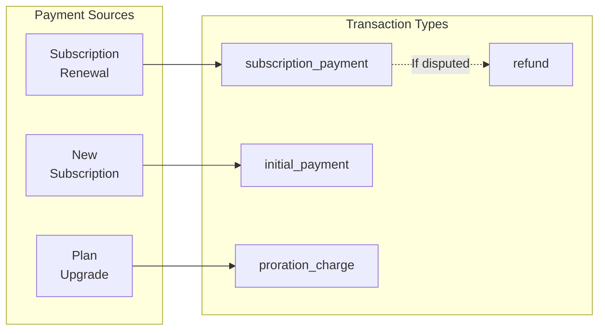
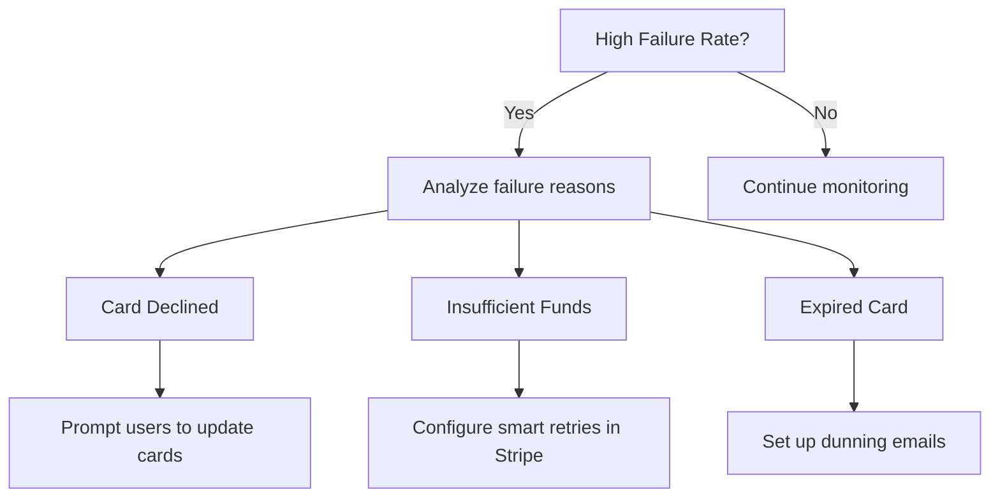

The Transactions page in Cloud Admin provides a complete audit trail of all payment activity. Monitor successful payments, identify failures, and track refunds across your projects.

## Accessing Transactions

Navigate to **Console > Payments > Transactions** to view the transaction history.

(((REPLACE_THIS_WITH_IMAGE: cloud-admin-transactions-list.png: Transactions list page showing table with date, user, amount, type, and status columns)))

## Transactions List

The transactions table displays:

| Column | Description |
|--------|-------------|
| **Date** | Transaction timestamp |
| **User** | End user's email address |
| **Amount** | Payment amount and currency |
| **Type** | Transaction type (subscription, one-time, refund) |
| **Status** | Payment status (succeeded, failed, pending) |
| **Invoice** | Stripe invoice ID (linked to Stripe Dashboard) |

## Transaction Types



| Type | Description | When It Occurs |
|------|-------------|----------------|
| `subscription_payment` | Recurring subscription charge | Monthly/yearly renewal |
| `initial_payment` | First payment for new subscription | Checkout completion |
| `proration_charge` | Prorated amount for plan change | Mid-cycle upgrade |
| `proration_credit` | Credit for unused portion | Mid-cycle downgrade |
| `refund` | Money returned to customer | Manual refund in Stripe |

## Transaction Statuses

| Status | Meaning | Icon |
|--------|---------|------|
| **succeeded** | Payment processed successfully | ✅ |
| **failed** | Payment attempt failed | ❌ |
| **pending** | Payment initiated, awaiting confirmation | ⏳ |
| **refunded** | Full refund processed | ↩️ |
| **partially_refunded** | Partial refund processed | ↩️ |
| **disputed** | Customer disputed the charge | ⚠️ |

## Filtering Transactions

### By Status

Filter to find specific transaction outcomes:

- All Statuses
- Succeeded
- Failed
- Pending
- Refunded
- Disputed

### By Type

Focus on specific transaction types:

- All Types
- Subscription Payments
- Initial Payments
- Proration Charges
- Refunds

### By Project

Select a specific project to view only its transactions, or "All Projects" for a global view.

### By Date Range

Common date filters:

- Today
- Last 7 days
- Last 30 days
- Last 90 days
- Custom range

(((REPLACE_THIS_WITH_IMAGE: cloud-admin-transaction-filters.png: Filter panel with status, type, project, and date range selectors)))

## Transaction Details

Click on a transaction row to view detailed information:

<AccordionGroup>
  <Accordion title="Payment Details">
    - Transaction ID
    - Stripe Payment Intent ID
    - Stripe Invoice ID
    - Amount (before and after fees)
    - Currency
  </Accordion>
  
  <Accordion title="Customer Information">
    - User ID and email
    - Stripe Customer ID
    - Payment method (card type, last 4 digits)
  </Accordion>
  
  <Accordion title="Subscription Link">
    - Associated subscription (if applicable)
    - Plan name
    - Billing period this payment covers
  </Accordion>
  
  <Accordion title="Failure Details">
    For failed transactions:
    - Failure reason (card declined, insufficient funds, etc.)
    - Failure code
    - Decline code from card network
  </Accordion>
</AccordionGroup>

## Monitoring Payment Health

### Key Metrics

Track these metrics from your transaction data:

| Metric | Formula | Healthy Range |
|--------|---------|---------------|
| **Success Rate** | succeeded / total × 100 | > 95% |
| **Failure Rate** | failed / total × 100 | < 5% |
| **Average Transaction** | sum(amounts) / count | Varies by plan |
| **Refund Rate** | refunds / total × 100 | < 2% |

### Identifying Issues



### Common Payment Failure Reasons

| Failure Code | Meaning | Resolution |
|--------------|---------|------------|
| `card_declined` | Generic decline | User should try another card |
| `insufficient_funds` | Not enough balance | Stripe retries automatically |
| `expired_card` | Card expired | Send card update reminder |
| `incorrect_cvc` | Wrong security code | User re-enters card details |
| `processing_error` | Temporary issue | Automatic retry |
| `authentication_required` | 3D Secure needed | Redirect to authentication |

## How End Users See Transactions

End users access their payment history through the Customer Portal:

| View | Access | Shows |
|------|--------|-------|
| **Dashboard Widget** | User dashboard | Recent transactions summary |
| **Customer Portal** | "Manage Billing" link | Full invoice history |
| **Email Receipts** | Automatic from Stripe | Per-transaction receipts |

### Starter Kit Integration

The Starter Kit displays transaction information via:

```typescript
// Fetch user's payments
const payments = await getMyPaymentsAction();

// Returns array of:
// - amount, currency
// - status
// - created_at
// - invoice_url (link to Stripe-hosted invoice)
```

## Exporting Transactions

Export transaction data for accounting or analysis:

1. Apply filters as needed
2. Click **Export** button
3. Select format:
   - **CSV**: For spreadsheets and accounting software
   - **JSON**: For programmatic processing
4. Download includes all filtered transactions with:
   - Transaction ID
   - Date and time
   - User email
   - Amount and currency
   - Type and status
   - Stripe references

## Reconciliation

Match Cloud Admin transactions with Stripe Dashboard:

<Steps>
  <Step title="Export from Cloud Admin">
    Export transactions for your reconciliation period.
  </Step>
  
  <Step title="Export from Stripe">
    In Stripe Dashboard, go to **Payments** and export the same period.
  </Step>
  
  <Step title="Match by Payment Intent ID">
    Use the Payment Intent ID to match records between systems.
  </Step>
  
  <Step title="Verify Amounts">
    Confirm amounts match (accounting for Stripe fees if comparing net).
  </Step>
</Steps>

<Note>
Cloud Admin shows gross amounts. For net amounts after Stripe fees, refer to your Stripe balance reports.
</Note>

## Troubleshooting

<AccordionGroup>
  <Accordion title="Transaction not appearing">
    - Check webhook delivery for `invoice.payment_succeeded` or `invoice.payment_failed`
    - Verify the payment was for the correct project
    - Transaction appears after webhook is processed
  </Accordion>
  
  <Accordion title="Amount mismatch">
    - Cloud Admin shows the charged amount, not net after fees
    - For proration, Stripe calculates based on billing cycle
    - Currency conversion may differ from display currency
  </Accordion>
  
  <Accordion title="Missing user information">
    - Guest checkout may have limited customer data
    - Check Stripe Customer for email and metadata
  </Accordion>
</AccordionGroup>

## Related Pages

<CardGroup cols={2}>
  <Card title="Subscriptions" icon="users" href="/cloud-admin/payments/subscriptions">
    View subscription status for your users
  </Card>
  
  <Card title="Subscription Lifecycle" icon="repeat" href="/getting-started/features/subscription-billing">
    Understand all billing workflows and events
  </Card>
  
  <Card title="Payment Setup" icon="gear" href="/getting-started/features/payment-setup">
    Configure payment integration for your project
  </Card>
  
  <Card title="Implement Billing UI" icon="window" href="/starter-kit/features/payments">
    Add billing components to your application
  </Card>
</CardGroup>
