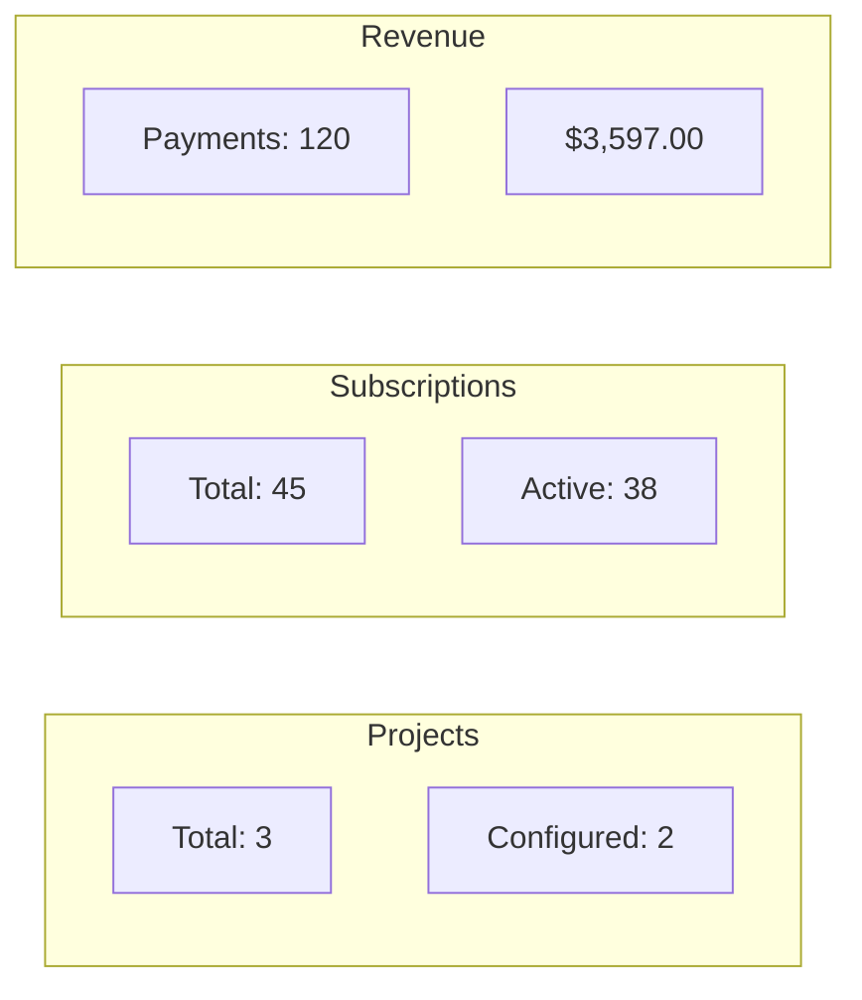

Retrieve aggregated payment statistics across all projects owned by the authenticated developer. Includes subscription counts, payment totals, and revenue metrics.

## Authentication

<Note>
This endpoint requires developer authentication via OAuth2 Bearer Token.
</Note>

## Query Parameters

<ParamField query="test_mode" type="boolean" default="true">
  Include test mode data in statistics. Set to `false` for live mode only.
</ParamField>

## Response

<ResponseField name="total_projects" type="integer">
  Total number of projects owned by the developer
</ResponseField>

<ResponseField name="projects_with_config" type="integer">
  Number of projects with Stripe configuration
</ResponseField>

<ResponseField name="projects_with_test" type="integer">
  Number of projects with test mode credentials
</ResponseField>

<ResponseField name="projects_with_live" type="integer">
  Number of projects with live mode credentials
</ResponseField>

<ResponseField name="total_subscriptions" type="integer">
  Total number of subscriptions across all projects
</ResponseField>

<ResponseField name="active_subscriptions" type="integer">
  Number of currently active subscriptions
</ResponseField>

<ResponseField name="total_payments" type="integer">
  Total number of payment transactions
</ResponseField>

<ResponseField name="successful_payments" type="integer">
  Number of successful payments
</ResponseField>

<ResponseField name="total_revenue_cents" type="integer">
  Total revenue in cents
</ResponseField>

<ResponseField name="currency" type="string" default="usd">
  Currency for revenue (lowercase ISO code)
</ResponseField>

## Example Request

```bash
curl "https://api.devkit4ai.com/api/v1/payments/stats?test_mode=true" \
  -H "Authorization: Bearer {developer_jwt}"
```

## Example Response

```json
{
  "total_projects": 3,
  "projects_with_config": 2,
  "projects_with_test": 2,
  "projects_with_live": 1,
  "total_subscriptions": 45,
  "active_subscriptions": 38,
  "total_payments": 127,
  "successful_payments": 120,
  "total_revenue_cents": 359700,
  "currency": "usd"
}
```

## Formatting Revenue

To display revenue as currency:

```javascript
const revenue = stats.total_revenue_cents / 100;
const formatted = new Intl.NumberFormat('en-US', {
  style: 'currency',
  currency: stats.currency.toUpperCase()
}).format(revenue);

// $3,597.00
```

## Dashboard Metrics

Use these statistics to build a developer dashboard:



(((REPLACE_THIS_WITH_IMAGE: cloud-admin-payment-stats-dashboard.png: Developer dashboard showing payment statistics with subscription counts, revenue chart, and project configuration status)))

## Key Metrics Explained

| Metric | Description |
|--------|-------------|
| `active_subscriptions` | Subscriptions with status `active` or `trialing` |
| `successful_payments` | Payments with status `succeeded` |
| `total_revenue_cents` | Sum of all successful payment amounts |

<Warning>
When `test_mode=true`, statistics include both test and live data. Set `test_mode=false` to see only production metrics.
</Warning>

## Related Pages

<CardGroup cols={2}>
  <Card title="List Subscriptions" icon="list" href="/cloud-api/payments/list-subscriptions">
    View all subscriptions
  </Card>
  <Card title="List Transactions" icon="receipt" href="/cloud-api/payments/list-transactions">
    View payment transactions
  </Card>
  <Card title="Console Statistics" icon="gauge" href="/cloud-admin/console/statistics">
    Cloud Admin statistics view
  </Card>
</CardGroup>
