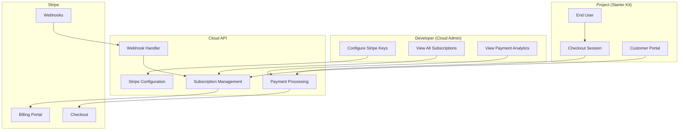
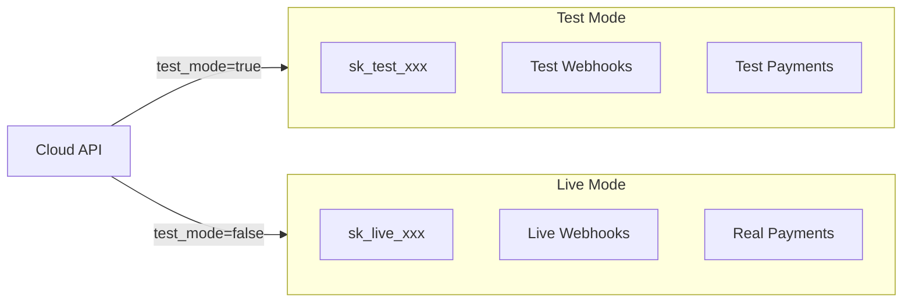

The Payments API enables developers to integrate Stripe-powered payment processing into their projects. This includes subscription management, one-time payments, customer portals, and comprehensive payment analytics.

## Architecture Overview

The payment system is designed with a multi-tenant architecture where each project can have its own Stripe configuration:



## API Groups

### Payments (Aggregated)

Cross-project payment data for developers to view all subscriptions and transactions across their projects.

| Endpoint | Method | Description |
|----------|--------|-------------|
| `/api/v1/payments/subscriptions` | GET | List all subscriptions across projects |
| `/api/v1/payments/transactions` | GET | List all payment transactions across projects |
| `/api/v1/payments/projects` | GET | List projects with payment configuration status |
| `/api/v1/payments/stats` | GET | Get aggregated payment statistics |

### Stripe Configuration

Developer-facing endpoints for configuring Stripe credentials per project.

| Endpoint | Method | Description |
|----------|--------|-------------|
| `/api/v1/payments/stripe/projects/{project_id}/config` | GET | Get Stripe configuration |
| `/api/v1/payments/stripe/projects/{project_id}/config` | PUT | Create or update Stripe configuration |
| `/api/v1/payments/stripe/projects/{project_id}/config` | DELETE | Deactivate Stripe configuration |
| `/api/v1/payments/stripe/projects/{project_id}/webhook-urls` | GET | Get webhook URLs for Stripe dashboard |
| `/api/v1/payments/stripe/projects/{project_id}/validate-credentials` | POST | Validate Stripe API credentials |
| `/api/v1/payments/stripe/projects/{project_id}/subscriptions` | GET | List project subscriptions |
| `/api/v1/payments/stripe/projects/{project_id}/payments` | GET | List project payment transactions |

### Stripe Checkout

Create Stripe checkout sessions for subscription or one-time payments.

| Endpoint | Method | Description |
|----------|--------|-------------|
| `/api/v1/payments/stripe/checkout-session` | POST | Create checkout session |

### Stripe Webhooks

Receive and process webhook events from Stripe.

| Endpoint | Method | Description |
|----------|--------|-------------|
| `/api/v1/payments/stripe/webhooks/{project_id}/{mode}` | POST | Handle Stripe webhook events |

### Stripe Subscriptions (End User)

End-user facing endpoints for managing their own subscriptions.

| Endpoint | Method | Description |
|----------|--------|-------------|
| `/api/v1/payments/stripe/my-subscription` | GET | Get current subscription |
| `/api/v1/payments/stripe/my-payments` | GET | Get payment history |
| `/api/v1/payments/stripe/customer-portal` | POST | Create customer portal session |
| `/api/v1/payments/stripe/cancel-subscription` | POST | Cancel subscription |
| `/api/v1/payments/stripe/update-subscription` | POST | Change subscription plan |

## Authentication

Payment endpoints use different authentication methods based on the user type:

| User Type | Auth Method | Header |
|-----------|-------------|--------|
| Developer | OAuth2 Bearer Token | `Authorization: Bearer {jwt}` |
| End User | HTTP Bearer Token | `Authorization: Bearer {jwt}` |
| Webhook | Stripe Signature | `Stripe-Signature: {signature}` |

## Test vs Live Mode

All Stripe endpoints support both test and live modes:

- **Test Mode**: Uses test API keys (prefix `sk_test_` / `pk_test_`), simulated payments
- **Live Mode**: Uses live API keys (prefix `sk_live_` / `pk_live_`), real payments

The `test_mode` query parameter controls which mode is used (defaults to `true` for safety).



## Quick Start

### 1. Configure Stripe Credentials

First, add your Stripe API keys to your project:

```bash
curl -X PUT https://api.devkit4ai.com/api/v1/payments/stripe/projects/{project_id}/config \
  -H "Authorization: Bearer {developer_jwt}" \
  -H "Content-Type: application/json" \
  -d '{
    "test_secret_key": "sk_test_...",
    "test_publishable_key": "pk_test_...",
    "test_webhook_secret": "whsec_..."
  }'
```

### 2. Get Webhook URLs

Configure webhooks in your Stripe dashboard:

```bash
curl https://api.devkit4ai.com/api/v1/payments/stripe/projects/{project_id}/webhook-urls \
  -H "Authorization: Bearer {developer_jwt}"
```

### 3. Create Checkout Session

Create a checkout session for end users:

```bash
curl -X POST https://api.devkit4ai.com/api/v1/payments/stripe/checkout-session \
  -H "Authorization: Bearer {end_user_jwt}" \
  -H "Content-Type: application/json" \
  -d '{
    "price_id": "price_...",
    "success_url": "https://yourapp.com/success",
    "cancel_url": "https://yourapp.com/cancel"
  }'
```

## Webhook Events

The following Stripe webhook events are processed:

| Event | Action |
|-------|--------|
| `checkout.session.completed` | Create subscription record |
| `customer.subscription.created` | Store subscription details |
| `customer.subscription.updated` | Update subscription status |
| `customer.subscription.deleted` | Mark subscription cancelled |
| `invoice.paid` | Record successful payment |
| `invoice.payment_failed` | Record failed payment |

## Related Documentation

<CardGroup cols={2}>
  <Card title="Stripe Integration Tutorial" icon="stripe" href="/tutorials/integrations/stripe-payments">
    Step-by-step guide to integrating Stripe
  </Card>
  <Card title="Cloud Admin Payments" icon="gauge" href="/cloud-admin/console/statistics">
    View payment analytics in Cloud Admin
  </Card>
  <Card title="Security Best Practices" icon="shield" href="/reference/best-practices/security">
    Secure your payment integration
  </Card>
  <Card title="Environment Variables" icon="gear" href="/reference/config/environment-variables">
    Configure payment settings
  </Card>
</CardGroup>
