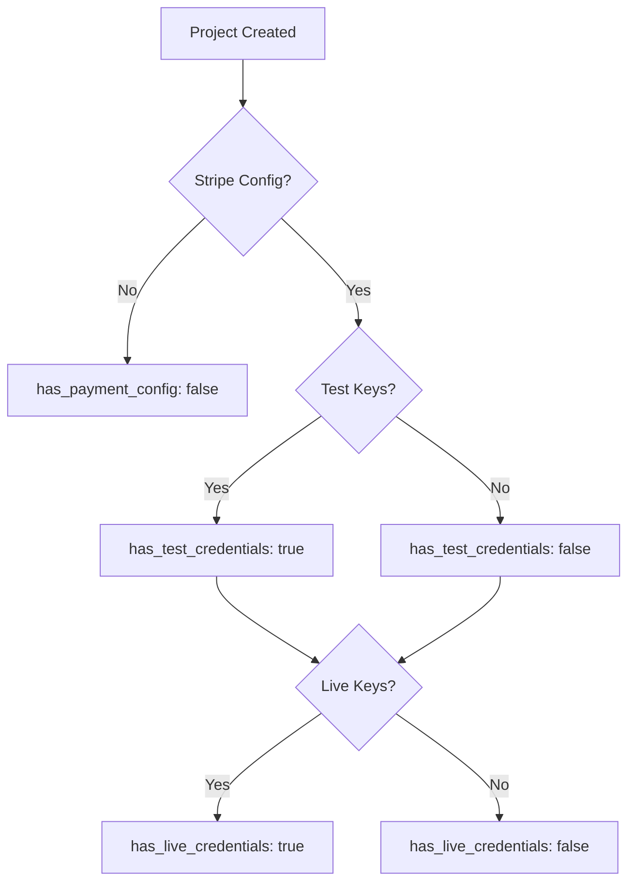

Retrieve all projects owned by the authenticated developer along with their Stripe payment configuration status. Shows whether test and/or live credentials are configured for each project.

## Authentication

<Note>
This endpoint requires developer authentication via OAuth2 Bearer Token.
</Note>

## Response

<ResponseField name="projects" type="array">
  Array of projects with payment configuration status
  
  <Expandable title="Project Payment Config">
    <ResponseField name="id" type="string (UUID)">
      Project ID
    </ResponseField>
    <ResponseField name="name" type="string">
      Project name
    </ResponseField>
    <ResponseField name="description" type="string">
      Project description
    </ResponseField>
    <ResponseField name="has_payment_config" type="boolean">
      Whether any Stripe configuration exists
    </ResponseField>
    <ResponseField name="has_test_credentials" type="boolean">
      Whether test mode credentials are configured
    </ResponseField>
    <ResponseField name="has_live_credentials" type="boolean">
      Whether live mode credentials are configured
    </ResponseField>
    <ResponseField name="test_configured_at" type="string (datetime)">
      When test credentials were last configured
    </ResponseField>
    <ResponseField name="live_configured_at" type="string (datetime)">
      When live credentials were last configured
    </ResponseField>
    <ResponseField name="is_active" type="boolean">
      Whether the project is active
    </ResponseField>
    <ResponseField name="created_at" type="string (datetime)">
      When the project was created
    </ResponseField>
  </Expandable>
</ResponseField>

<ResponseField name="total" type="integer">
  Total number of projects
</ResponseField>

## Example Request

```bash
curl "https://api.devkit4ai.com/api/v1/payments/projects" \
  -H "Authorization: Bearer {developer_jwt}"
```

## Example Response

```json
{
  "projects": [
    {
      "id": "550e8400-e29b-41d4-a716-446655440000",
      "name": "My SaaS App",
      "description": "AI-powered image generation platform",
      "has_payment_config": true,
      "has_test_credentials": true,
      "has_live_credentials": false,
      "test_configured_at": "2026-01-10T14:30:00Z",
      "live_configured_at": null,
      "is_active": true,
      "created_at": "2026-01-01T00:00:00Z"
    },
    {
      "id": "660e8400-e29b-41d4-a716-446655440001",
      "name": "Beta Project",
      "description": null,
      "has_payment_config": false,
      "has_test_credentials": false,
      "has_live_credentials": false,
      "test_configured_at": null,
      "live_configured_at": null,
      "is_active": true,
      "created_at": "2026-01-15T00:00:00Z"
    }
  ],
  "total": 2
}
```

## Configuration Status

The payment configuration status helps you understand which projects are ready for payments:



<Tip>
Start with test credentials for development and testing, then add live credentials when you're ready to accept real payments.
</Tip>

## Related Pages

<CardGroup cols={2}>
  <Card title="Get Stripe Config" icon="gear" href="/cloud-api/payments/stripe/get-config">
    View detailed Stripe configuration
  </Card>
  <Card title="Update Stripe Config" icon="pen" href="/cloud-api/payments/stripe/update-config">
    Configure Stripe credentials
  </Card>
  <Card title="List Projects" icon="folder" href="/cloud-api/projects/list">
    View all projects
  </Card>
</CardGroup>
