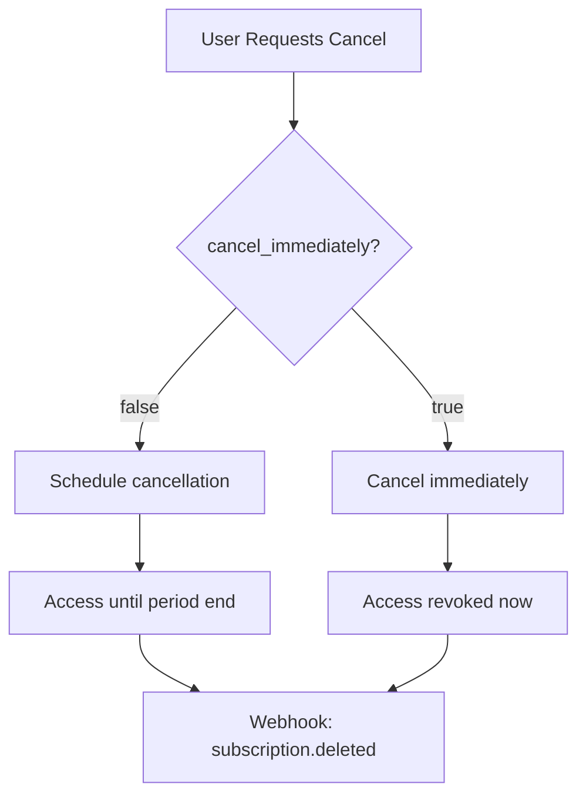

Cancel the authenticated user's active subscription. Can cancel immediately or at the end of the current billing period.

## Authentication

<Note>
This endpoint requires end user authentication via HTTP Bearer Token with project scope.
</Note>

## Query Parameters

<ParamField query="test_mode" type="boolean" default="true">
  Use test mode credentials. Set to `false` for production.
</ParamField>

## Request Body

<ParamField body="cancel_immediately" type="boolean" default="false">
  If `true`, cancels the subscription immediately and revokes access. If `false`, cancels at the end of the current billing period (user retains access until then).
</ParamField>

## Response

<ResponseField name="subscription_id" type="string">
  Stripe subscription ID
</ResponseField>

<ResponseField name="status" type="string">
  New subscription status: `canceled` or `active` (will cancel at period end)
</ResponseField>

<ResponseField name="cancel_at" type="datetime">
  When the subscription will be canceled (if scheduled)
</ResponseField>

<ResponseField name="cancelled_at" type="datetime">
  When the cancellation was processed
</ResponseField>

<ResponseField name="message" type="string">
  Human-readable confirmation message
</ResponseField>

## Example Request

### Cancel at Period End (Recommended)

```bash
curl -X POST "https://api.devkit4ai.com/api/v1/payments/stripe/cancel-subscription?test_mode=true" \
  -H "Authorization: Bearer {end_user_jwt}" \
  -H "Content-Type: application/json" \
  -d '{
    "cancel_immediately": false
  }'
```

### Cancel Immediately

```bash
curl -X POST "https://api.devkit4ai.com/api/v1/payments/stripe/cancel-subscription?test_mode=true" \
  -H "Authorization: Bearer {end_user_jwt}" \
  -H "Content-Type: application/json" \
  -d '{
    "cancel_immediately": true
  }'
```

## Example Response

### Cancel at Period End

```json
{
  "subscription_id": "sub_1ABC123def456",
  "status": "active",
  "cancel_at": "2026-02-01T00:00:00Z",
  "cancelled_at": "2026-01-24T15:30:00Z",
  "message": "Subscription will be canceled at the end of the current billing period."
}
```

### Immediate Cancellation

```json
{
  "subscription_id": "sub_1ABC123def456",
  "status": "canceled",
  "cancel_at": null,
  "cancelled_at": "2026-01-24T15:30:00Z",
  "message": "Subscription has been canceled immediately."
}
```

## Cancellation Options



<Tip>
**Best Practice:** Default to `cancel_immediately: false` to give users time to reconsider or allow continued access until they've been billed for.
</Tip>

## Integration Example

```typescript
// Cancel subscription with confirmation
async function cancelSubscription(immediately: boolean = false) {
  const confirmed = await showConfirmDialog(
    immediately 
      ? 'Cancel immediately? You will lose access now.'
      : 'Cancel at period end? You will retain access until your next billing date.'
  );
  
  if (!confirmed) return;
  
  const response = await fetch('/api/cancel-subscription', {
    method: 'POST',
    headers: { 'Content-Type': 'application/json' },
    body: JSON.stringify({ cancel_immediately: immediately })
  });
  
  const result = await response.json();
  showToast(result.message);
  refreshSubscriptionStatus();
}
```

## Handling Scheduled Cancellations

When a subscription is scheduled to cancel, update your UI accordingly:

```typescript
function SubscriptionStatus({ subscription }) {
  if (subscription.cancel_at) {
    return (
      <div className="warning">
        <p>Your subscription will end on {formatDate(subscription.cancel_at)}</p>
        <button onClick={reactivateSubscription}>Keep Subscription</button>
      </div>
    );
  }
  
  return <p>Active until {formatDate(subscription.current_period_end)}</p>;
}
```

## Reactivating Canceled Subscriptions

<Warning>
To reactivate a subscription scheduled for cancellation, users should use the [Customer Portal](/cloud-api/payments/stripe/create-customer-portal) or start a new checkout.
</Warning>

## Error Responses

| Status | Description |
|--------|-------------|
| `401` | Unauthorized - Invalid or missing authentication |
| `404` | No active subscription to cancel |
| `404` | Project not found or Stripe not configured |

## Related Pages

<CardGroup cols={2}>
  <Card title="Get My Subscription" icon="user" href="/cloud-api/payments/stripe/get-my-subscription">
    Check subscription status
  </Card>
  <Card title="Update Subscription" icon="arrows-rotate" href="/cloud-api/payments/stripe/update-subscription">
    Change plans instead
  </Card>
  <Card title="Customer Portal" icon="user-gear" href="/cloud-api/payments/stripe/create-customer-portal">
    Let user manage cancellation
  </Card>
</CardGroup>
