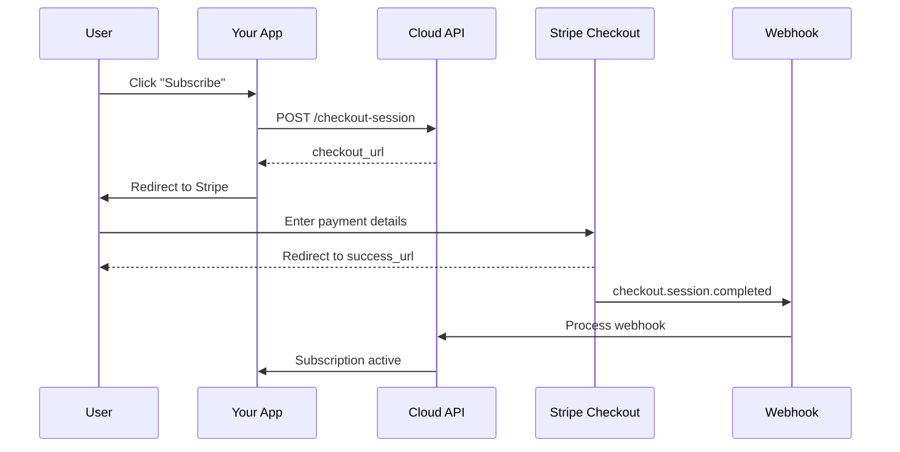
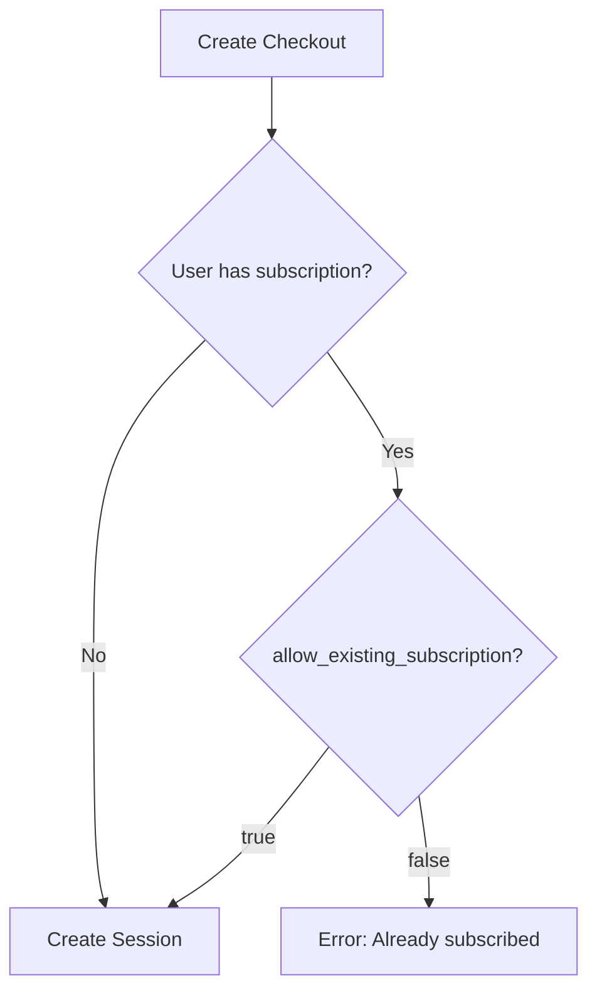

Create a Stripe Checkout session to redirect users to Stripe's hosted checkout page. Supports both subscription and one-time payment modes.

## Authentication

<Note>
This endpoint requires end user authentication via HTTP Bearer Token with project scope.
</Note>

## Query Parameters

<ParamField query="test_mode" type="boolean" default="true">
  Use test mode credentials. Set to `false` for production payments.
</ParamField>

## Request Body

<ParamField body="price_id" type="string" required>
  Stripe Price ID for the product or subscription (e.g., `price_1ABC...`)
</ParamField>

<ParamField body="success_url" type="string" required>
  URL to redirect after successful payment. Include `{CHECKOUT_SESSION_ID}` placeholder.
</ParamField>

<ParamField body="cancel_url" type="string" required>
  URL to redirect if user cancels checkout
</ParamField>

<ParamField body="mode" type="string" default="subscription">
  Checkout mode: `subscription` or `payment` (one-time)
</ParamField>

<ParamField body="quantity" type="integer" default="1">
  Quantity of items (minimum: 1)
</ParamField>

<ParamField body="metadata" type="object">
  Additional metadata to attach to the checkout session
</ParamField>

<ParamField body="allow_existing_subscription" type="boolean" default="false">
  If `true`, allows checkout even if user already has an active subscription
</ParamField>

## Response

<ResponseField name="session_id" type="string">
  Stripe Checkout Session ID
</ResponseField>

<ResponseField name="checkout_url" type="string">
  URL to redirect user to Stripe Checkout
</ResponseField>

## Example Request

```bash
curl -X POST "https://api.devkit4ai.com/api/v1/payments/stripe/checkout-session?test_mode=true" \
  -H "Authorization: Bearer {end_user_jwt}" \
  -H "Content-Type: application/json" \
  -d '{
    "price_id": "price_1ABC123def456",
    "success_url": "https://myapp.com/success?session_id={CHECKOUT_SESSION_ID}",
    "cancel_url": "https://myapp.com/pricing",
    "mode": "subscription"
  }'
```

## Example Response

```json
{
  "session_id": "cs_test_a1b2c3d4e5f6g7h8i9j0",
  "checkout_url": "https://checkout.stripe.com/c/pay/cs_test_a1b2c3d4e5f6g7h8i9j0"
}
```

## Checkout Flow



## Integration Example

### Frontend (React)

```typescript
// Pricing button component
const SubscribeButton = ({ priceId }: { priceId: string }) => {
  const handleSubscribe = async () => {
    const response = await fetch('/api/checkout', {
      method: 'POST',
      headers: { 'Content-Type': 'application/json' },
      body: JSON.stringify({
        price_id: priceId,
        success_url: `${window.location.origin}/success?session_id={CHECKOUT_SESSION_ID}`,
        cancel_url: `${window.location.origin}/pricing`
      })
    });
    
    const { checkout_url } = await response.json();
    window.location.href = checkout_url;
  };

  return <button onClick={handleSubscribe}>Subscribe</button>;
};
```

### Backend (Next.js API Route)

```typescript
// app/api/checkout/route.ts
export async function POST(request: Request) {
  const body = await request.json();
  
  const response = await fetch(
    `${process.env.NEXT_PUBLIC_API_URL}/api/v1/payments/stripe/checkout-session?test_mode=${process.env.STRIPE_TEST_MODE}`,
    {
      method: 'POST',
      headers: {
        'Authorization': `Bearer ${getUserToken()}`,
        'Content-Type': 'application/json'
      },
      body: JSON.stringify(body)
    }
  );
  
  return Response.json(await response.json());
}
```

## Existing Subscription Handling

By default, users with active subscriptions cannot start a new checkout:



<Tip>
Set `allow_existing_subscription: true` for upgrade/downgrade flows, or use the [Update Subscription](/cloud-api/payments/stripe/update-subscription) endpoint instead.
</Tip>

## Price IDs

Get Price IDs from your Stripe Dashboard:

1. Navigate to **Products > Pricing**
2. Click on a price to view its ID

(((REPLACE_THIS_WITH_IMAGE: stripe-dashboard-price-id.png: Stripe Dashboard showing a product's pricing section with Price ID visible)))

## Error Responses

| Status | Description |
|--------|-------------|
| `400` | User already has active subscription (when `allow_existing_subscription: false`) |
| `401` | Unauthorized - Invalid or missing authentication |
| `404` | Project not found or Stripe not configured |
| `422` | Validation error - Invalid price_id or URLs |

## Related Pages

<CardGroup cols={2}>
  <Card title="Get My Subscription" icon="user" href="/cloud-api/payments/stripe/get-my-subscription">
    Check user's subscription status
  </Card>
  <Card title="Stripe Webhook" icon="bolt" href="/cloud-api/payments/stripe/stripe-webhook">
    Handle checkout completion
  </Card>
  <Card title="Update Subscription" icon="arrows-rotate" href="/cloud-api/payments/stripe/update-subscription">
    Change subscription plans
  </Card>
</CardGroup>
