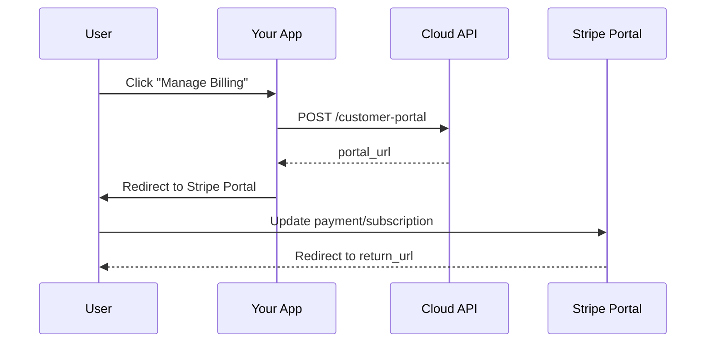

Create a Stripe Customer Portal session that lets users manage their subscriptions, payment methods, and billing details directly in Stripe's hosted interface.

## Authentication

<Note>
This endpoint requires end user authentication via HTTP Bearer Token with project scope.
</Note>

## Query Parameters

<ParamField query="test_mode" type="boolean" default="true">
  Use test mode credentials. Set to `false` for production.
</ParamField>

## Request Body

<ParamField body="return_url" type="string" required>
  URL to redirect user after they exit the portal
</ParamField>

## Response

<ResponseField name="portal_url" type="string">
  URL to redirect user to the Stripe Customer Portal
</ResponseField>

## Example Request

```bash
curl -X POST "https://api.devkit4ai.com/api/v1/payments/stripe/customer-portal?test_mode=true" \
  -H "Authorization: Bearer {end_user_jwt}" \
  -H "Content-Type: application/json" \
  -d '{
    "return_url": "https://myapp.com/account/billing"
  }'
```

## Example Response

```json
{
  "portal_url": "https://billing.stripe.com/p/session/test_YWNjdF8xQUJDMTIzZG"
}
```

## Portal Flow



## Portal Capabilities

The Customer Portal allows users to:

| Capability | Description |
|------------|-------------|
| **View Invoices** | See and download past invoices |
| **Update Payment Method** | Add or change credit/debit cards |
| **Cancel Subscription** | End their subscription |
| **Change Plan** | Upgrade or downgrade (if configured) |
| **Update Billing Info** | Change billing email and address |

<Tip>
Configure portal features in **Stripe Dashboard > Settings > Customer Portal**.
</Tip>

## Integration Example

```typescript
// Manage billing button component
function ManageBillingButton() {
  const [loading, setLoading] = useState(false);

  const handleManageBilling = async () => {
    setLoading(true);
    try {
      const response = await fetch('/api/customer-portal', {
        method: 'POST',
        headers: { 'Content-Type': 'application/json' },
        body: JSON.stringify({
          return_url: window.location.href
        })
      });
      
      const { portal_url } = await response.json();
      window.location.href = portal_url;
    } catch (error) {
      console.error('Failed to open portal:', error);
    } finally {
      setLoading(false);
    }
  };

  return (
    <button onClick={handleManageBilling} disabled={loading}>
      {loading ? 'Loading...' : 'Manage Billing'}
    </button>
  );
}
```

## Portal Configuration

Configure allowed actions in Stripe Dashboard:

(((REPLACE_THIS_WITH_IMAGE: stripe-customer-portal-settings.png: Stripe Dashboard Customer Portal configuration page showing subscription and invoice settings)))

## Prerequisites

<Warning>
The user must have an existing Stripe Customer ID from a previous checkout. If the user has never subscribed, this endpoint will return an error.
</Warning>

## Error Responses

| Status | Description |
|--------|-------------|
| `401` | Unauthorized - Invalid or missing authentication |
| `404` | No Stripe customer found for user |
| `404` | Project not found or Stripe not configured |
| `422` | Validation error - Invalid return_url |

## Related Pages

<CardGroup cols={2}>
  <Card title="Get My Subscription" icon="user" href="/cloud-api/payments/stripe/get-my-subscription">
    Check subscription status
  </Card>
  <Card title="Cancel Subscription" icon="xmark" href="/cloud-api/payments/stripe/cancel-subscription">
    Cancel programmatically
  </Card>
  <Card title="Update Subscription" icon="arrows-rotate" href="/cloud-api/payments/stripe/update-subscription">
    Change plans via API
  </Card>
</CardGroup>
