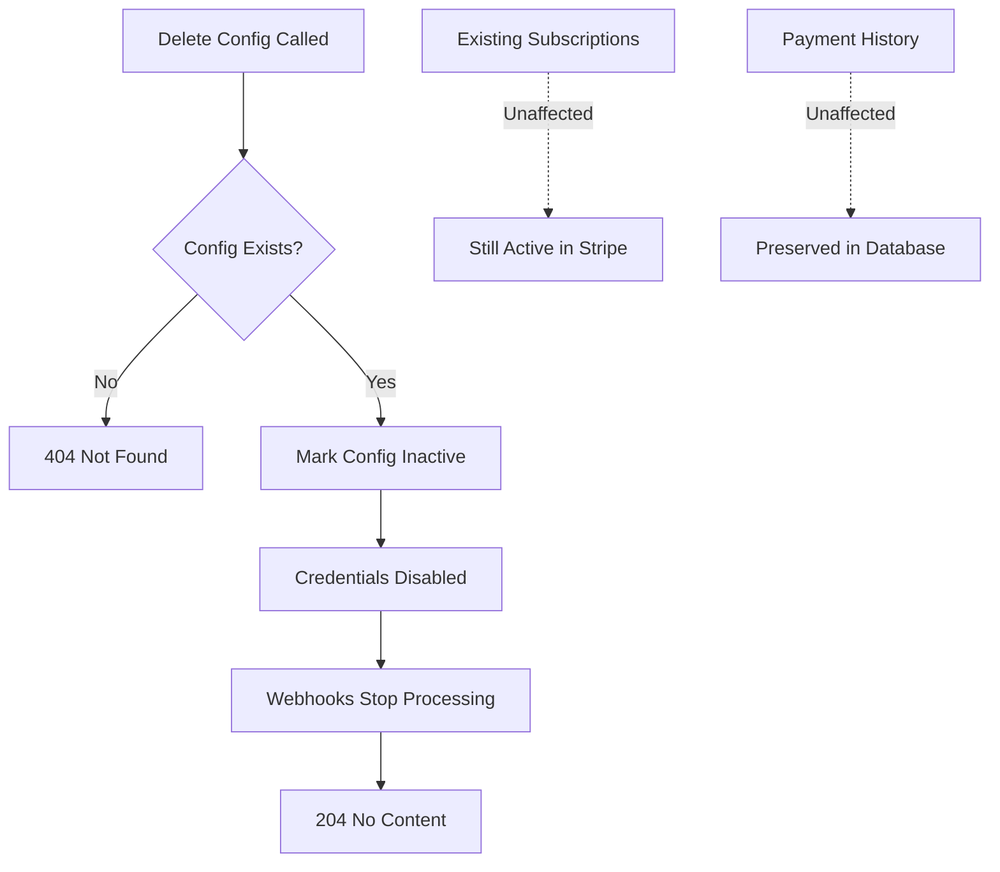

Deactivate the Stripe payment configuration for a project. This marks the configuration as inactive but does not delete existing subscriptions or payment records.

## Authentication

<Note>
This endpoint requires developer authentication via OAuth2 Bearer Token. You must own the project.
</Note>

## Path Parameters

<ParamField path="project_id" type="string (UUID)" required>
  The unique identifier of the project
</ParamField>

## Example Request

```bash
curl -X DELETE "https://api.devkit4ai.com/api/v1/payments/stripe/projects/550e8400-e29b-41d4-a716-446655440000/config" \
  -H "Authorization: Bearer {developer_jwt}"
```

## Response

Returns `204 No Content` on success.

## What Gets Deactivated

When you delete a Stripe configuration:

| Item | Action |
|------|--------|
| API Credentials | Marked as inactive, no longer usable |
| Webhook Secret | No longer validates incoming webhooks |
| Existing Subscriptions | **Remain active** in Stripe |
| Payment History | **Preserved** for records |



<Warning>
**Important:** Deleting the Stripe configuration does NOT cancel active subscriptions. Users will continue to be charged until you manually cancel subscriptions in Stripe.
</Warning>

## Before Deleting

<Steps>
  <Step title="Cancel Active Subscriptions">
    Cancel all active subscriptions through Stripe Dashboard or API to stop billing.
  </Step>
  <Step title="Notify Users">
    Inform subscribers about the service discontinuation.
  </Step>
  <Step title="Export Data">
    Download payment and subscription records if needed.
  </Step>
  <Step title="Delete Configuration">
    Call this endpoint to deactivate the configuration.
  </Step>
</Steps>

## Reactivating Payments

To re-enable payments after deletion, create a new configuration:

```bash
curl -X PUT "https://api.devkit4ai.com/api/v1/payments/stripe/projects/{project_id}/config" \
  -H "Authorization: Bearer {developer_jwt}" \
  -H "Content-Type: application/json" \
  -d '{
    "test_secret_key": "sk_test_..."
  }'
```

## Error Responses

| Status | Description |
|--------|-------------|
| `401` | Unauthorized - Invalid or missing authentication |
| `403` | Forbidden - You don't own this project |
| `404` | Project or configuration not found |

## Related Pages

<CardGroup cols={2}>
  <Card title="Get Stripe Config" icon="gear" href="/cloud-api/payments/stripe/get-config">
    View current configuration
  </Card>
  <Card title="Update Stripe Config" icon="pen" href="/cloud-api/payments/stripe/update-config">
    Reconfigure Stripe settings
  </Card>
  <Card title="Cancel Subscription" icon="xmark" href="/cloud-api/payments/stripe/cancel-subscription">
    Cancel user subscriptions
  </Card>
</CardGroup>
