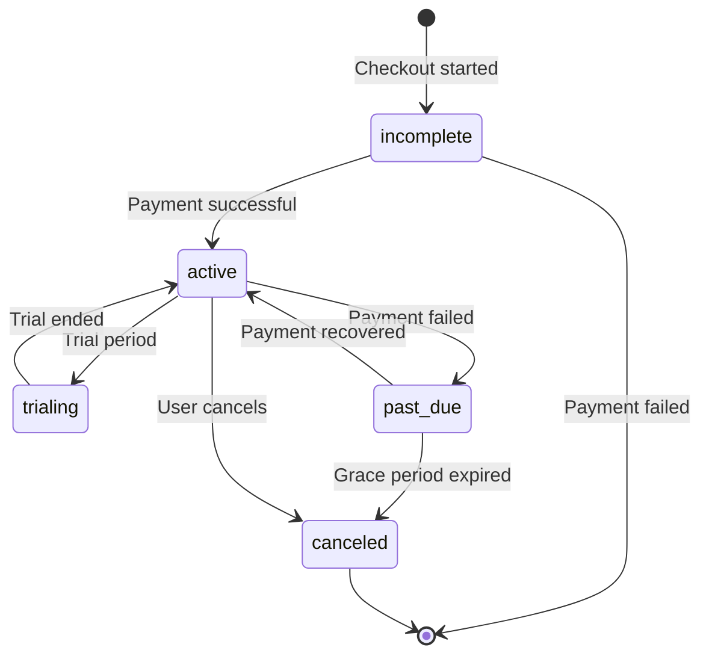

Retrieve the current authenticated user's active subscription for the project. Use this to display subscription status in your application.

## Authentication

<Note>
This endpoint requires end user authentication via HTTP Bearer Token with project scope.
</Note>

## Query Parameters

<ParamField query="test_mode" type="boolean" default="true">
  Use test mode data. Set to `false` for production subscriptions.
</ParamField>

## Response

Returns the subscription object if active, or `null` if no subscription exists.

<ResponseField name="id" type="string (UUID)">
  Internal subscription record ID
</ResponseField>

<ResponseField name="project_id" type="string (UUID)">
  Project the subscription belongs to
</ResponseField>

<ResponseField name="user_id" type="string (UUID)">
  User who owns the subscription
</ResponseField>

<ResponseField name="is_test_mode" type="boolean">
  Whether this is a test mode subscription
</ResponseField>

<ResponseField name="subscription_id" type="string">
  Stripe subscription ID (e.g., `sub_ABC123`)
</ResponseField>

<ResponseField name="customer_id" type="string">
  Stripe customer ID
</ResponseField>

<ResponseField name="status" type="string">
  Subscription status: `active`, `trialing`, `past_due`, `canceled`, `incomplete`
</ResponseField>

<ResponseField name="plan_name" type="string">
  Name of the subscribed plan
</ResponseField>

<ResponseField name="quantity" type="integer">
  Number of subscription seats/units
</ResponseField>

<ResponseField name="current_period_start" type="datetime">
  Start of current billing period
</ResponseField>

<ResponseField name="current_period_end" type="datetime">
  End of current billing period (renewal date)
</ResponseField>

<ResponseField name="cancel_at" type="datetime">
  Scheduled cancellation date (if set)
</ResponseField>

<ResponseField name="cancelled_at" type="datetime">
  When cancellation was requested
</ResponseField>

<ResponseField name="created_at" type="datetime">
  When subscription was created
</ResponseField>

## Example Request

```bash
curl -X GET "https://api.devkit4ai.com/api/v1/payments/stripe/my-subscription?test_mode=true" \
  -H "Authorization: Bearer {end_user_jwt}"
```

## Example Response

### Active Subscription

```json
{
  "id": "550e8400-e29b-41d4-a716-446655440000",
  "project_id": "660e8400-e29b-41d4-a716-446655440000",
  "user_id": "770e8400-e29b-41d4-a716-446655440000",
  "is_test_mode": true,
  "subscription_id": "sub_1ABC123def456",
  "customer_id": "cus_XYZ789",
  "status": "active",
  "plan_name": "Pro Plan",
  "quantity": 1,
  "current_period_start": "2026-01-01T00:00:00Z",
  "current_period_end": "2026-02-01T00:00:00Z",
  "cancel_at": null,
  "cancelled_at": null,
  "created_at": "2025-12-15T10:30:00Z"
}
```

### No Subscription

```json
null
```

## Subscription Status Flow



## Integration Example

```typescript
// React hook for subscription status
import { useQuery } from '@tanstack/react-query';

export function useSubscription() {
  return useQuery({
    queryKey: ['subscription'],
    queryFn: async () => {
      const response = await fetch('/api/subscription');
      if (!response.ok) throw new Error('Failed to fetch subscription');
      return response.json();
    }
  });
}

// Usage in component
function SubscriptionBadge() {
  const { data: subscription, isLoading } = useSubscription();
  
  if (isLoading) return <Spinner />;
  if (!subscription) return <Badge>Free</Badge>;
  
  return <Badge variant={subscription.status}>{subscription.plan_name}</Badge>;
}
```

## Common Use Cases

| Use Case | Implementation |
|----------|----------------|
| Show upgrade button | Check if `subscription` is `null` |
| Display plan name | Use `subscription.plan_name` |
| Show renewal date | Format `current_period_end` |
| Warn about cancellation | Check if `cancel_at` is set |
| Handle payment issues | Check for `past_due` status |

## Error Responses

| Status | Description |
|--------|-------------|
| `401` | Unauthorized - Invalid or missing authentication |
| `404` | Project not found or Stripe not configured |

## Related Pages

<CardGroup cols={2}>
  <Card title="Create Checkout" icon="credit-card" href="/cloud-api/payments/stripe/create-checkout-session">
    Start a new subscription
  </Card>
  <Card title="Cancel Subscription" icon="xmark" href="/cloud-api/payments/stripe/cancel-subscription">
    Cancel user's subscription
  </Card>
  <Card title="Update Subscription" icon="arrows-rotate" href="/cloud-api/payments/stripe/update-subscription">
    Change subscription plan
  </Card>
  <Card title="Customer Portal" icon="user-gear" href="/cloud-api/payments/stripe/create-customer-portal">
    Let user manage billing
  </Card>
</CardGroup>
