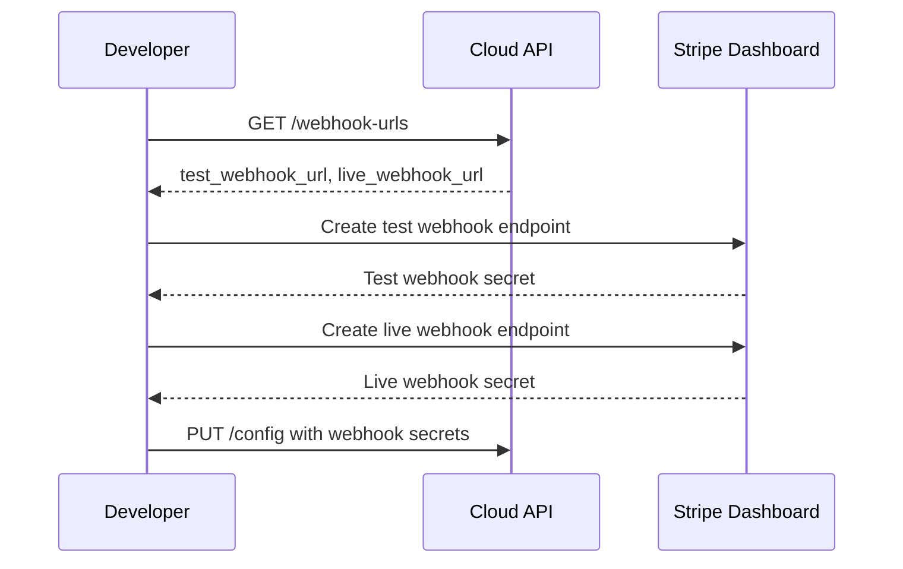

Get the webhook endpoint URLs for your project. Use these URLs when configuring webhook endpoints in your Stripe Dashboard for both test and live modes.

## Authentication

<Note>
This endpoint requires developer authentication via OAuth2 Bearer Token. You must own the project.
</Note>

## Path Parameters

<ParamField path="project_id" type="string (UUID)" required>
  The unique identifier of the project
</ParamField>

## Response

<ResponseField name="test_webhook_url" type="string">
  Webhook URL for test mode events
</ResponseField>

<ResponseField name="live_webhook_url" type="string">
  Webhook URL for live mode events
</ResponseField>

## Example Request

```bash
curl "https://api.devkit4ai.com/api/v1/payments/stripe/projects/550e8400-e29b-41d4-a716-446655440000/webhook-urls" \
  -H "Authorization: Bearer {developer_jwt}"
```

## Example Response

```json
{
  "test_webhook_url": "https://api.devkit4ai.com/api/v1/payments/stripe/webhooks/550e8400-e29b-41d4-a716-446655440000/test",
  "live_webhook_url": "https://api.devkit4ai.com/api/v1/payments/stripe/webhooks/550e8400-e29b-41d4-a716-446655440000/live"
}
```

## Configuring Webhooks in Stripe



<Steps>
  <Step title="Get Webhook URLs">
    Call this endpoint to get your project's webhook URLs.
  </Step>
  <Step title="Open Stripe Dashboard">
    Navigate to **Developers > Webhooks** in [Stripe Dashboard](https://dashboard.stripe.com/webhooks).
    
    (((REPLACE_THIS_WITH_IMAGE: stripe-dashboard-webhooks-page.png: Stripe Dashboard webhooks page showing the Add endpoint button)))
  </Step>
  <Step title="Create Test Endpoint">
    Click **Add endpoint** and paste the `test_webhook_url`. Make sure you're in **Test mode**.
  </Step>
  <Step title="Select Events">
    Select the events to listen for:
    - `checkout.session.completed`
    - `customer.subscription.created`
    - `customer.subscription.updated`
    - `customer.subscription.deleted`
    - `invoice.paid`
    - `invoice.payment_failed`
  </Step>
  <Step title="Get Signing Secret">
    After creating the endpoint, click to reveal the **Signing secret** (starts with `whsec_`).
  </Step>
  <Step title="Save Webhook Secret">
    Use [Update Stripe Config](/cloud-api/payments/stripe/update-config) to save the webhook secret.
  </Step>
  <Step title="Repeat for Live Mode">
    Switch to **Live mode** in Stripe and repeat steps 3-6 with the `live_webhook_url`.
  </Step>
</Steps>

## Required Webhook Events

Configure these events for full functionality:

| Event | Purpose |
|-------|---------|
| `checkout.session.completed` | Track successful checkouts |
| `customer.subscription.created` | New subscription created |
| `customer.subscription.updated` | Subscription plan changed |
| `customer.subscription.deleted` | Subscription cancelled |
| `invoice.paid` | Payment received |
| `invoice.payment_failed` | Payment failed |

## Webhook URL Format

```
https://api.devkit4ai.com/api/v1/payments/stripe/webhooks/{project_id}/{mode}
```

| Parameter | Description |
|-----------|-------------|
| `project_id` | Your project's UUID |
| `mode` | `test` or `live` |

<Tip>
**Testing locally?** Use [Stripe CLI](https://stripe.com/docs/stripe-cli) to forward webhooks to your local development server:

```bash
stripe listen --forward-to localhost:8000/api/v1/payments/stripe/webhooks/{project_id}/test
```
</Tip>

## Error Responses

| Status | Description |
|--------|-------------|
| `401` | Unauthorized - Invalid or missing authentication |
| `403` | Forbidden - You don't own this project |
| `404` | Project not found |

## Related Pages

<CardGroup cols={2}>
  <Card title="Stripe Webhook Handler" icon="bolt" href="/cloud-api/payments/stripe/stripe-webhook">
    How webhooks are processed
  </Card>
  <Card title="Update Stripe Config" icon="pen" href="/cloud-api/payments/stripe/update-config">
    Save webhook secrets
  </Card>
</CardGroup>
