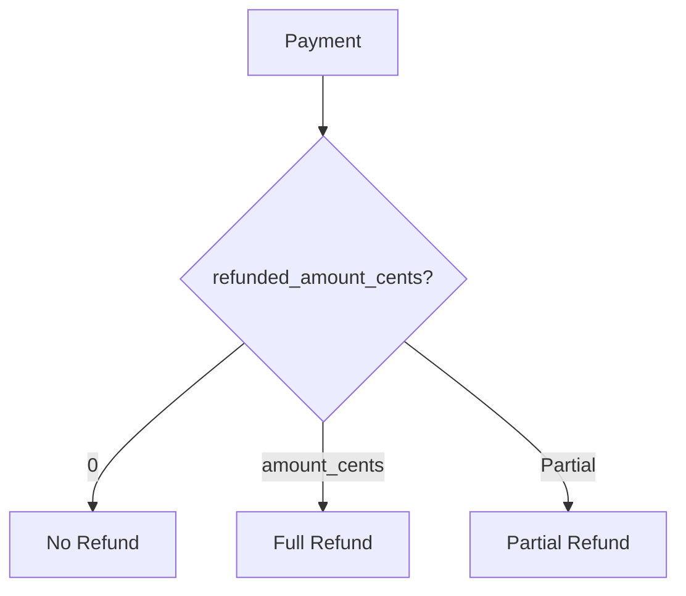

List all Stripe payment transactions for a specific project. This endpoint is for developers to view all payments made by their end users.

## Authentication

<Note>
This endpoint requires developer authentication via OAuth2 Bearer Token. You must own the project.
</Note>

## Path Parameters

<ParamField path="project_id" type="string (UUID)" required>
  The unique identifier of the project
</ParamField>

## Query Parameters

<ParamField query="test_mode" type="boolean" default="true">
  Filter by test mode. Set to `false` for live payments only.
</ParamField>

<ParamField query="page" type="integer" default="1">
  Page number for pagination (minimum: 1)
</ParamField>

<ParamField query="page_size" type="integer" default="50">
  Number of items per page (1-100)
</ParamField>

## Response

<ResponseField name="payments" type="array">
  Array of payment objects
  
  <Expandable title="Payment">
    <ResponseField name="id" type="string (UUID)">
      Internal payment ID
    </ResponseField>
    <ResponseField name="project_id" type="string (UUID)">
      Project ID
    </ResponseField>
    <ResponseField name="subscription_id" type="string (UUID)">
      Related subscription ID (if subscription payment)
    </ResponseField>
    <ResponseField name="user_id" type="string (UUID)">
      End user ID (if linked)
    </ResponseField>
    <ResponseField name="is_test_mode" type="boolean">
      Whether this is a test payment
    </ResponseField>
    <ResponseField name="payment_intent_id" type="string">
      Stripe PaymentIntent ID (e.g., `pi_1ABC...`)
    </ResponseField>
    <ResponseField name="status" type="string">
      Payment status
    </ResponseField>
    <ResponseField name="amount_cents" type="integer">
      Payment amount in cents
    </ResponseField>
    <ResponseField name="currency" type="string">
      Currency code (e.g., `usd`)
    </ResponseField>
    <ResponseField name="description" type="string">
      Payment description
    </ResponseField>
    <ResponseField name="refunded_amount_cents" type="integer" default="0">
      Amount refunded in cents
    </ResponseField>
    <ResponseField name="created_at" type="string (datetime)">
      When the payment was created
    </ResponseField>
  </Expandable>
</ResponseField>

<ResponseField name="total" type="integer">
  Total number of payments
</ResponseField>

<ResponseField name="page" type="integer">
  Current page number
</ResponseField>

<ResponseField name="page_size" type="integer">
  Items per page
</ResponseField>

## Example Request

```bash
curl "https://api.devkit4ai.com/api/v1/payments/stripe/projects/550e8400-e29b-41d4-a716-446655440000/payments?test_mode=true&page=1" \
  -H "Authorization: Bearer {developer_jwt}"
```

## Example Response

```json
{
  "payments": [
    {
      "id": "aa0e8400-e29b-41d4-a716-446655440000",
      "project_id": "550e8400-e29b-41d4-a716-446655440000",
      "subscription_id": "880e8400-e29b-41d4-a716-446655440000",
      "user_id": "990e8400-e29b-41d4-a716-446655440000",
      "is_test_mode": true,
      "payment_intent_id": "pi_1ABC123def456",
      "status": "succeeded",
      "amount_cents": 1999,
      "currency": "usd",
      "description": "Subscription to Pro Plan",
      "refunded_amount_cents": 0,
      "created_at": "2026-01-15T10:30:00Z"
    }
  ],
  "total": 1,
  "page": 1,
  "page_size": 50
}
```

## Payment Statuses

| Status | Description |
|--------|-------------|
| `succeeded` | Payment completed successfully |
| `pending` | Payment is being processed |
| `failed` | Payment attempt failed |
| `refunded` | Payment was fully refunded |
| `partially_refunded` | Payment was partially refunded |
| `canceled` | Payment was canceled |

## Amount Formatting

Amounts are stored in cents. To display as currency:

```javascript
const amount = payment.amount_cents / 100;
const formatted = new Intl.NumberFormat('en-US', {
  style: 'currency',
  currency: payment.currency.toUpperCase()
}).format(amount);

// $19.99
```

## Refund Tracking

Check if a payment has been refunded:



```javascript
if (payment.refunded_amount_cents === 0) {
  // No refund
} else if (payment.refunded_amount_cents === payment.amount_cents) {
  // Full refund
} else {
  // Partial refund
}
```

## Related Pages

<CardGroup cols={2}>
  <Card title="List Project Subscriptions" icon="list" href="/cloud-api/payments/stripe/list-project-subscriptions">
    View project subscriptions
  </Card>
  <Card title="List All Transactions" icon="credit-card" href="/cloud-api/payments/list-transactions">
    View payments across projects
  </Card>
  <Card title="Get My Payments" icon="user" href="/cloud-api/payments/stripe/get-my-payments">
    End user payment history
  </Card>
</CardGroup>
