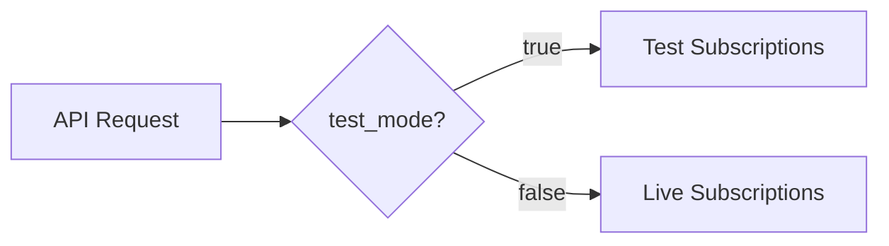

List all Stripe subscriptions for a specific project. This endpoint is for developers to view all subscriptions created by their end users.

## Authentication

<Note>
This endpoint requires developer authentication via OAuth2 Bearer Token. You must own the project.
</Note>

## Path Parameters

<ParamField path="project_id" type="string (UUID)" required>
  The unique identifier of the project
</ParamField>

## Query Parameters

<ParamField query="test_mode" type="boolean" default="true">
  Filter by test mode. Set to `false` for live subscriptions only.
</ParamField>

<ParamField query="page" type="integer" default="1">
  Page number for pagination (minimum: 1)
</ParamField>

<ParamField query="page_size" type="integer" default="50">
  Number of items per page (1-100)
</ParamField>

## Response

<ResponseField name="subscriptions" type="array">
  Array of subscription objects
  
  <Expandable title="Subscription">
    <ResponseField name="id" type="string (UUID)">
      Internal subscription ID
    </ResponseField>
    <ResponseField name="project_id" type="string (UUID)">
      Project ID
    </ResponseField>
    <ResponseField name="user_id" type="string (UUID)">
      End user ID (if linked)
    </ResponseField>
    <ResponseField name="is_test_mode" type="boolean">
      Whether this is a test subscription
    </ResponseField>
    <ResponseField name="subscription_id" type="string">
      Stripe subscription ID (e.g., `sub_1ABC...`)
    </ResponseField>
    <ResponseField name="customer_id" type="string">
      Stripe customer ID
    </ResponseField>
    <ResponseField name="status" type="string">
      Subscription status
    </ResponseField>
    <ResponseField name="plan_name" type="string">
      Plan or product name
    </ResponseField>
    <ResponseField name="quantity" type="integer">
      Subscription quantity
    </ResponseField>
    <ResponseField name="current_period_start" type="string (datetime)">
      Current billing period start
    </ResponseField>
    <ResponseField name="current_period_end" type="string (datetime)">
      Current billing period end
    </ResponseField>
    <ResponseField name="cancel_at" type="string (datetime)">
      Scheduled cancellation date
    </ResponseField>
    <ResponseField name="cancelled_at" type="string (datetime)">
      When the subscription was cancelled
    </ResponseField>
    <ResponseField name="created_at" type="string (datetime)">
      When the subscription was created
    </ResponseField>
  </Expandable>
</ResponseField>

<ResponseField name="total" type="integer">
  Total number of subscriptions
</ResponseField>

<ResponseField name="page" type="integer">
  Current page number
</ResponseField>

<ResponseField name="page_size" type="integer">
  Items per page
</ResponseField>

## Example Request

```bash
curl "https://api.devkit4ai.com/api/v1/payments/stripe/projects/550e8400-e29b-41d4-a716-446655440000/subscriptions?test_mode=true&page=1&page_size=20" \
  -H "Authorization: Bearer {developer_jwt}"
```

## Example Response

```json
{
  "subscriptions": [
    {
      "id": "880e8400-e29b-41d4-a716-446655440000",
      "project_id": "550e8400-e29b-41d4-a716-446655440000",
      "user_id": "990e8400-e29b-41d4-a716-446655440000",
      "is_test_mode": true,
      "subscription_id": "sub_1ABC123def456",
      "customer_id": "cus_XYZ789abc",
      "status": "active",
      "plan_name": "Pro Plan",
      "quantity": 1,
      "current_period_start": "2026-01-01T00:00:00Z",
      "current_period_end": "2026-02-01T00:00:00Z",
      "cancel_at": null,
      "cancelled_at": null,
      "created_at": "2026-01-01T00:00:00Z"
    }
  ],
  "total": 1,
  "page": 1,
  "page_size": 20
}
```

## Subscription Statuses

| Status | Description |
|--------|-------------|
| `active` | Subscription is active and paid |
| `trialing` | In free trial period |
| `past_due` | Payment failed, awaiting retry |
| `canceled` | Subscription has been canceled |
| `incomplete` | Initial payment failed |
| `incomplete_expired` | Initial payment window expired |
| `unpaid` | Multiple payment failures |

## Filtering by Mode

Test vs live subscriptions are stored separately:



<Tip>
Always use `test_mode=true` during development. Switch to `test_mode=false` in production to see real subscriptions.
</Tip>

## Related Pages

<CardGroup cols={2}>
  <Card title="List Project Payments" icon="receipt" href="/cloud-api/payments/stripe/list-project-payments">
    View project payment history
  </Card>
  <Card title="List All Subscriptions" icon="list-check" href="/cloud-api/payments/list-subscriptions">
    View subscriptions across projects
  </Card>
  <Card title="Get My Subscription" icon="user" href="/cloud-api/payments/stripe/get-my-subscription">
    End user subscription endpoint
  </Card>
</CardGroup>
