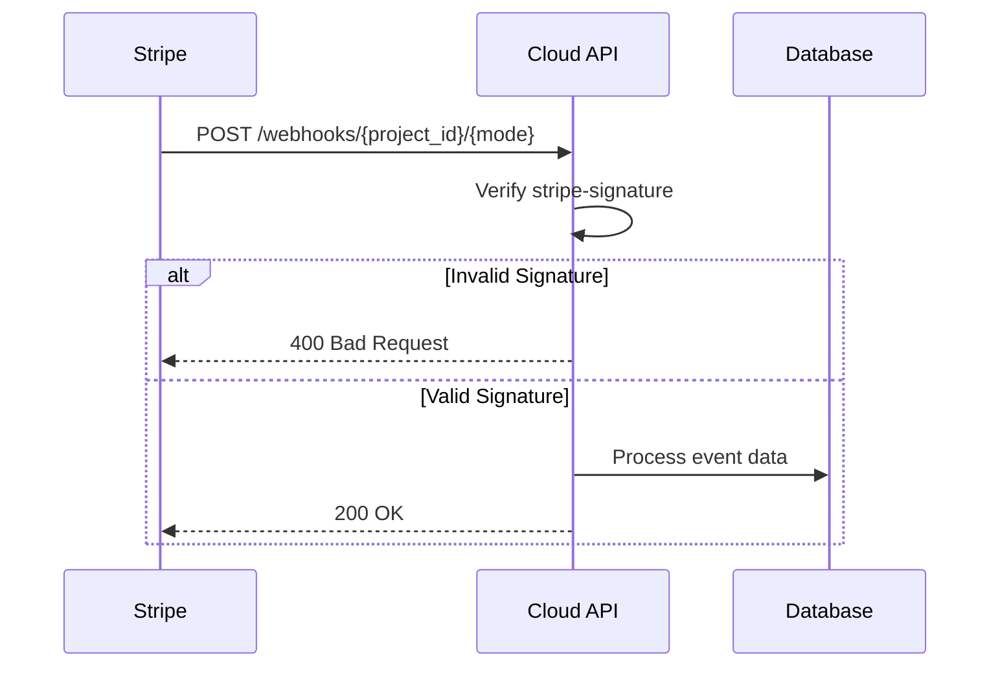
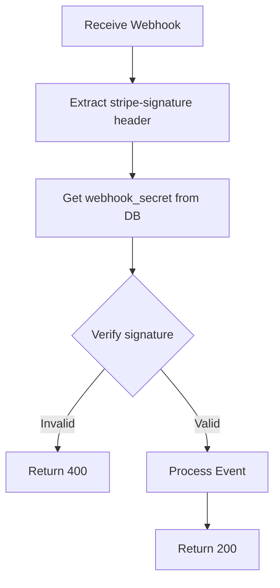

Receive and process webhook events from Stripe. This endpoint should be configured in your Stripe Dashboard to receive events for checkout completions, subscription changes, and payment updates.

## Authentication

<Warning>
This endpoint does NOT use Bearer token authentication. Instead, it validates requests using the Stripe webhook signature.
</Warning>

## Path Parameters

<ParamField path="project_id" type="string (UUID)" required>
  The unique identifier of the project
</ParamField>

<ParamField path="mode" type="string" required>
  Webhook mode: `test` or `live`
</ParamField>

## Headers

<ParamField header="stripe-signature" type="string" required>
  Stripe signature header for webhook verification
</ParamField>

## Request Body

Stripe sends event payloads as JSON. The body contains the event object with type and data.

## Response

Returns `200 OK` on successful processing.

## Webhook URL Format

```
https://api.devkit4ai.com/api/v1/payments/stripe/webhooks/{project_id}/{mode}
```

| Mode | Description |
|------|-------------|
| `test` | For test mode webhooks (development) |
| `live` | For live mode webhooks (production) |

<Tip>
Use the [Get Webhook URLs](/cloud-api/payments/stripe/get-webhook-urls) endpoint to get the correct URLs for your project.
</Tip>

## Supported Events

The Cloud API processes these Stripe events:

| Event | Action |
|-------|--------|
| `checkout.session.completed` | Creates subscription and customer records |
| `customer.subscription.created` | Records new subscription |
| `customer.subscription.updated` | Updates subscription status/plan |
| `customer.subscription.deleted` | Marks subscription as canceled |
| `invoice.paid` | Records successful payment |
| `invoice.payment_failed` | Marks subscription as past_due |

## Event Processing Flow



## Webhook Verification

All webhooks are verified using the signing secret configured in your Stripe settings:



<Warning>
**Security:** Always use HTTPS for webhook endpoints. Never log or expose the webhook signing secret.
</Warning>

## Configuring Webhooks

<Steps>
  <Step title="Get Webhook URLs">
    Call [Get Webhook URLs](/cloud-api/payments/stripe/get-webhook-urls) to get your project's webhook endpoints.
  </Step>
  <Step title="Create Endpoint in Stripe">
    Go to **Developers > Webhooks** in Stripe Dashboard and click **Add endpoint**.
  </Step>
  <Step title="Configure Events">
    Select the events to receive:
    ```
    checkout.session.completed
    customer.subscription.created
    customer.subscription.updated
    customer.subscription.deleted
    invoice.paid
    invoice.payment_failed
    ```
  </Step>
  <Step title="Save Webhook Secret">
    Copy the signing secret and save it using [Update Stripe Config](/cloud-api/payments/stripe/update-config).
  </Step>
</Steps>

## Local Development

Use Stripe CLI to forward webhooks to your local development server:

```bash
# Install Stripe CLI
brew install stripe/stripe-cli/stripe

# Login to Stripe
stripe login

# Forward webhooks to local backend
stripe listen --forward-to localhost:8000/api/v1/payments/stripe/webhooks/{project_id}/test

# The CLI will display a webhook secret - use this for local testing
```

## Event Payload Example

```json
{
  "id": "evt_1ABC123def456",
  "type": "checkout.session.completed",
  "data": {
    "object": {
      "id": "cs_test_a1b2c3d4",
      "customer": "cus_XYZ789",
      "subscription": "sub_ABC123",
      "metadata": {
        "user_id": "990e8400-e29b-41d4-a716-446655440000"
      }
    }
  }
}
```

## Error Responses

| Status | Description |
|--------|-------------|
| `400` | Invalid signature or malformed payload |
| `404` | Project not found or Stripe not configured |
| `500` | Internal error processing event |

## Retry Behavior

Stripe retries failed webhooks for up to 3 days with exponential backoff. Return `200 OK` quickly to acknowledge receipt - process data asynchronously if needed.

## Related Pages

<CardGroup cols={2}>
  <Card title="Get Webhook URLs" icon="link" href="/cloud-api/payments/stripe/get-webhook-urls">
    Get your webhook endpoint URLs
  </Card>
  <Card title="Update Stripe Config" icon="gear" href="/cloud-api/payments/stripe/update-config">
    Save webhook signing secret
  </Card>
  <Card title="List Project Subscriptions" icon="list" href="/cloud-api/payments/stripe/list-project-subscriptions">
    View created subscriptions
  </Card>
</CardGroup>
