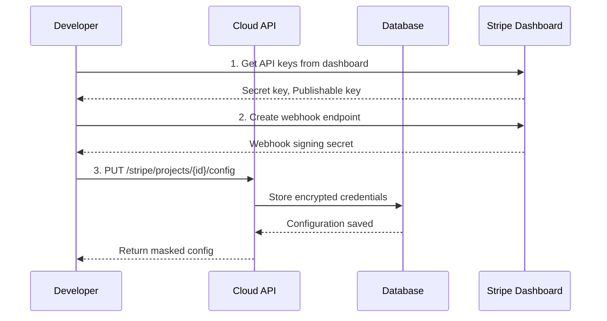

Create or update the Stripe payment configuration for a project. Supports both test and live credentials. This endpoint creates a new configuration if none exists, or updates the existing one.

## Authentication

<Note>
This endpoint requires developer authentication via OAuth2 Bearer Token. You must own the project.
</Note>

## Path Parameters

<ParamField path="project_id" type="string (UUID)" required>
  The unique identifier of the project
</ParamField>

## Request Body

All fields are optional. Only provide the credentials you want to configure or update.

<ParamField body="test_secret_key" type="string">
  Stripe test mode secret key (starts with `sk_test_`)
</ParamField>

<ParamField body="test_publishable_key" type="string">
  Stripe test mode publishable key (starts with `pk_test_`)
</ParamField>

<ParamField body="test_webhook_secret" type="string">
  Stripe test mode webhook signing secret (starts with `whsec_`)
</ParamField>

<ParamField body="live_secret_key" type="string">
  Stripe live mode secret key (starts with `sk_live_`)
</ParamField>

<ParamField body="live_publishable_key" type="string">
  Stripe live mode publishable key (starts with `pk_live_`)
</ParamField>

<ParamField body="live_webhook_secret" type="string">
  Stripe live mode webhook signing secret (starts with `whsec_`)
</ParamField>

## Example Request

Configure test mode credentials:

```bash
curl -X PUT "https://api.devkit4ai.com/api/v1/payments/stripe/projects/550e8400-e29b-41d4-a716-446655440000/config" \
  -H "Authorization: Bearer {developer_jwt}" \
  -H "Content-Type: application/json" \
  -d '{
    "test_secret_key": "sk_test_51ABC...",
    "test_publishable_key": "pk_test_51ABC...",
    "test_webhook_secret": "whsec_ABC..."
  }'
```

## Example Response

```json
{
  "id": "770e8400-e29b-41d4-a716-446655440000",
  "project_id": "550e8400-e29b-41d4-a716-446655440000",
  "is_active": true,
  "has_test_credentials": true,
  "has_live_credentials": false,
  "test_secret_key_masked": "sk_test_...aBcD",
  "test_publishable_key_masked": "pk_test_...eFgH",
  "test_webhook_secret_masked": "whsec_...iJkL",
  "live_secret_key_masked": null,
  "live_publishable_key_masked": null,
  "live_webhook_secret_masked": null,
  "test_configured_at": "2026-01-24T10:00:00Z",
  "live_configured_at": null,
  "created_at": "2026-01-24T10:00:00Z",
  "updated_at": "2026-01-24T10:00:00Z"
}
```

## Configuration Flow



## Getting Stripe Credentials

<Steps>
  <Step title="Create Stripe Account">
    Sign up at [stripe.com](https://stripe.com) if you haven't already.
  </Step>
  <Step title="Get API Keys">
    Navigate to **Developers > API keys** in the Stripe Dashboard.
    
    (((REPLACE_THIS_WITH_IMAGE: stripe-dashboard-api-keys.png: Stripe Dashboard showing API keys section with publishable and secret keys)))
  </Step>
  <Step title="Create Webhook Endpoint">
    Navigate to **Developers > Webhooks** and create an endpoint using the URL from [Get Webhook URLs](/cloud-api/payments/stripe/get-webhook-urls).
  </Step>
  <Step title="Get Webhook Secret">
    After creating the webhook, reveal and copy the signing secret.
  </Step>
</Steps>

## Credential Validation

<Tip>
Before saving, validate your credentials using the [Validate Credentials](/cloud-api/payments/stripe/validate-credentials) endpoint to ensure they work correctly.
</Tip>

## Partial Updates

You can update credentials incrementally. For example, to add live credentials to an existing test configuration:

```bash
curl -X PUT "https://api.devkit4ai.com/api/v1/payments/stripe/projects/{project_id}/config" \
  -H "Authorization: Bearer {developer_jwt}" \
  -H "Content-Type: application/json" \
  -d '{
    "live_secret_key": "sk_live_51ABC...",
    "live_publishable_key": "pk_live_51ABC...",
    "live_webhook_secret": "whsec_XYZ..."
  }'
```

## Error Responses

| Status | Description |
|--------|-------------|
| `401` | Unauthorized - Invalid or missing authentication |
| `403` | Forbidden - You don't own this project |
| `404` | Project not found |
| `422` | Validation error - Invalid key format |

## Security

<Warning>
- Never commit Stripe secret keys to version control
- Use environment variables in your application
- Rotate keys immediately if they are exposed
- Use test mode keys for development and testing
</Warning>

## Related Pages

<CardGroup cols={2}>
  <Card title="Get Stripe Config" icon="gear" href="/cloud-api/payments/stripe/get-config">
    View current configuration
  </Card>
  <Card title="Validate Credentials" icon="check" href="/cloud-api/payments/stripe/validate-credentials">
    Test credentials before saving
  </Card>
  <Card title="Get Webhook URLs" icon="webhook" href="/cloud-api/payments/stripe/get-webhook-urls">
    Get webhook endpoint URLs
  </Card>
</CardGroup>
