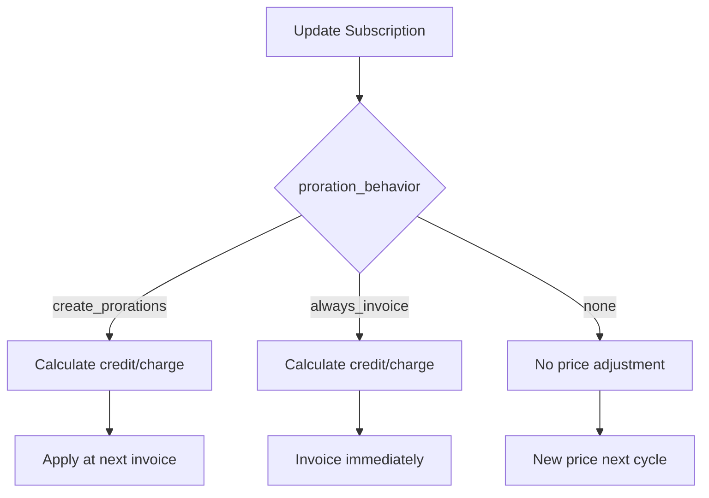
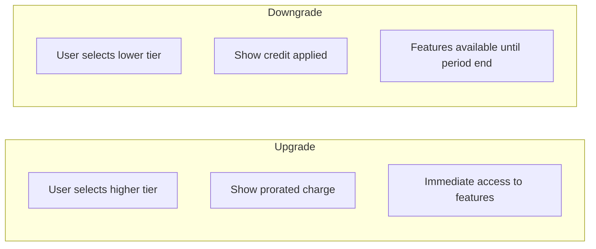

Change the authenticated user's subscription to a different plan. Proration is applied by default, adjusting the billing amount based on time remaining in the current period.

## Authentication

<Note>
This endpoint requires end user authentication via HTTP Bearer Token with project scope.
</Note>

## Query Parameters

<ParamField query="test_mode" type="boolean" default="true">
  Use test mode credentials. Set to `false` for production.
</ParamField>

## Request Body

<ParamField body="new_price_id" type="string" required>
  Stripe Price ID for the new plan (e.g., `price_1ABC123def456`)
</ParamField>

<ParamField body="proration_behavior" type="string" default="create_prorations">
  How to handle proration:
  - `create_prorations` - Apply credit/charge for prorated amount
  - `none` - No proration; new price applies next billing cycle
  - `always_invoice` - Invoice immediately for prorated amount
</ParamField>

## Response

<ResponseField name="subscription_id" type="string">
  Stripe subscription ID
</ResponseField>

<ResponseField name="status" type="string">
  Subscription status after update
</ResponseField>

<ResponseField name="price_id" type="string">
  New active Price ID
</ResponseField>

<ResponseField name="message" type="string">
  Human-readable confirmation message
</ResponseField>

## Example Request

```bash
curl -X POST "https://api.devkit4ai.com/api/v1/payments/stripe/update-subscription?test_mode=true" \
  -H "Authorization: Bearer {end_user_jwt}" \
  -H "Content-Type: application/json" \
  -d '{
    "new_price_id": "price_1XYZ789abc123",
    "proration_behavior": "create_prorations"
  }'
```

## Example Response

```json
{
  "subscription_id": "sub_1ABC123def456",
  "status": "active",
  "price_id": "price_1XYZ789abc123",
  "message": "Subscription updated to new plan successfully."
}
```

## Proration Behaviors



### Proration Examples

| Scenario | Current | New | Proration |
|----------|---------|-----|-----------|
| **Upgrade** | $10/mo | $20/mo | Charge difference prorated |
| **Downgrade** | $20/mo | $10/mo | Credit applied to next invoice |
| **Same price** | $10/mo | $10/mo | No change in billing |

## Integration Example

```typescript
// Plan upgrade/downgrade component
function ChangePlanModal({ currentPriceId, plans }) {
  const [selectedPlan, setSelectedPlan] = useState(currentPriceId);
  const [loading, setLoading] = useState(false);

  const handleChangePlan = async () => {
    if (selectedPlan === currentPriceId) return;
    
    setLoading(true);
    try {
      const response = await fetch('/api/update-subscription', {
        method: 'POST',
        headers: { 'Content-Type': 'application/json' },
        body: JSON.stringify({
          new_price_id: selectedPlan,
          proration_behavior: 'create_prorations'
        })
      });
      
      const result = await response.json();
      showToast(result.message);
      closeModal();
      refreshSubscriptionStatus();
    } catch (error) {
      showError('Failed to update plan');
    } finally {
      setLoading(false);
    }
  };

  return (
    <div>
      <h2>Change Your Plan</h2>
      {plans.map(plan => (
        <PlanCard
          key={plan.price_id}
          plan={plan}
          selected={selectedPlan === plan.price_id}
          current={currentPriceId === plan.price_id}
          onSelect={() => setSelectedPlan(plan.price_id)}
        />
      ))}
      <button onClick={handleChangePlan} disabled={loading}>
        {loading ? 'Updating...' : 'Confirm Change'}
      </button>
    </div>
  );
}
```

## Upgrade vs Downgrade UX



<Tip>
**UX Best Practice:** Show users what they'll pay or save before confirming the change. Use Stripe's preview invoice API to calculate exact amounts.
</Tip>

## Error Responses

| Status | Description |
|--------|-------------|
| `400` | Invalid price ID or incompatible plan |
| `401` | Unauthorized - Invalid or missing authentication |
| `404` | No active subscription to update |
| `404` | Project not found or Stripe not configured |
| `422` | Validation error - Invalid parameters |

## Related Pages

<CardGroup cols={2}>
  <Card title="Get My Subscription" icon="user" href="/cloud-api/payments/stripe/get-my-subscription">
    Check current subscription
  </Card>
  <Card title="Create Checkout" icon="credit-card" href="/cloud-api/payments/stripe/create-checkout-session">
    Start new subscription
  </Card>
  <Card title="Cancel Subscription" icon="xmark" href="/cloud-api/payments/stripe/cancel-subscription">
    End subscription
  </Card>
</CardGroup>
