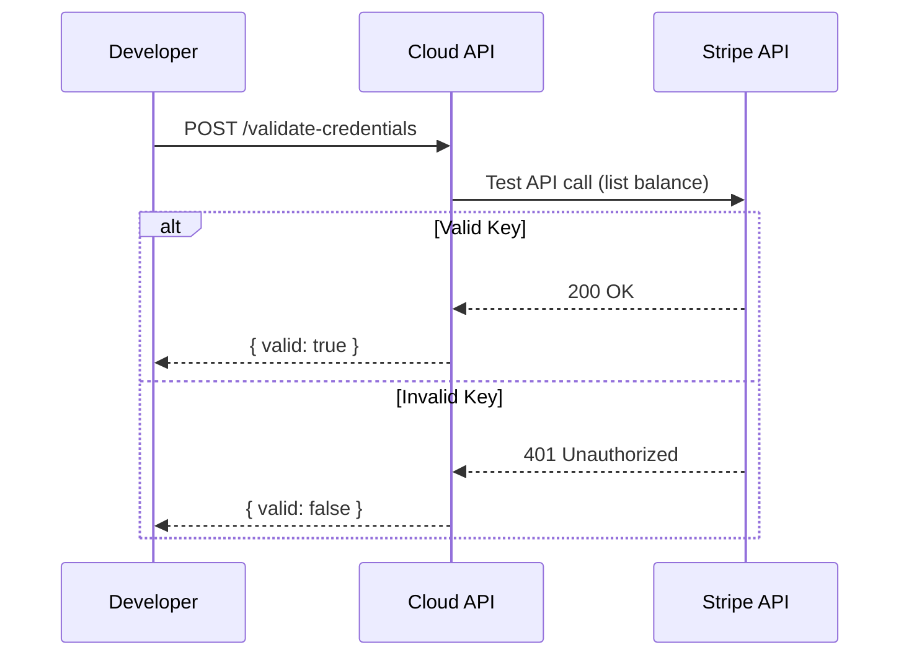

Validate Stripe API credentials before saving them to your configuration. This endpoint makes a test API call to Stripe to verify the credentials are valid and have the necessary permissions.

## Authentication

<Note>
This endpoint requires developer authentication via OAuth2 Bearer Token. You must own the project.
</Note>

## Path Parameters

<ParamField path="project_id" type="string (UUID)" required>
  The unique identifier of the project
</ParamField>

## Request Body

<ParamField body="secret_key" type="string" required>
  The Stripe secret key to validate (starts with `sk_test_` or `sk_live_`)
</ParamField>

<ParamField body="is_test_mode" type="boolean" default="true">
  Whether this is a test mode key. Set to `false` for live keys.
</ParamField>

## Response

<ResponseField name="valid" type="boolean">
  Whether the credentials are valid
</ResponseField>

<ResponseField name="message" type="string">
  Validation result message
</ResponseField>

## Example Request

Validate a test mode secret key:

```bash
curl -X POST "https://api.devkit4ai.com/api/v1/payments/stripe/projects/550e8400-e29b-41d4-a716-446655440000/validate-credentials" \
  -H "Authorization: Bearer {developer_jwt}" \
  -H "Content-Type: application/json" \
  -d '{
    "secret_key": "sk_test_51ABC...",
    "is_test_mode": true
  }'
```

## Successful Validation

```json
{
  "valid": true,
  "message": "Stripe credentials are valid"
}
```

## Failed Validation

```json
{
  "valid": false,
  "message": "Invalid API key provided: sk_test_..."
}
```

## Validation Flow



## Common Validation Errors

| Error | Cause | Solution |
|-------|-------|----------|
| Invalid API key | Key doesn't exist or is malformed | Double-check the key from Stripe Dashboard |
| API key is restricted | Key has limited permissions | Use an unrestricted key or add required permissions |
| Test key for live mode | Provided test key with `is_test_mode: false` | Use matching key type for the mode |
| Account not verified | Stripe account requires verification | Complete verification in Stripe Dashboard |

## Best Practices

<Steps>
  <Step title="Validate Before Saving">
    Always validate credentials before calling [Update Stripe Config](/cloud-api/payments/stripe/update-config).
  </Step>
  <Step title="Test Both Modes">
    Validate test and live keys separately before going to production.
  </Step>
  <Step title="Check Mode Matching">
    Ensure `is_test_mode` matches the key type (`sk_test_` vs `sk_live_`).
  </Step>
</Steps>

<Warning>
This endpoint only validates the secret key. Make sure your publishable key and webhook secret are also correct when configuring payments.
</Warning>

## Error Responses

| Status | Description |
|--------|-------------|
| `401` | Unauthorized - Invalid or missing authentication |
| `403` | Forbidden - You don't own this project |
| `404` | Project not found |
| `422` | Validation error - Missing or invalid request body |

## Related Pages

<CardGroup cols={2}>
  <Card title="Update Stripe Config" icon="pen" href="/cloud-api/payments/stripe/update-config">
    Save validated credentials
  </Card>
  <Card title="Get Stripe Config" icon="gear" href="/cloud-api/payments/stripe/get-config">
    View current configuration
  </Card>
</CardGroup>
