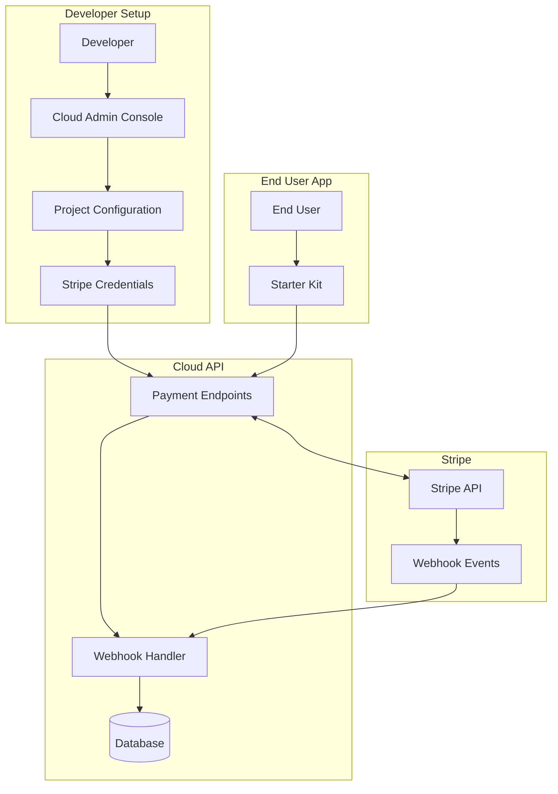
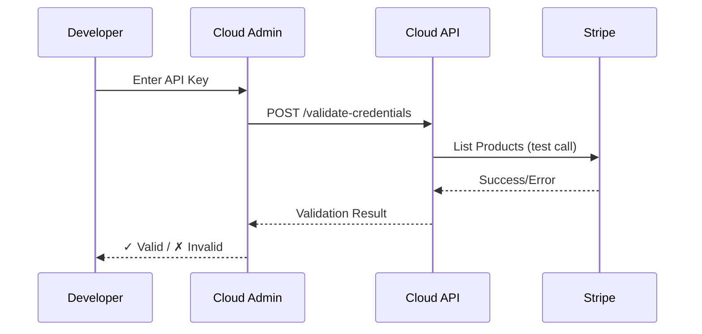

Dev Kit for AI provides built-in Stripe integration for subscription-based monetization of your AI-powered applications. This guide covers the complete setup process from Stripe account creation to production deployment.

## Payment Architecture Overview

The payment system follows a secure, project-scoped design where each project maintains its own Stripe configuration:



### Key Design Principles

<CardGroup cols={2}>
  <Card title="Project-Scoped Credentials" icon="key">
    Each project stores its own Stripe API keys separately, enabling different Stripe accounts per project or shared accounts with proper isolation.
  </Card>
  <Card title="Test/Live Mode Separation" icon="toggle-on">
    Maintain separate credentials for test and live environments, with mode-specific webhook endpoints for proper event routing.
  </Card>
  <Card title="Encrypted Storage" icon="lock">
    All Stripe credentials are encrypted at rest in the Cloud API database—never exposed in logs or API responses.
  </Card>
  <Card title="Webhook Verification" icon="shield-check">
    All incoming webhooks are verified using Stripe's signature verification to prevent spoofed events.
  </Card>
</CardGroup>

## Prerequisites

Before configuring payments, ensure you have:

<Steps>
  <Step title="Active Stripe Account">
    Create a [Stripe account](https://dashboard.stripe.com/register) if you don't have one. You can use the same account for multiple projects or create separate accounts per project.
  </Step>
  <Step title="Dev Kit Project">
    A project created in [Cloud Admin](https://devkit4ai.com/console/projects) with at least one API key.
  </Step>
  <Step title="Stripe Products & Prices">
    Create your subscription products and prices in the [Stripe Dashboard](https://dashboard.stripe.com/products). Note the Price IDs (e.g., `price_1234...`) for use in checkout sessions.
  </Step>
</Steps>

## Obtaining Stripe Credentials

### API Keys

Navigate to the [Stripe API Keys page](https://dashboard.stripe.com/apikeys) to find your credentials:

<Tabs>
  <Tab title="Test Mode">
    Test mode keys are prefixed with `sk_test_` and `pk_test_`. Use these during development and testing.
    
    <Warning>
      Test mode processes simulated transactions only. No real payments are made.
    </Warning>
  </Tab>
  <Tab title="Live Mode">
    Live mode keys are prefixed with `sk_live_` and `pk_live_`. Use these for production payments.
    
    <Warning>
      Live mode processes real transactions. Handle these credentials with extreme care.
    </Warning>
  </Tab>
</Tabs>

You'll need:
- **Secret Key** (`sk_test_...` or `sk_live_...`) — Used server-side for API calls. Never expose this in client code.
- **Publishable Key** (`pk_test_...` or `pk_live_...`) — Used client-side for Stripe.js (optional, if implementing custom checkout UI).

### Webhook Signing Secret

Webhook secrets are generated when you create a webhook endpoint in Stripe. You'll get these from Cloud Admin after configuring your project (the webhook URLs are provided automatically).

## Configuring Payments in Cloud Admin

### Step 1: Navigate to Project Payments

Open your project in Cloud Admin and navigate to the Payments tab:

(((REPLACE_THIS_WITH_IMAGE: console-project-payments-tab-overview.png: Cloud Admin project payments tab showing configuration options and empty state)))

### Step 2: Add Stripe Credentials

Click **Configure Payments** to open the configuration form:

(((REPLACE_THIS_WITH_IMAGE: console-payment-config-form.png: Payment configuration form with fields for Stripe API keys and webhook secrets)))

<Steps>
  <Step title="Select Mode">
    Choose **Test Mode** initially to safely test your integration without processing real payments.
  </Step>
  <Step title="Enter Secret Key">
    Paste your Stripe Secret Key (`sk_test_...` for test mode). This is used for all server-side Stripe operations.
  </Step>
  <Step title="Validate Credentials">
    Click **Validate** to verify your API key works. The system makes a test API call to Stripe to confirm validity.
  </Step>
  <Step title="Save Configuration">
    Once validated, click **Save** to store your encrypted credentials.
  </Step>
</Steps>

### Step 3: Configure Webhook Endpoints

After saving your Stripe configuration, Cloud Admin displays your webhook URLs:

```
Test Mode: https://api.devkit4ai.com/api/v1/payments/stripe/webhooks/{project_id}/test
Live Mode: https://api.devkit4ai.com/api/v1/payments/stripe/webhooks/{project_id}/live
```

<Note>
  Alternative domain: `https://api.vibecoding.ad/api/v1/payments/stripe/webhooks/{project_id}/{mode}`
</Note>

Copy the appropriate URL and add it to your Stripe webhook configuration:

<Steps>
  <Step title="Open Stripe Webhooks">
    Navigate to [Stripe Webhooks](https://dashboard.stripe.com/webhooks) and click **Add endpoint**.
  </Step>
  <Step title="Enter Endpoint URL">
    Paste the webhook URL from Cloud Admin.
  </Step>
  <Step title="Select Events">
    Choose the events to listen for. Recommended events:
    - `checkout.session.completed`
    - `customer.subscription.created`
    - `customer.subscription.updated`
    - `customer.subscription.deleted`
    - `invoice.paid`
    - `invoice.payment_failed`
    - `charge.refunded`
  </Step>
  <Step title="Copy Signing Secret">
    After creating the endpoint, copy the **Signing Secret** (`whsec_...`) and add it to your Cloud Admin payment configuration.
  </Step>
</Steps>

## Credential Validation

The Cloud API provides automatic credential validation to ensure your Stripe configuration is correct before going live:



### Validation Checks

The validation endpoint performs these checks:

| Check | Description |
|-------|-------------|
| API Key Format | Verifies the key matches Stripe key format (`sk_test_*` or `sk_live_*`) |
| Authentication | Confirms the key authenticates successfully with Stripe |
| Permissions | Verifies the key has necessary permissions for payment operations |

<Tip>
  If validation fails, double-check that you copied the complete key including the `sk_` prefix.
</Tip>

## Local Development with Stripe CLI

For local development and testing, use the [Stripe CLI](https://stripe.com/docs/stripe-cli) to forward webhook events to your local environment:

### Install Stripe CLI

<Tabs>
  <Tab title="macOS">
    ```bash
    brew install stripe/stripe-cli/stripe
    ```
  </Tab>
  <Tab title="Linux">
    ```bash
    # Download and extract
    curl -L https://github.com/stripe/stripe-cli/releases/download/v1.19.0/stripe_1.19.0_linux_x86_64.tar.gz | tar xz
    sudo mv stripe /usr/local/bin/
    ```
  </Tab>
  <Tab title="Windows">
    ```powershell
    # Using scoop
    scoop install stripe
    ```
  </Tab>
</Tabs>

### Login and Forward Webhooks

```bash
# Login to Stripe (opens browser)
stripe login

# Forward webhooks to Cloud API (test mode)
stripe listen --forward-to https://api.devkit4ai.com/api/v1/payments/stripe/webhooks/{project_id}/test
```

<Note>
  Replace `{project_id}` with your actual project UUID from Cloud Admin. Alternative API domain: `https://api.vibecoding.ad/...`
</Note>

The CLI will display a webhook signing secret (`whsec_...`). Use this temporary secret in your local development environment, or configure it in Cloud Admin for testing.

### Trigger Test Events

```bash
# Trigger a checkout completion event
stripe trigger checkout.session.completed

# Trigger a subscription creation
stripe trigger customer.subscription.created

# Trigger a payment success
stripe trigger invoice.paid
```

## Security Best Practices

<AccordionGroup>
  <Accordion title="Never Expose Secret Keys">
    Stripe secret keys (`sk_*`) should only be stored in Cloud Admin and used server-side. Never include them in:
    - Client-side JavaScript
    - Mobile app code
    - Git repositories
    - Logs or error messages
  </Accordion>
  
  <Accordion title="Use Test Mode for Development">
    Always use test mode (`sk_test_*`) during development. Switch to live mode only after thorough testing. Test mode:
    - Processes simulated transactions
    - Uses [test card numbers](https://stripe.com/docs/testing#cards)
    - Generates test webhook events
  </Accordion>
  
  <Accordion title="Verify Webhook Signatures">
    Cloud API automatically verifies all incoming webhooks using the signing secret. This prevents:
    - Replay attacks
    - Spoofed events
    - Unauthorized subscription modifications
  </Accordion>
  
  <Accordion title="Rotate Credentials Regularly">
    Periodically rotate your Stripe API keys and webhook secrets, especially if you suspect compromise. Update them in Cloud Admin immediately.
  </Accordion>
</AccordionGroup>

## Configuration API Reference

For programmatic configuration, Cloud Admin uses these Cloud API endpoints:

<CardGroup cols={2}>
  <Card title="Get Configuration" icon="eye" href="/cloud-api/payments/stripe/get-config">
    Retrieve current Stripe configuration status for a project
  </Card>
  <Card title="Update Configuration" icon="pen" href="/cloud-api/payments/stripe/update-config">
    Create or update Stripe credentials for a project
  </Card>
  <Card title="Delete Configuration" icon="trash" href="/cloud-api/payments/stripe/delete-config">
    Deactivate Stripe configuration for a project
  </Card>
  <Card title="Get Webhook URLs" icon="link" href="/cloud-api/payments/stripe/get-webhook-urls">
    Get the webhook endpoint URLs for Stripe dashboard
  </Card>
  <Card title="Validate Credentials" icon="check" href="/cloud-api/payments/stripe/validate-credentials">
    Test Stripe API credentials before saving
  </Card>
</CardGroup>

## Switching to Live Mode

When you're ready to accept real payments:

<Steps>
  <Step title="Complete Test Mode Verification">
    Ensure all payment flows work correctly in test mode:
    - New subscriptions
    - Plan changes (upgrade/downgrade)
    - Cancellations
    - Webhook events processing
  </Step>
  <Step title="Add Live Credentials">
    In Cloud Admin, switch to **Live Mode** and add your live Stripe API key (`sk_live_...`).
  </Step>
  <Step title="Configure Live Webhook">
    Create a new webhook endpoint in Stripe for your live mode URL and add the signing secret to Cloud Admin.
  </Step>
  <Step title="Verify Live Configuration">
    Use the validation feature to confirm your live credentials work correctly.
  </Step>
</Steps>

<Warning>
  After switching to live mode, all transactions process real payments. Double-check your pricing configuration in Stripe before going live.
</Warning>

## Next Steps

<CardGroup cols={2}>
  <Card title="Subscription Management" icon="repeat" href="/getting-started/features/subscription-billing">
    Learn about the complete subscription lifecycle and billing workflows
  </Card>
  <Card title="Stripe Integration Tutorial" icon="graduation-cap" href="/tutorials/integrations/stripe-payments">
    Step-by-step tutorial for implementing payments in your app
  </Card>
  <Card title="End-User Billing" icon="user" href="/starter-kit/features/payments">
    Implement billing UI components in your Starter Kit application
  </Card>
  <Card title="Payments API Reference" icon="code" href="/cloud-api/payments/introduction">
    Complete API documentation for all payment endpoints
  </Card>
</CardGroup>
