Dev Kit for AI provides a complete subscription management system built on Stripe, handling the full lifecycle from checkout to cancellation. This guide covers all billing workflows, subscription states, and use cases for SaaS monetization.

## Subscription Lifecycle Overview

The subscription system manages the complete payment lifecycle through Stripe integration:

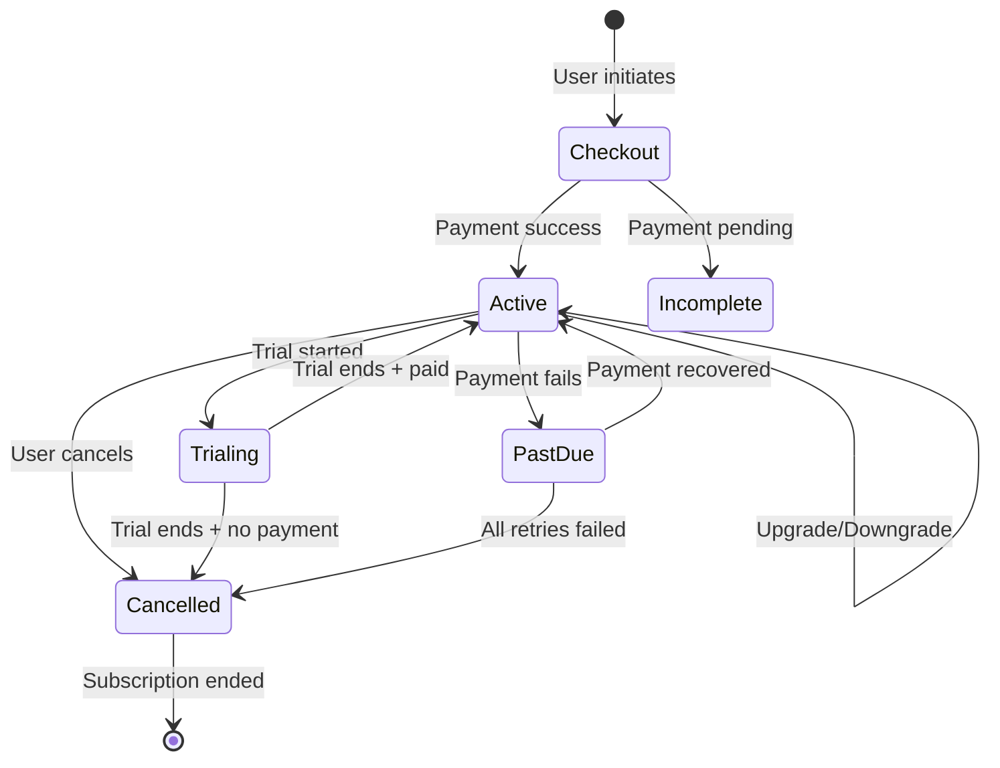

### Subscription States

| State | Description | User Access |
|-------|-------------|-------------|
| `active` | Subscription is current and paid | Full access |
| `trialing` | User is in a trial period | Full access |
| `past_due` | Payment failed, retrying | Limited access (configurable) |
| `cancelled` | Subscription ended | No access |
| `incomplete` | Initial payment pending | No access |
| `paused` | Subscription temporarily paused | No access |
| `unpaid` | All payment retries exhausted | No access |

## Core Billing Workflows

### Checkout Session Flow

When a user subscribes, the system creates a Stripe Checkout Session and redirects them to Stripe's hosted payment page:

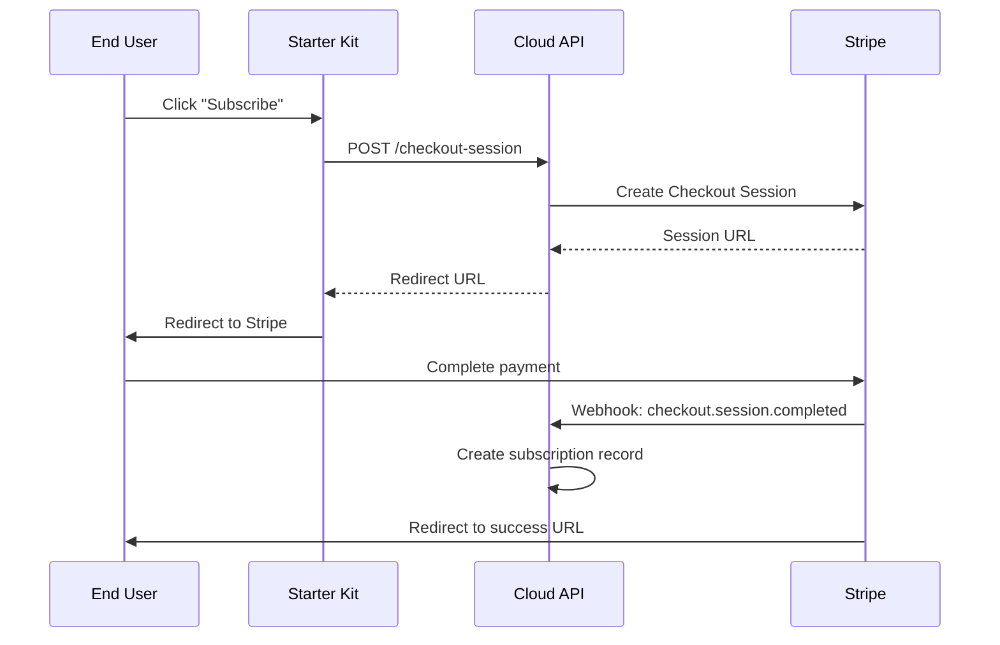

### Webhook Event Processing

Cloud API processes Stripe webhook events to maintain subscription state:

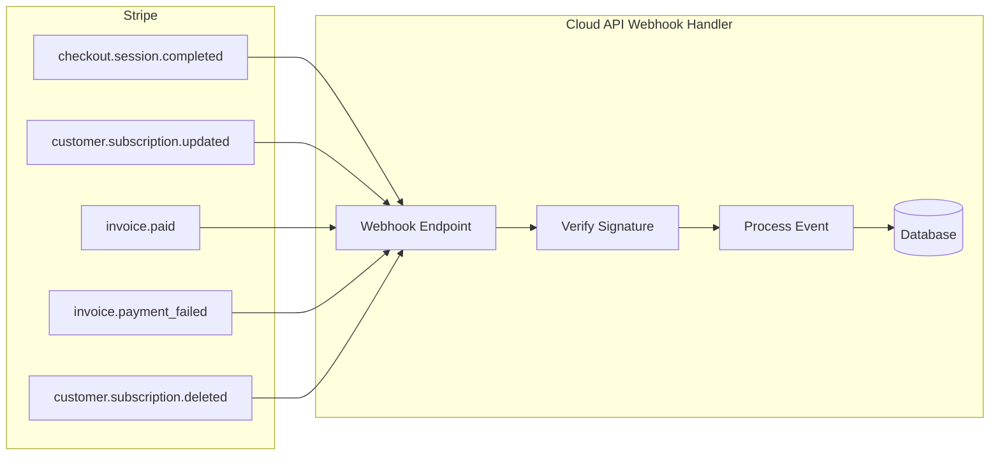

### Handled Webhook Events

| Event | Action Taken |
|-------|--------------|
| `checkout.session.completed` | Create subscription, link Stripe customer to user |
| `customer.subscription.created` | Record new subscription with status and period |
| `customer.subscription.updated` | Update status, plan, or cancellation flags |
| `customer.subscription.deleted` | Mark subscription as cancelled |
| `invoice.paid` | Record payment, extend subscription period |
| `invoice.payment_failed` | Mark subscription as past_due |
| `charge.refunded` | Record refund in payment history |

## Use Case Scenarios

Dev Kit for AI handles all common subscription scenarios out of the box:

### New Subscription

A user without an existing subscription initiates checkout, completes payment, and receives an active subscription:

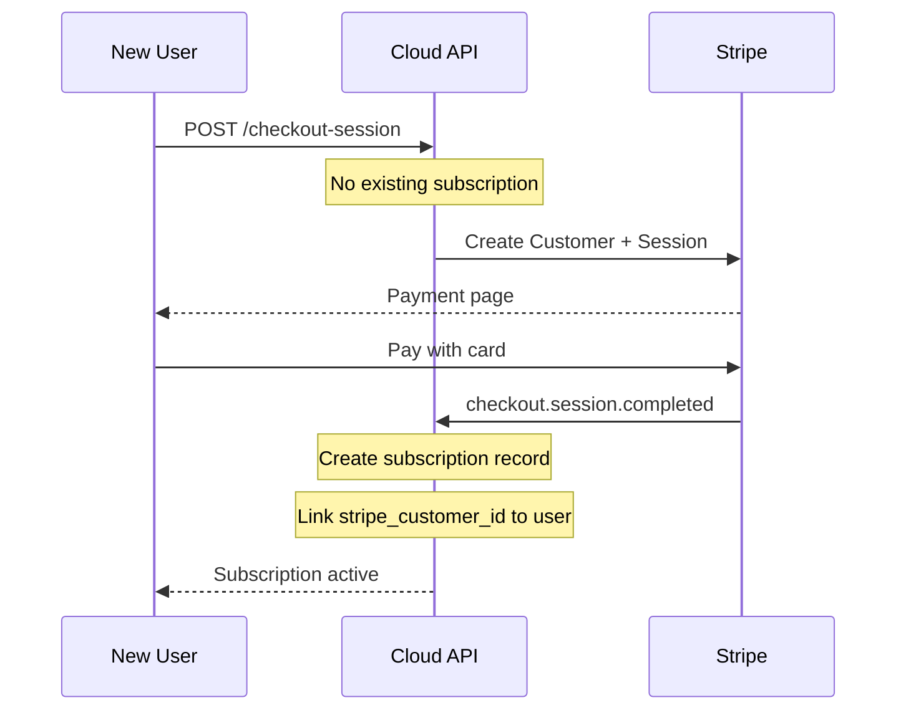

<Note>
The system creates a Stripe customer record and stores `stripe_customer_id` on the user for future transactions.
</Note>

### Returning Customer

When a user who previously had a subscription (cancelled or expired) subscribes again, the system reuses their existing Stripe customer ID:

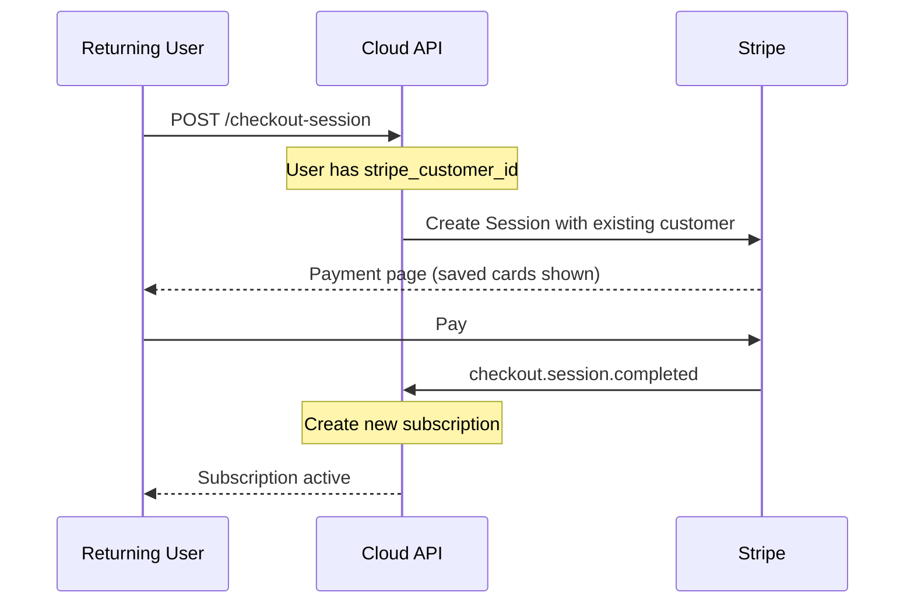

<Tip>
Returning customers see their saved payment methods in Stripe Checkout, enabling faster re-subscription.
</Tip>

### Duplicate Prevention

If a user with an active subscription attempts to start another checkout, the system blocks it and directs them to manage their existing subscription:

```typescript
// Cloud API validates subscription status before creating checkout
const existingSubscription = await getActiveSubscription(userId, projectId);
if (existingSubscription) {
  return { error: "Active subscription exists", redirectTo: "/billing" };
}
```

### Upgrade/Downgrade

Users can change their subscription plan through the customer portal or update API:

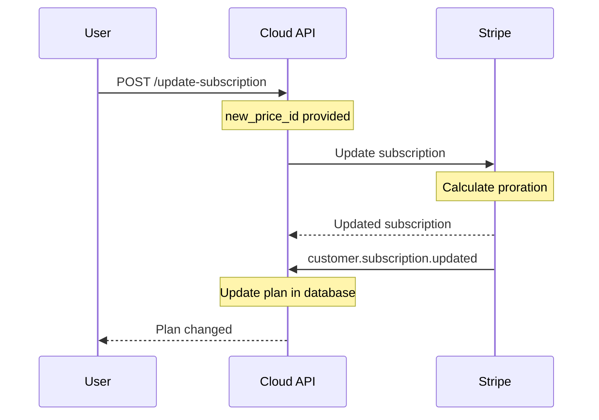

| Change Type | Billing Behavior |
|-------------|-----------------|
| Upgrade | Prorated charge immediately |
| Downgrade | Credit applied to next invoice |

### Cancellation

Users can cancel their subscription immediately or at the end of the billing period:

<Tabs>
  <Tab title="Cancel at Period End">
    User retains access until the current billing period expires.
    
    ```mermaid
    sequenceDiagram
        participant U as User
        participant API as Cloud API
        participant S as Stripe
        
        U->>API: POST /cancel-subscription
        Note over API: at_period_end: true
        API->>S: Update cancel_at_period_end
        S-->>API: Subscription updated
        Note over API: Flag subscription for cancellation
        API-->>U: Access until period end
        
        Note over S: Period ends
        S->>API: customer.subscription.deleted
        Note over API: Mark as cancelled
    ```
  </Tab>
  <Tab title="Cancel Immediately">
    Access is revoked immediately and prorated refund may apply.
    
    ```mermaid
    sequenceDiagram
        participant U as User
        participant API as Cloud API
        participant S as Stripe
        
        U->>API: POST /cancel-subscription
        Note over API: immediate: true
        API->>S: Cancel subscription now
        S->>API: customer.subscription.deleted
        Note over API: Mark as cancelled
        API-->>U: Access revoked
    ```
  </Tab>
</Tabs>

### Uncancellation

When a user who scheduled cancellation at period end changes their mind, they can restore their subscription:

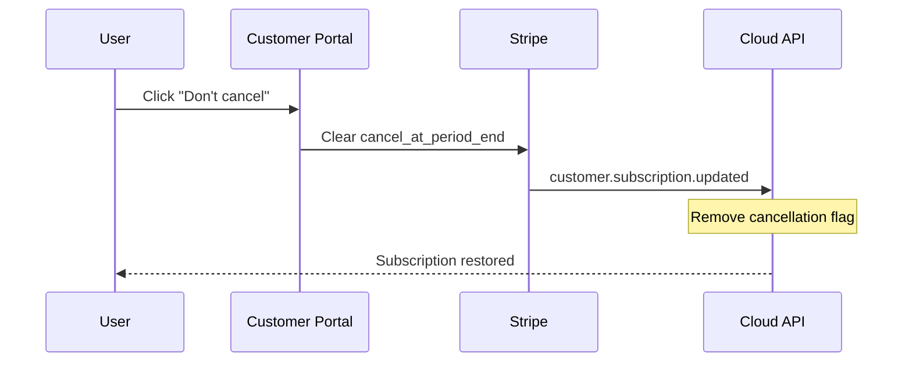

<Tip>
Users can manage their subscription through the Stripe Customer Portal, accessible via the `/customer-portal` endpoint.
</Tip>

### Subscription Renewal

When recurring billing succeeds, the system records the payment and extends the subscription:

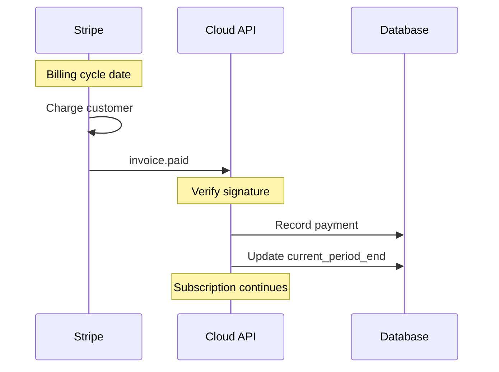

### Trial Periods

Subscriptions can include trial periods where users access features before their first payment:

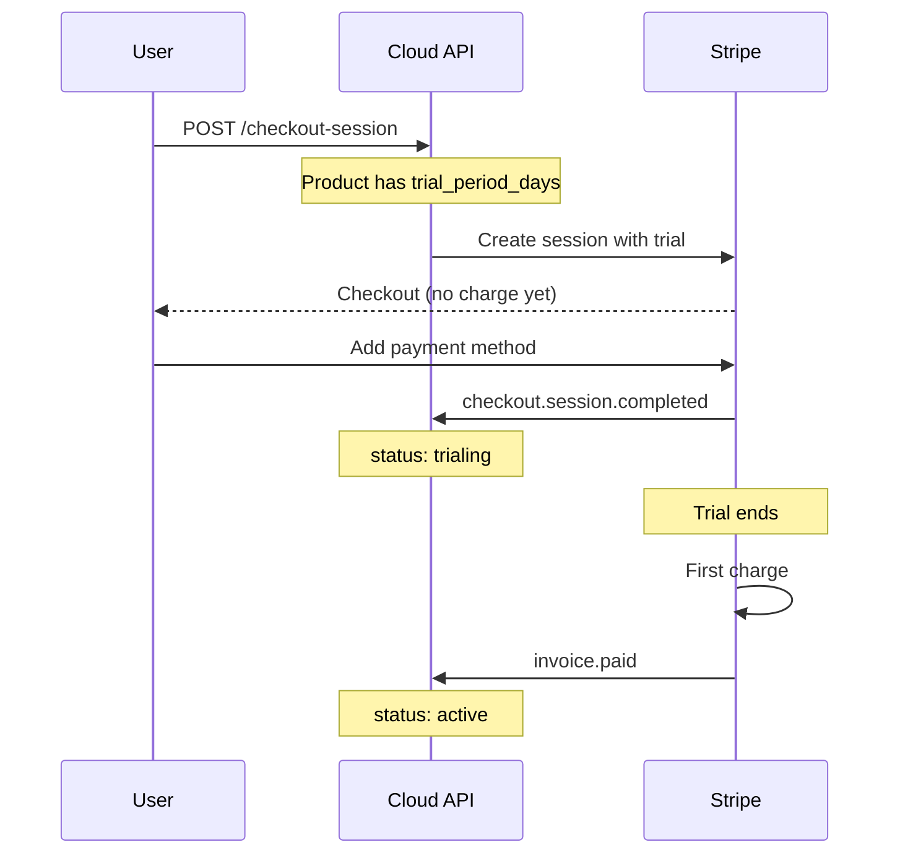

### Payment Failure

When a recurring payment fails, Stripe automatically retries and the system tracks the status:

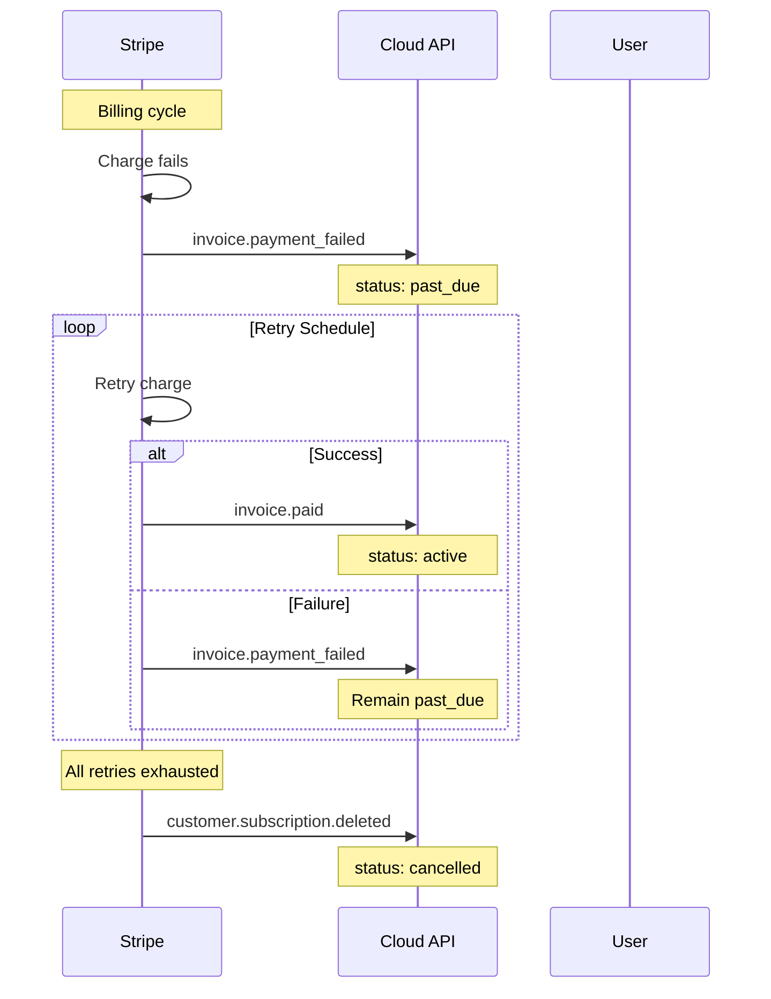

<Warning>
Configure your application to gracefully degrade or restrict access for users with `past_due` subscriptions.
</Warning>

### Customer Portal Access

Users can manage their subscription through Stripe's hosted customer portal:

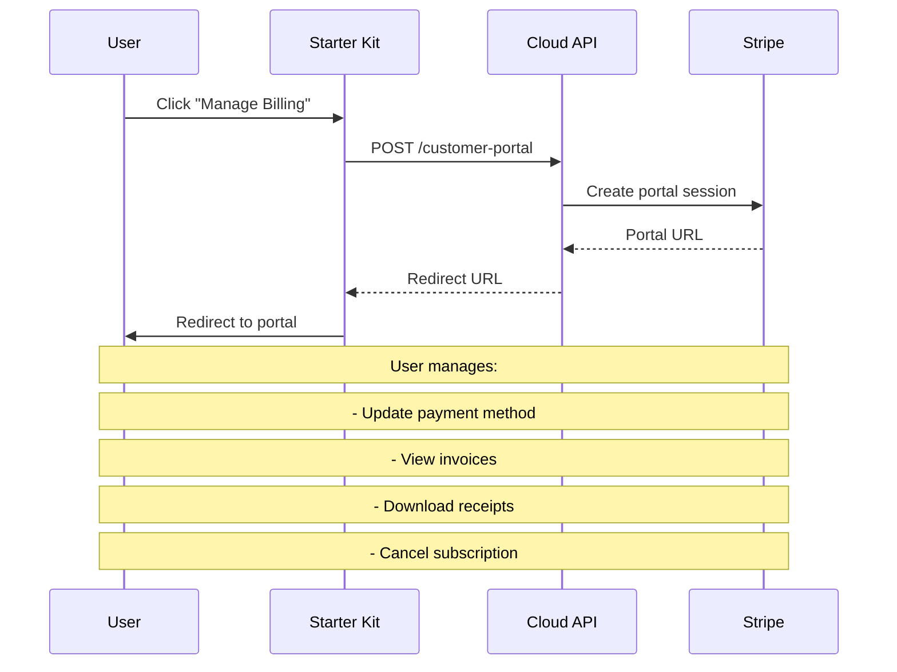

## Subscription Data Model

The Cloud API stores subscription data with these key fields:

| Field | Type | Description |
|-------|------|-------------|
| `id` | UUID | Unique subscription identifier |
| `user_id` | UUID | Associated end user |
| `project_id` | UUID | Project scope |
| `stripe_subscription_id` | string | Stripe subscription ID |
| `stripe_customer_id` | string | Stripe customer ID |
| `status` | enum | Current subscription state |
| `price_id` | string | Stripe price ID for the plan |
| `current_period_start` | timestamp | Current billing period start |
| `current_period_end` | timestamp | Current billing period end |
| `cancel_at_period_end` | boolean | Scheduled for cancellation |
| `cancelled_at` | timestamp | When cancellation was requested |

## Payment History

All transactions are recorded for user access and developer reporting:

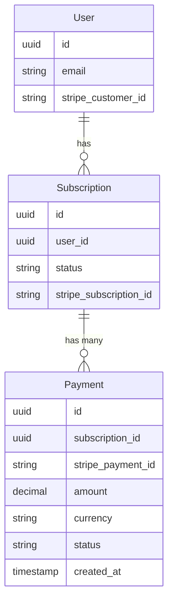

## End-User Billing Endpoints

End users access their billing information through these Cloud API endpoints:

<CardGroup cols={2}>
  <Card title="Get My Subscription" icon="credit-card" href="/cloud-api/payments/stripe/get-my-subscription">
    Retrieve current subscription status, plan, and billing period
  </Card>
  <Card title="Get My Payments" icon="receipt" href="/cloud-api/payments/stripe/get-my-payments">
    List payment history with amounts, dates, and statuses
  </Card>
  <Card title="Customer Portal" icon="user-cog" href="/cloud-api/payments/stripe/create-customer-portal">
    Access Stripe's self-service billing portal
  </Card>
  <Card title="Cancel Subscription" icon="xmark" href="/cloud-api/payments/stripe/cancel-subscription">
    Cancel subscription immediately or at period end
  </Card>
  <Card title="Update Subscription" icon="arrows-rotate" href="/cloud-api/payments/stripe/update-subscription">
    Upgrade or downgrade to a different plan
  </Card>
</CardGroup>

## Developer Analytics

Developers can monitor subscription and payment metrics through Cloud Admin or the API:

### Aggregated Statistics

The `/api/v1/payments/stats` endpoint provides:

- Total active subscriptions
- Total revenue (by period)
- Subscription counts by status
- Transaction counts and totals

### Per-Project Analytics

Each project's Payments tab in Cloud Admin displays:

(((REPLACE_THIS_WITH_IMAGE: console-project-payments-analytics.png: Project payments tab showing subscription stats, transaction history, and revenue metrics)))

- Active subscription count
- Monthly recurring revenue
- Recent transactions
- Subscription/cancellation trends

## Integration Checklist

<Steps>
  <Step title="Configure Stripe">
    Set up API keys and webhook endpoints in [Cloud Admin](/getting-started/features/payment-setup)
  </Step>
  <Step title="Create Stripe Products">
    Define your subscription plans in the [Stripe Dashboard](https://dashboard.stripe.com/products)
  </Step>
  <Step title="Implement Checkout UI">
    Add subscription buttons that call the [checkout session endpoint](/cloud-api/payments/stripe/create-checkout-session)
  </Step>
  <Step title="Handle Subscription States">
    Check user subscription status to gate access to premium features
  </Step>
  <Step title="Add Billing Management">
    Implement [billing UI components](/starter-kit/features/payments) for end users
  </Step>
  <Step title="Test Thoroughly">
    Use [Stripe test mode](/tutorials/integrations/stripe-payments) to verify all workflows
  </Step>
</Steps>

## Next Steps

<CardGroup cols={2}>
  <Card title="Payment Setup" icon="gear" href="/getting-started/features/payment-setup">
    Configure Stripe credentials and webhooks
  </Card>
  <Card title="Starter Kit Billing" icon="window" href="/starter-kit/features/payments">
    Implement billing UI in your application
  </Card>
  <Card title="Stripe Tutorial" icon="graduation-cap" href="/tutorials/integrations/stripe-payments">
    Step-by-step implementation guide
  </Card>
  <Card title="Payment API Reference" icon="code" href="/cloud-api/payments/introduction">
    Complete endpoint documentation
  </Card>
</CardGroup>
