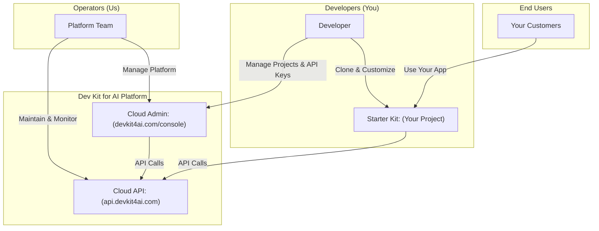

Dev Kit for AI is designed around three distinct user types, each with specific responsibilities, access levels, and interactions with the platform.

<Note>
**You are likely a Developer.** Most people reading this documentation are developers who want to build AI-powered SaaS applications. The platform is designed with you as the primary audience.
</Note>

## How Users Interact with the Platform

## Operators

Operators are the team that runs and maintains the Dev Kit for AI platform — that's us.

### What Operators Do

- **Platform maintenance:** Keep Cloud API and Cloud Admin running and available
- **Infrastructure management:** Handle servers, databases, and scaling
- **Security oversight:** Monitor for threats and ensure data protection
- **Support:** Help developers with technical issues and questions

### Operator Access

Operators have access to:
- Full platform administration
- All system metrics and logs
- User account management
- Infrastructure controls

<Info>
As a developer using Dev Kit for AI, you don't need to interact with operators directly for most tasks. The platform is designed to be self-service. Contact [support@devkit4ai.com](mailto:support@devkit4ai.com) if you need assistance.
</Info>

## Developers

Developers are the primary audience for Dev Kit for AI. You're building AI-powered SaaS applications for your customers.

### What Developers Do

- **Create projects:** Set up new AI applications in Cloud Admin
- **Manage credentials:** Generate and rotate API keys and developer keys
- **Build applications:** Clone the Starter Kit and customize it for your use case
- **Deploy:** Launch your application on your hosting provider
- **Monitor:** Track end user activity and usage statistics

### Developer Access

Developers have access to:

| Component | Access Level |
|-----------|--------------|
| [Cloud Admin](/getting-started/cloud-admin-explained) | Full access to `/console` |
| [Cloud API](/getting-started/cloud-api-explained) | Authenticated via developer key |
| [Starter Kit](/getting-started/starter-kit-explained) | Clone and full ownership |

### Authentication Headers

When your application calls the Cloud API, these headers identify you as a developer:

- **X-User-Role:** `developer` (when accessing Cloud Admin)
- **X-Developer-Key:** Your developer credential from [Cloud Admin](/cloud-admin/api-keys/creating-developer-keys)
- **X-Project-ID:** Your project's UUID
- **X-API-Key:** Your project's API key from [Cloud Admin](/cloud-admin/api-keys/creating-project-keys)

<Tip>
**Developer Profiles**

Whether you're a **Vibe Coding Developer** who wants to ship fast using AI assistants, or a **Professional Developer** who values control and code quality — Dev Kit for AI supports both approaches. The platform provides the same features to all developers, letting you choose your development style.
</Tip>

### Getting Started as a Developer

<Steps>
  <Step title="Sign up">
    Create your account at [devkit4ai.com/register/developer](https://devkit4ai.com/register/developer) or [vibecoding.ad/register/developer](https://vibecoding.ad/register/developer)
  </Step>
  <Step title="Create a project">
    Set up your first project in [Cloud Admin](/cloud-admin/projects/creating-projects)
  </Step>
  <Step title="Clone Starter Kit">
    Get the [Starter Kit](https://github.com/VibeCodingStarter/starter-kit) and configure it with your credentials
  </Step>
  <Step title="Build and deploy">
    Customize your app and [deploy](/starter-kit/deployment/production-build) to your users
  </Step>
</Steps>

## End Users

End Users are the customers of your application — the people who use the AI-powered SaaS you built with Dev Kit for AI.

### What End Users Do

- **Use your application:** Interact with the features you built
- **Create accounts:** Register and log in to your app
- **Generate AI content:** Use the AI capabilities you've enabled
- **Manage their profile:** Update their account settings

### End User Access

End users have access to:

| Component | Access Level |
|-----------|--------------|
| Your Starter Kit app | Full access to features you expose |
| Cloud API | Indirect access through your app |
| Cloud Admin | **No access** |

<Warning>
End users never directly interact with Cloud Admin or the raw Cloud API. All their interactions go through your Starter Kit application, which handles authentication and API calls on their behalf.
</Warning>

### End User Scoping

End users are **project-scoped**, meaning:

- Each end user belongs to a specific project (your application)
- The same email can exist as an end user in different projects
- End user data is isolated between projects
- You can view your end users in [Cloud Admin](/cloud-admin/users/viewing-end-users)

### Authentication Headers

When end users interact with your app, these headers are automatically included:

- **X-User-Role:** `end_user`
- **X-Developer-Key:** Your developer credential
- **X-Project-ID:** Your project's UUID
- **X-API-Key:** Your project's API key
- **Authorization:** The end user's JWT token (after login)

## Role Comparison

| Capability | Operator | Developer | End User |
|------------|----------|-----------|----------|
| Access Cloud Admin | ✅ Full | ✅ Console | ❌ No |
| Create projects | ✅ | ✅ | ❌ |
| Generate API keys | ✅ | ✅ | ❌ |
| View end users | ✅ All | ✅ Own projects | ❌ |
| Use Starter Kit apps | ✅ | ✅ | ✅ |
| AI generation | ✅ | ✅ | ✅ |
| Platform administration | ✅ | ❌ | ❌ |

## Next Steps

<CardGroup cols={2}>
  <Card title="Platform Overview" icon="sitemap" href="/getting-started/platform-overview">
    Understand how components work together
  </Card>
  <Card title="Quick Start" icon="rocket" href="/quickstart">
    Get your first app running in minutes
  </Card>
  <Card title="Cloud Admin" icon="building" href="/getting-started/cloud-admin-explained">
    Learn about the developer console
  </Card>
  <Card title="API Reference" icon="server" href="/cloud-api/introduction">
    Explore the Cloud API endpoints
  </Card>
</CardGroup>
