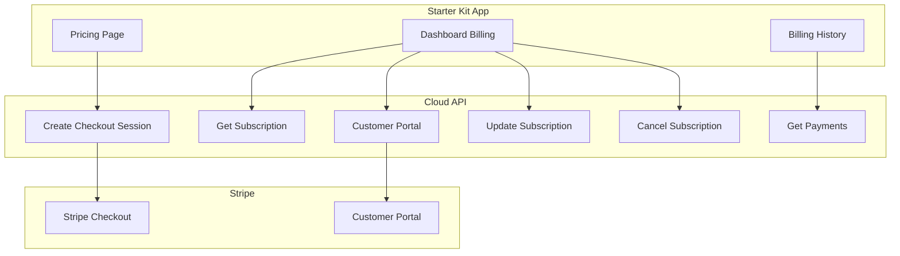

The Starter Kit integrates with Dev Kit for AI's payment system to provide subscription billing for your end users. This guide covers implementing billing UI, managing subscriptions, and providing self-service payment management.

## Overview

End users of your Starter Kit application can:

- Subscribe to paid plans through Stripe Checkout
- View their current subscription status
- Access payment history and download invoices
- Manage billing through the customer portal
- Upgrade, downgrade, or cancel subscriptions



## Prerequisites

Before implementing billing in your app:

<Steps>
  <Step title="Configure Stripe in Cloud Admin">
    Complete the [Payment Setup & Configuration](/getting-started/features/payment-setup) guide to add your Stripe credentials.
  </Step>
  <Step title="Create Stripe Products">
    Set up your subscription products and prices in the [Stripe Dashboard](https://dashboard.stripe.com/products). Note the Price IDs.
  </Step>
  <Step title="Verify Webhooks">
    Ensure webhook endpoints are configured and receiving events correctly.
  </Step>
</Steps>

## Displaying Subscription Status

Fetch and display the user's current subscription in your dashboard:

### Server Action

Create a server action to fetch subscription status:

```typescript
// app/billing/actions.ts
"use server";

import { cookies } from "next/headers";

interface Subscription {
  id: string;
  status: "active" | "trialing" | "past_due" | "cancelled" | "incomplete";
  current_period_start: string;
  current_period_end: string;
  cancel_at_period_end: boolean;
  price_id: string;
  plan_name?: string;
}

interface SubscriptionResponse {
  subscription: Subscription | null;
}

export async function getMySubscription(): Promise<Subscription | null> {
  const token = cookies().get("devkit4ai-token")?.value;
  
  if (!token) {
    return null;
  }

  const response = await fetch(
    `${process.env.NEXT_PUBLIC_API_URL}/api/v1/payments/stripe/my-subscription`,
    {
      headers: {
        Authorization: `Bearer ${token}`,
        "X-Project-ID": process.env.DEVKIT4AI_PROJECT_ID!,
        "X-API-Key": process.env.DEVKIT4AI_PROJECT_KEY!,
      },
      cache: "no-store",
    }
  );

  if (!response.ok) {
    return null;
  }

  const data: SubscriptionResponse = await response.json();
  return data.subscription;
}
```

### Subscription Status Component

Display subscription status with appropriate messaging:

```tsx
// components/billing/subscription-status.tsx
import { getMySubscription } from "@/app/billing/actions";
import { Badge } from "@/components/ui/badge";
import { Card, CardContent, CardHeader, CardTitle } from "@/components/ui/card";

const statusColors: Record<string, string> = {
  active: "bg-green-500",
  trialing: "bg-blue-500",
  past_due: "bg-yellow-500",
  cancelled: "bg-gray-500",
  incomplete: "bg-red-500",
};

export async function SubscriptionStatus() {
  const subscription = await getMySubscription();

  if (!subscription) {
    return (
      <Card>
        <CardHeader>
          <CardTitle>Subscription</CardTitle>
        </CardHeader>
        <CardContent>
          <p className="text-muted-foreground">No active subscription</p>
          <a href="/pricing" className="text-primary hover:underline">
            View plans →
          </a>
        </CardContent>
      </Card>
    );
  }

  return (
    <Card>
      <CardHeader>
        <CardTitle className="flex items-center justify-between">
          Subscription
          <Badge className={statusColors[subscription.status]}>
            {subscription.status}
          </Badge>
        </CardTitle>
      </CardHeader>
      <CardContent>
        <dl className="space-y-2">
          <div>
            <dt className="text-sm text-muted-foreground">Plan</dt>
            <dd className="font-medium">{subscription.plan_name || "Premium"}</dd>
          </div>
          <div>
            <dt className="text-sm text-muted-foreground">Renews</dt>
            <dd className="font-medium">
              {new Date(subscription.current_period_end).toLocaleDateString()}
            </dd>
          </div>
          {subscription.cancel_at_period_end && (
            <div className="text-yellow-600 dark:text-yellow-400">
              ⚠️ Cancels at end of billing period
            </div>
          )}
        </dl>
      </CardContent>
    </Card>
  );
}
```

## Creating Checkout Sessions

Redirect users to Stripe Checkout to subscribe:

### Server Action

```typescript
// app/billing/actions.ts
"use server";

import { redirect } from "next/navigation";
import { cookies } from "next/headers";

interface CheckoutInput {
  priceId: string;
  successUrl?: string;
  cancelUrl?: string;
}

export async function createCheckoutSession(input: CheckoutInput) {
  const token = cookies().get("devkit4ai-token")?.value;
  
  if (!token) {
    redirect("/login?returnUrl=/pricing");
  }

  const response = await fetch(
    `${process.env.NEXT_PUBLIC_API_URL}/api/v1/payments/stripe/checkout-session`,
    {
      method: "POST",
      headers: {
        "Content-Type": "application/json",
        Authorization: `Bearer ${token}`,
        "X-Project-ID": process.env.DEVKIT4AI_PROJECT_ID!,
        "X-API-Key": process.env.DEVKIT4AI_PROJECT_KEY!,
      },
      body: JSON.stringify({
        price_id: input.priceId,
        success_url: input.successUrl || `${process.env.NEXT_PUBLIC_APP_URL}/billing/success`,
        cancel_url: input.cancelUrl || `${process.env.NEXT_PUBLIC_APP_URL}/pricing`,
      }),
    }
  );

  if (!response.ok) {
    const error = await response.json();
    throw new Error(error.detail || "Failed to create checkout session");
  }

  const data = await response.json();
  redirect(data.checkout_url);
}
```

### Subscribe Button

```tsx
// components/billing/subscribe-button.tsx
"use client";

import { useState } from "react";
import { Button } from "@/components/ui/button";
import { createCheckoutSession } from "@/app/billing/actions";

interface SubscribeButtonProps {
  priceId: string;
  planName: string;
}

export function SubscribeButton({ priceId, planName }: SubscribeButtonProps) {
  const [loading, setLoading] = useState(false);

  async function handleSubscribe() {
    setLoading(true);
    try {
      await createCheckoutSession({ priceId });
    } catch (error) {
      console.error("Checkout error:", error);
      setLoading(false);
    }
  }

  return (
    <Button onClick={handleSubscribe} disabled={loading}>
      {loading ? "Redirecting..." : `Subscribe to ${planName}`}
    </Button>
  );
}
```

## Payment History

Display the user's payment history:

### Server Action

```typescript
// app/billing/actions.ts
"use server";

interface Payment {
  id: string;
  amount: number;
  currency: string;
  status: string;
  created_at: string;
  invoice_url?: string;
}

export async function getMyPayments(): Promise<Payment[]> {
  const token = cookies().get("devkit4ai-token")?.value;
  
  if (!token) {
    return [];
  }

  const response = await fetch(
    `${process.env.NEXT_PUBLIC_API_URL}/api/v1/payments/stripe/my-payments`,
    {
      headers: {
        Authorization: `Bearer ${token}`,
        "X-Project-ID": process.env.DEVKIT4AI_PROJECT_ID!,
        "X-API-Key": process.env.DEVKIT4AI_PROJECT_KEY!,
      },
      cache: "no-store",
    }
  );

  if (!response.ok) {
    return [];
  }

  const data = await response.json();
  return data.payments || [];
}
```

### Payment History Component

```tsx
// components/billing/payment-history.tsx
import { getMyPayments } from "@/app/billing/actions";
import {
  Table,
  TableBody,
  TableCell,
  TableHead,
  TableHeader,
  TableRow,
} from "@/components/ui/table";
import { Badge } from "@/components/ui/badge";

function formatCurrency(amount: number, currency: string): string {
  return new Intl.NumberFormat("en-US", {
    style: "currency",
    currency: currency.toUpperCase(),
  }).format(amount / 100);
}

export async function PaymentHistory() {
  const payments = await getMyPayments();

  if (payments.length === 0) {
    return (
      <p className="text-muted-foreground">No payment history available.</p>
    );
  }

  return (
    <Table>
      <TableHeader>
        <TableRow>
          <TableHead>Date</TableHead>
          <TableHead>Amount</TableHead>
          <TableHead>Status</TableHead>
          <TableHead>Invoice</TableHead>
        </TableRow>
      </TableHeader>
      <TableBody>
        {payments.map((payment) => (
          <TableRow key={payment.id}>
            <TableCell>
              {new Date(payment.created_at).toLocaleDateString()}
            </TableCell>
            <TableCell>
              {formatCurrency(payment.amount, payment.currency)}
            </TableCell>
            <TableCell>
              <Badge variant={payment.status === "succeeded" ? "default" : "secondary"}>
                {payment.status}
              </Badge>
            </TableCell>
            <TableCell>
              {payment.invoice_url && (
                <a
                  href={payment.invoice_url}
                  target="_blank"
                  rel="noopener noreferrer"
                  className="text-primary hover:underline"
                >
                  Download
                </a>
              )}
            </TableCell>
          </TableRow>
        ))}
      </TableBody>
    </Table>
  );
}
```

## Customer Portal Access

Let users manage their billing through Stripe's hosted customer portal:

### Server Action

```typescript
// app/billing/actions.ts
"use server";

import { redirect } from "next/navigation";
import { cookies } from "next/headers";

export async function openCustomerPortal() {
  const token = cookies().get("devkit4ai-token")?.value;
  
  if (!token) {
    redirect("/login");
  }

  const response = await fetch(
    `${process.env.NEXT_PUBLIC_API_URL}/api/v1/payments/stripe/customer-portal`,
    {
      method: "POST",
      headers: {
        "Content-Type": "application/json",
        Authorization: `Bearer ${token}`,
        "X-Project-ID": process.env.DEVKIT4AI_PROJECT_ID!,
        "X-API-Key": process.env.DEVKIT4AI_PROJECT_KEY!,
      },
      body: JSON.stringify({
        return_url: `${process.env.NEXT_PUBLIC_APP_URL}/dashboard`,
      }),
    }
  );

  if (!response.ok) {
    throw new Error("Failed to create portal session");
  }

  const data = await response.json();
  redirect(data.portal_url);
}
```

### Manage Billing Button

```tsx
// components/billing/manage-billing-button.tsx
"use client";

import { useState } from "react";
import { Button } from "@/components/ui/button";
import { openCustomerPortal } from "@/app/billing/actions";

export function ManageBillingButton() {
  const [loading, setLoading] = useState(false);

  async function handleClick() {
    setLoading(true);
    try {
      await openCustomerPortal();
    } catch (error) {
      console.error("Portal error:", error);
      setLoading(false);
    }
  }

  return (
    <Button variant="outline" onClick={handleClick} disabled={loading}>
      {loading ? "Opening..." : "Manage Billing"}
    </Button>
  );
}
```

The customer portal provides users with:

- Update payment method
- View and download invoices
- Cancel subscription
- Update billing address

(((REPLACE_THIS_WITH_IMAGE: stripe-customer-portal-example.png: Stripe customer portal showing payment methods, invoices, and subscription management options)))

## Subscription Management

### Cancel Subscription

Allow users to cancel their subscription:

```typescript
// app/billing/actions.ts
"use server";

interface CancelInput {
  immediate?: boolean;
}

export async function cancelSubscription(input: CancelInput = {}) {
  const token = cookies().get("devkit4ai-token")?.value;
  
  if (!token) {
    throw new Error("Not authenticated");
  }

  const response = await fetch(
    `${process.env.NEXT_PUBLIC_API_URL}/api/v1/payments/stripe/cancel-subscription`,
    {
      method: "POST",
      headers: {
        "Content-Type": "application/json",
        Authorization: `Bearer ${token}`,
        "X-Project-ID": process.env.DEVKIT4AI_PROJECT_ID!,
        "X-API-Key": process.env.DEVKIT4AI_PROJECT_KEY!,
      },
      body: JSON.stringify({
        immediate: input.immediate || false,
      }),
    }
  );

  if (!response.ok) {
    const error = await response.json();
    throw new Error(error.detail || "Failed to cancel subscription");
  }

  return { success: true };
}
```

### Update Subscription (Plan Change)

Allow users to upgrade or downgrade their plan:

```typescript
// app/billing/actions.ts
"use server";

interface UpdateInput {
  newPriceId: string;
}

export async function updateSubscription(input: UpdateInput) {
  const token = cookies().get("devkit4ai-token")?.value;
  
  if (!token) {
    throw new Error("Not authenticated");
  }

  const response = await fetch(
    `${process.env.NEXT_PUBLIC_API_URL}/api/v1/payments/stripe/update-subscription`,
    {
      method: "POST",
      headers: {
        "Content-Type": "application/json",
        Authorization: `Bearer ${token}`,
        "X-Project-ID": process.env.DEVKIT4AI_PROJECT_ID!,
        "X-API-Key": process.env.DEVKIT4AI_PROJECT_KEY!,
      },
      body: JSON.stringify({
        new_price_id: input.newPriceId,
      }),
    }
  );

  if (!response.ok) {
    const error = await response.json();
    throw new Error(error.detail || "Failed to update subscription");
  }

  return { success: true };
}
```

## Gating Premium Features

Check subscription status to gate premium features:

```tsx
// lib/subscription.ts
import { getMySubscription } from "@/app/billing/actions";

export async function hasActiveSubscription(): Promise<boolean> {
  const subscription = await getMySubscription();
  return subscription?.status === "active" || subscription?.status === "trialing";
}

export async function requireSubscription() {
  const hasSubscription = await hasActiveSubscription();
  if (!hasSubscription) {
    redirect("/pricing");
  }
}
```

Use in pages:

```tsx
// app/premium-feature/page.tsx
import { requireSubscription } from "@/lib/subscription";

export default async function PremiumFeaturePage() {
  await requireSubscription();
  
  return (
    <div>
      <h1>Premium Feature</h1>
      {/* Premium content */}
    </div>
  );
}
```

## Billing Page Example

Complete billing management page:

```tsx
// app/billing/page.tsx
import { requireAuth } from "@/lib/auth-server";
import { SubscriptionStatus } from "@/components/billing/subscription-status";
import { PaymentHistory } from "@/components/billing/payment-history";
import { ManageBillingButton } from "@/components/billing/manage-billing-button";

export default async function BillingPage() {
  await requireAuth();

  return (
    <div className="container mx-auto py-8 space-y-8">
      <div className="flex items-center justify-between">
        <h1 className="text-3xl font-bold">Billing</h1>
        <ManageBillingButton />
      </div>

      <div className="grid gap-6 md:grid-cols-2">
        <SubscriptionStatus />
      </div>

      <div>
        <h2 className="text-2xl font-bold mb-4">Payment History</h2>
        <PaymentHistory />
      </div>
    </div>
  );
}
```

(((REPLACE_THIS_WITH_IMAGE: starter-kit-billing-page.png: Starter Kit billing page showing subscription status card, manage billing button, and payment history table)))

## Next Steps

<CardGroup cols={2}>
  <Card title="Payment Setup" icon="gear" href="/getting-started/features/payment-setup">
    Configure Stripe credentials in Cloud Admin
  </Card>
  <Card title="Subscription Lifecycle" icon="repeat" href="/getting-started/features/subscription-billing">
    Understand the complete subscription workflow
  </Card>
  <Card title="Stripe Tutorial" icon="graduation-cap" href="/tutorials/integrations/stripe-payments">
    Step-by-step implementation guide
  </Card>
  <Card title="Payment API Reference" icon="code" href="/cloud-api/payments/introduction">
    Complete endpoint documentation
  </Card>
</CardGroup>
