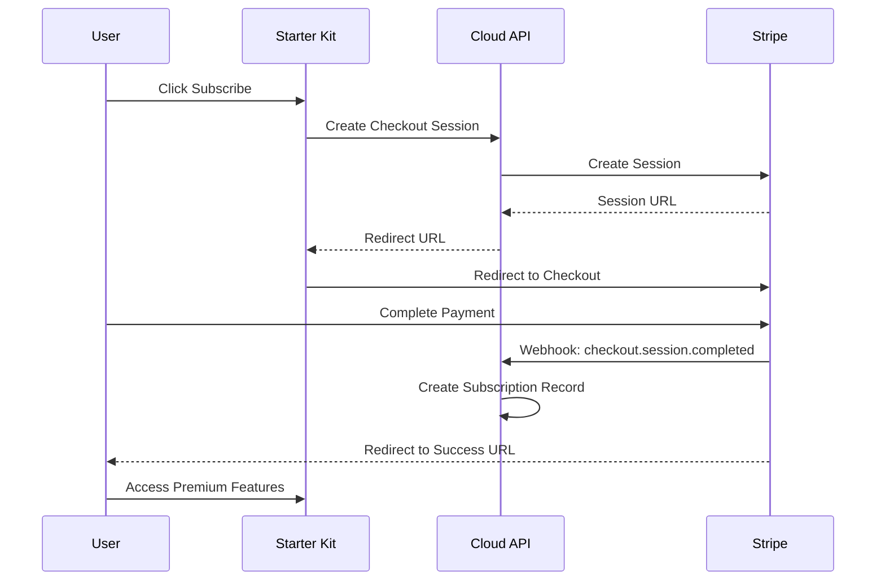
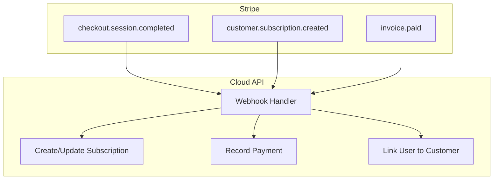

This tutorial walks you through the complete process of setting up Stripe subscription payments for your Dev Kit for AI project, from creating a Stripe account to processing live transactions.

## What You'll Build

By the end of this tutorial, your application will:

- Accept subscription payments through Stripe Checkout
- Process webhook events for subscription lifecycle management
- Provide self-service billing through the customer portal
- Handle upgrades, downgrades, and cancellations



## Prerequisites

Before starting this tutorial:

- A Dev Kit for AI account with at least one project ([register here](https://devkit4ai.com/register/developer))
- Your Starter Kit application running locally
- Node.js 18+ and npm installed
- Basic understanding of TypeScript and React

<Info>
Your Starter Kit requires these environment variables for payment integration:
- `DEVKIT4AI_DEVELOPER_KEY` - Your developer key from Cloud Admin
- `DEVKIT4AI_PROJECT_ID` - Your project UUID
- `DEVKIT4AI_PROJECT_KEY` - Your project API key
- `NEXT_PUBLIC_API_URL` - Cloud API URL (default: `https://api.devkit4ai.com`)
- `NEXT_PUBLIC_APP_URL` - Your application URL for redirects
</Info>

## Step 1: Create a Stripe Account

<Steps>
  <Step title="Register for Stripe">
    Go to [stripe.com](https://stripe.com) and create an account. You can start in test mode immediately without providing banking details.
  </Step>
  <Step title="Complete Account Setup">
    Fill in your business details. For testing, you can use placeholder information.
  </Step>
  <Step title="Access the Dashboard">
    Navigate to the [Stripe Dashboard](https://dashboard.stripe.com). Make sure "Test mode" is enabled (toggle in the top-right corner).
  </Step>
</Steps>

(((REPLACE_THIS_WITH_IMAGE: stripe-dashboard-test-mode-toggle.png: Stripe dashboard showing the test mode toggle in the header)))

## Step 2: Get Your Stripe API Keys

<Steps>
  <Step title="Navigate to API Keys">
    In the Stripe Dashboard, go to **Developers → API keys** or visit [dashboard.stripe.com/apikeys](https://dashboard.stripe.com/apikeys).
  </Step>
  <Step title="Copy Test Keys">
    You'll see two test keys:
    - **Publishable key**: Starts with `pk_test_`
    - **Secret key**: Starts with `sk_test_` (click "Reveal test key" to view)
    
    Copy both keys to a secure location.
  </Step>
</Steps>

<Warning>
Never commit your Stripe secret key to version control or expose it in client-side code. The secret key should only be used server-side.
</Warning>

## Step 3: Create Subscription Products

Before configuring payments, set up your subscription products in Stripe:

<Steps>
  <Step title="Navigate to Products">
    Go to **Products** in the Stripe Dashboard or visit [dashboard.stripe.com/products](https://dashboard.stripe.com/products).
  </Step>
  <Step title="Create a Product">
    Click "Add product" and fill in:
    - **Name**: e.g., "Pro Plan"
    - **Description**: Your plan description
  </Step>
  <Step title="Add Pricing">
    Add a recurring price:
    - **Pricing model**: Standard pricing
    - **Price**: e.g., $29.00
    - **Billing period**: Monthly or Yearly
    
    Note the **Price ID** (starts with `price_`) - you'll need this later.
  </Step>
</Steps>

Create at least one product for testing. You can create multiple products for different tiers (e.g., Basic, Pro, Enterprise).

## Step 4: Configure Stripe in Cloud Admin

Now configure your project to use Stripe:

<Steps>
  <Step title="Open Cloud Admin">
    Log in to [Cloud Admin](https://devkit4ai.com/console) and navigate to your project.
  </Step>
  <Step title="Go to Payments Tab">
    Click on the "Payments" tab in your project details.
  </Step>
  <Step title="Configure Test Mode">
    Click "Configure Stripe" and enter:
    - **Mode**: Test
    - **Publishable Key**: Your `pk_test_` key
    - **Secret Key**: Your `sk_test_` key
    - Leave webhook secret empty for now
  </Step>
  <Step title="Save Configuration">
    Click "Validate & Save". The system will verify your credentials with Stripe.
  </Step>
</Steps>

(((REPLACE_THIS_WITH_IMAGE: cloud-admin-stripe-config-dialog.png: Cloud Admin Stripe configuration dialog showing API key input fields)))

## Step 5: Set Up Webhook Forwarding

Webhooks allow Stripe to notify your application about events like successful payments. For local development, use the Stripe CLI:

<Steps>
  <Step title="Install Stripe CLI">
    <Tabs>
      <Tab title="macOS">
        ```bash
        brew install stripe/stripe-cli/stripe
        ```
      </Tab>
      <Tab title="Windows">
        Download from [Stripe CLI releases](https://github.com/stripe/stripe-cli/releases) or use Scoop:
        ```bash
        scoop install stripe
        ```
      </Tab>
      <Tab title="Linux">
        ```bash
        # Debian/Ubuntu
        curl -s https://packages.stripe.dev/api/security/keypair/stripe-cli-gpg/public | gpg --dearmor | sudo tee /usr/share/keyrings/stripe.gpg
        echo "deb [signed-by=/usr/share/keyrings/stripe.gpg] https://packages.stripe.dev/stripe-cli-debian-local stable main" | sudo tee -a /etc/apt/sources.list.d/stripe.list
        sudo apt update && sudo apt install stripe
        ```
      </Tab>
    </Tabs>
  </Step>
  <Step title="Login to Stripe CLI">
    ```bash
    stripe login
    ```
    This opens a browser window to authenticate.
  </Step>
  <Step title="Forward Webhooks">
    Start webhook forwarding to your local Cloud API:
    ```bash
    stripe listen --forward-to localhost:8000/api/v1/payments/stripe/webhooks/{your-project-id}/test
    ```
    
    Replace `{your-project-id}` with your actual project UUID.
  </Step>
  <Step title="Copy Webhook Signing Secret">
    The CLI displays a webhook signing secret starting with `whsec_`. Copy this value.
  </Step>
  <Step title="Update Cloud Admin Configuration">
    Go back to Cloud Admin → Project → Payments → Configure Stripe and add the webhook signing secret.
  </Step>
</Steps>

<Tip>
Keep the `stripe listen` terminal running while testing. Each time you restart it, you'll get a new webhook secret that needs to be updated in Cloud Admin.
</Tip>

## Step 6: Create Your First Checkout Session

Now let's test the payment flow. Add a checkout button to your Starter Kit application:

### Server Action

Create the checkout action:

```typescript
// app/billing/actions.ts
"use server";

import { cookies } from "next/headers";
import { redirect } from "next/navigation";

export async function createCheckoutSession(priceId: string, testMode: boolean = true) {
  const cookieStore = await cookies();
  const token = cookieStore.get("devkit4ai-token")?.value;
  
  if (!token) {
    redirect("/login?returnUrl=/pricing");
  }

  const response = await fetch(
    `${process.env.NEXT_PUBLIC_API_URL}/api/v1/payments/stripe/checkout-session?test_mode=${testMode}`,
    {
      method: "POST",
      headers: {
        "Content-Type": "application/json",
        "Authorization": `Bearer ${token}`,
        "X-User-Role": "end_user",
        "X-Developer-Key": process.env.DEVKIT4AI_DEVELOPER_KEY!,
        "X-Project-ID": process.env.DEVKIT4AI_PROJECT_ID!,
        "X-API-Key": process.env.DEVKIT4AI_PROJECT_KEY!,
      },
      body: JSON.stringify({
        price_id: priceId,
        success_url: `${process.env.NEXT_PUBLIC_APP_URL}/billing/success`,
        cancel_url: `${process.env.NEXT_PUBLIC_APP_URL}/pricing`,
      }),
    }
  );

  if (!response.ok) {
    const error = await response.json();
    throw new Error(error.detail || "Failed to create checkout session");
  }

  const data = await response.json();
  redirect(data.checkout_url);
}
```

<Note>
The `testMode` parameter defaults to `true` for development. Set to `false` when processing live payments in production. This determines whether the API uses your test or live Stripe credentials.
</Note>

### Subscribe Button Component

```tsx
// components/billing/subscribe-button.tsx
"use client";

import { useState } from "react";
import { Button } from "@/components/ui/button";
import { createCheckoutSession } from "@/app/billing/actions";

interface SubscribeButtonProps {
  priceId: string;
  planName: string;
  testMode?: boolean;
}

export function SubscribeButton({ priceId, planName, testMode = true }: SubscribeButtonProps) {
  const [loading, setLoading] = useState(false);

  async function handleSubscribe() {
    setLoading(true);
    try {
      await createCheckoutSession(priceId, testMode);
    } catch (error) {
      console.error("Checkout error:", error);
      setLoading(false);
    }
  }

  return (
    <Button onClick={handleSubscribe} disabled={loading} size="lg">
      {loading ? "Redirecting..." : `Subscribe to ${planName}`}
    </Button>
  );
}
```

### Pricing Page

```tsx
// app/pricing/page.tsx
import { SubscribeButton } from "@/components/billing/subscribe-button";

export default function PricingPage() {
  return (
    <div className="container mx-auto py-16">
      <h1 className="text-4xl font-bold text-center mb-12">
        Choose Your Plan
      </h1>
      
      <div className="grid md:grid-cols-2 gap-8 max-w-4xl mx-auto">
        <div className="border rounded-lg p-8">
          <h2 className="text-2xl font-bold">Basic</h2>
          <p className="text-4xl font-bold mt-4">$9<span className="text-lg">/mo</span></p>
          <ul className="mt-6 space-y-2">
            <li>✓ 100 AI generations/month</li>
            <li>✓ Basic support</li>
          </ul>
          <div className="mt-8">
            <SubscribeButton 
              priceId="price_basic_monthly_id" 
              planName="Basic" 
            />
          </div>
        </div>
        
        <div className="border rounded-lg p-8 border-primary">
          <h2 className="text-2xl font-bold">Pro</h2>
          <p className="text-4xl font-bold mt-4">$29<span className="text-lg">/mo</span></p>
          <ul className="mt-6 space-y-2">
            <li>✓ Unlimited AI generations</li>
            <li>✓ Priority support</li>
            <li>✓ Advanced features</li>
          </ul>
          <div className="mt-8">
            <SubscribeButton 
              priceId="price_pro_monthly_id" 
              planName="Pro" 
            />
          </div>
        </div>
      </div>
    </div>
  );
}
```

<Note>
Replace `price_basic_monthly_id` and `price_pro_monthly_id` with your actual Price IDs from Stripe.
</Note>

## Step 7: Test the Payment Flow

Now test the complete payment flow using Stripe's test cards:

<Steps>
  <Step title="Ensure Services Are Running">
    Make sure you have:
    - Starter Kit running locally (`npm run dev`)
    - Cloud API running locally or using the hosted API
    - Stripe CLI forwarding webhooks (`stripe listen ...`)
  </Step>
  <Step title="Navigate to Pricing">
    Open your app and go to the pricing page.
  </Step>
  <Step title="Click Subscribe">
    Click any "Subscribe" button. You'll be redirected to Stripe Checkout.
  </Step>
  <Step title="Use Test Card">
    Enter the test card details:
    
    | Field | Value |
    |-------|-------|
    | Card number | `4242 4242 4242 4242` |
    | Expiry | Any future date (e.g., `12/34`) |
    | CVC | Any 3 digits (e.g., `123`) |
    | Name | Any name |
    | Country | Any country |
  </Step>
  <Step title="Complete Payment">
    Click "Subscribe" on the Stripe Checkout page.
  </Step>
  <Step title="Verify Success">
    You should be redirected to your success page, and you should see webhook events in your Stripe CLI terminal.
  </Step>
</Steps>

### Test Card Numbers

Stripe provides various test card numbers for different scenarios:

| Scenario | Card Number |
|----------|-------------|
| Successful payment | `4242 4242 4242 4242` |
| Requires authentication | `4000 0025 0000 3155` |
| Declined (generic) | `4000 0000 0000 9995` |
| Declined (insufficient funds) | `4000 0000 0000 9995` |
| Expired card | `4000 0000 0000 0069` |

<Tip>
Use different test cards to verify your error handling works correctly.
</Tip>

## Step 8: Verify Webhook Events

Check that webhooks are being processed correctly:

### In Stripe CLI

Your terminal running `stripe listen` should show events like:

```
2026-01-14 10:30:15   --> checkout.session.completed [evt_...]
2026-01-14 10:30:15   --> customer.subscription.created [evt_...]
2026-01-14 10:30:16   --> invoice.paid [evt_...]
```

### In Cloud Admin

Navigate to your project's Payments tab. You should see:
- A new subscription in the subscriptions list
- A payment transaction in the transaction history

### Webhook Event Flow



## Step 9: Implement Billing Management

Add subscription status display and billing management:

### Get Subscription Status

```typescript
// app/billing/actions.ts
"use server";

import { cookies } from "next/headers";

interface Subscription {
  id: string;
  status: string;
  subscription_id: string;
  plan_name?: string;
  current_period_start: string | null;
  current_period_end: string | null;
  cancel_at: string | null;
  cancelled_at: string | null;
}

export async function getMySubscription(testMode: boolean = true): Promise<Subscription | null> {
  const cookieStore = await cookies();
  const token = cookieStore.get("devkit4ai-token")?.value;
  
  if (!token) return null;

  const response = await fetch(
    `${process.env.NEXT_PUBLIC_API_URL}/api/v1/payments/stripe/my-subscription?test_mode=${testMode}`,
    {
      headers: {
        "Authorization": `Bearer ${token}`,
        "X-User-Role": "end_user",
        "X-Developer-Key": process.env.DEVKIT4AI_DEVELOPER_KEY!,
        "X-Project-ID": process.env.DEVKIT4AI_PROJECT_ID!,
        "X-API-Key": process.env.DEVKIT4AI_PROJECT_KEY!,
      },
      cache: "no-store",
    }
  );

  if (!response.ok) return null;

  // Returns subscription object directly or null if no subscription exists
  return await response.json();
}
```

### Customer Portal Access

```typescript
// app/billing/actions.ts
"use server";

import { cookies } from "next/headers";
import { redirect } from "next/navigation";

export async function openCustomerPortal(testMode: boolean = true) {
  const cookieStore = await cookies();
  const token = cookieStore.get("devkit4ai-token")?.value;
  
  if (!token) {
    redirect("/login");
  }

  const response = await fetch(
    `${process.env.NEXT_PUBLIC_API_URL}/api/v1/payments/stripe/customer-portal?test_mode=${testMode}`,
    {
      method: "POST",
      headers: {
        "Content-Type": "application/json",
        "Authorization": `Bearer ${token}`,
        "X-User-Role": "end_user",
        "X-Developer-Key": process.env.DEVKIT4AI_DEVELOPER_KEY!,
        "X-Project-ID": process.env.DEVKIT4AI_PROJECT_ID!,
        "X-API-Key": process.env.DEVKIT4AI_PROJECT_KEY!,
      },
      body: JSON.stringify({
        return_url: `${process.env.NEXT_PUBLIC_APP_URL}/dashboard`,
      }),
    }
  );

  if (!response.ok) {
    throw new Error("Failed to create portal session");
  }

  const data = await response.json();
  redirect(data.portal_url);
}
```

## Step 10: Switch to Live Mode

Once you've thoroughly tested in test mode, switch to live payments:

<Steps>
  <Step title="Complete Stripe Account Setup">
    In the Stripe Dashboard, complete your account activation:
    - Add business details
    - Connect a bank account for payouts
    - Verify your identity
  </Step>
  <Step title="Create Live Products">
    Create your subscription products in live mode (they don't transfer from test mode).
  </Step>
  <Step title="Get Live API Keys">
    Go to Developers → API keys and switch to live mode. Copy your live keys (`pk_live_` and `sk_live_`).
  </Step>
  <Step title="Configure Live Mode in Cloud Admin">
    Go to your project's Payments tab → Configure Stripe:
    - Switch to **Live** mode
    - Enter your live API keys
    - Enter your live webhook signing secret
  </Step>
  <Step title="Set Up Production Webhooks">
    In Stripe Dashboard → Developers → Webhooks:
    - Add endpoint: `https://api.devkit4ai.com/api/v1/payments/stripe/webhooks/{project-id}/live`
    - Select events: `checkout.session.completed`, `customer.subscription.*`, `invoice.*`
    - Copy the signing secret to Cloud Admin
  </Step>
  <Step title="Update Price IDs">
    Replace test Price IDs in your code with live Price IDs.
  </Step>
  <Step title="Update testMode Parameter">
    Change `testMode` from `true` to `false` in your billing actions to use live Stripe credentials:
    ```typescript
    // Production usage
    await createCheckoutSession(priceId, false);
    await getMySubscription(false);
    await openCustomerPortal(false);
    ```
  </Step>
</Steps>

<Warning>
Test thoroughly in test mode before going live. Live mode processes real payments and charges real money.
</Warning>

## Troubleshooting

### Checkout Session Fails to Create

**Error**: "Failed to create checkout session"

**Solutions**:
1. Verify your Stripe credentials are correctly configured in Cloud Admin
2. Check that the Price ID exists in your Stripe account
3. Ensure the user is authenticated before starting checkout
4. Check Cloud API logs for detailed error messages

### Webhook Events Not Received

**Error**: Subscriptions not appearing after payment

**Solutions**:
1. Verify Stripe CLI is running and forwarding to the correct URL
2. Check the webhook signing secret matches in Cloud Admin
3. Look for errors in the Stripe CLI output
4. Verify the webhook URL includes the correct project ID and mode (test/live)

### Customer Portal Not Opening

**Error**: "Failed to create portal session"

**Solutions**:
1. Ensure the user has an existing Stripe customer record (created during checkout)
2. Check that customer portal is enabled in your Stripe Dashboard (Settings → Billing → Customer portal)
3. Verify the return URL is valid

### Webhook Signature Verification Failed

**Error**: 400 error on webhook endpoint

**Solutions**:
1. Copy the webhook secret exactly (including `whsec_` prefix)
2. Ensure you're using the correct secret for test vs live mode
3. Check that the webhook secret hasn't expired (restart Stripe CLI gets a new secret)

## Complete Implementation Example

For a complete working example, see the [Starter Kit billing implementation](https://github.com/VibeCodingStarter/starter-kit) which includes:

- Full billing page with subscription status
- Payment history display
- Customer portal integration
- Feature gating based on subscription status

## Next Steps

<CardGroup cols={2}>
  <Card title="Payment Setup" icon="gear" href="/getting-started/features/payment-setup">
    Deep dive into Stripe configuration options
  </Card>
  <Card title="Monitor in Cloud Admin" icon="chart-line" href="/cloud-admin/payments/overview">
    View subscriptions and transactions in the console
  </Card>
  <Card title="Starter Kit Billing" icon="credit-card" href="/starter-kit/features/payments">
    Complete billing UI component reference
  </Card>
  <Card title="Payment API Reference" icon="code" href="/cloud-api/payments/introduction">
    Full endpoint documentation
  </Card>
</CardGroup>